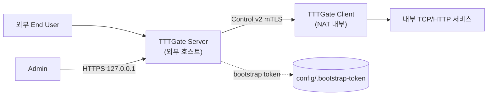
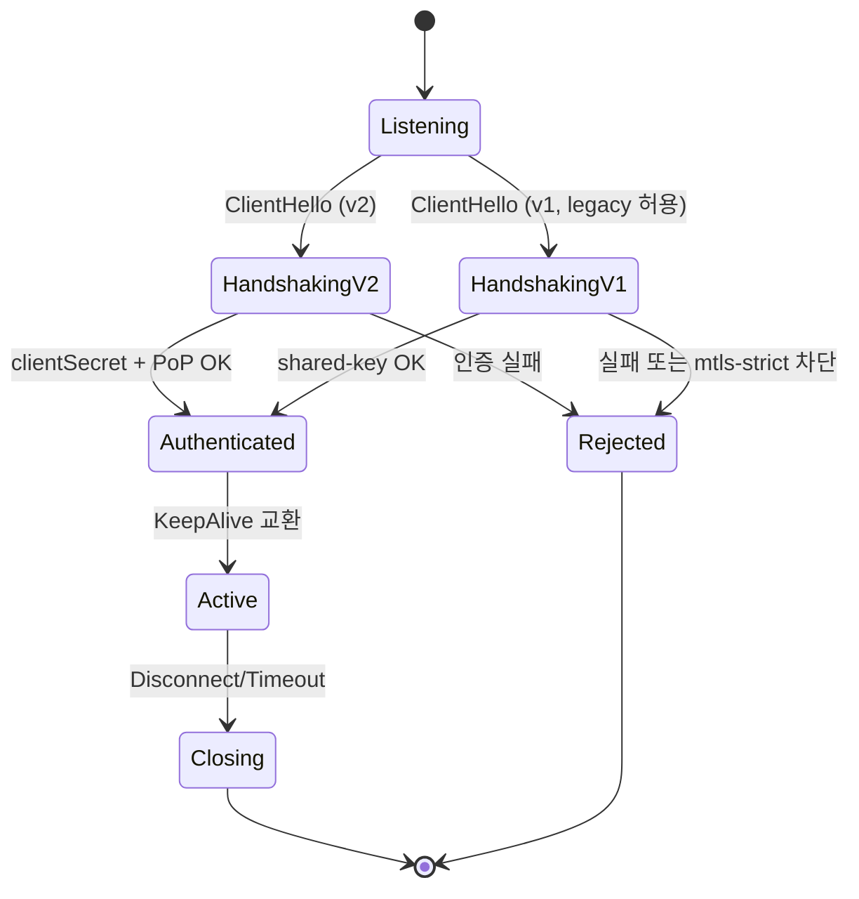
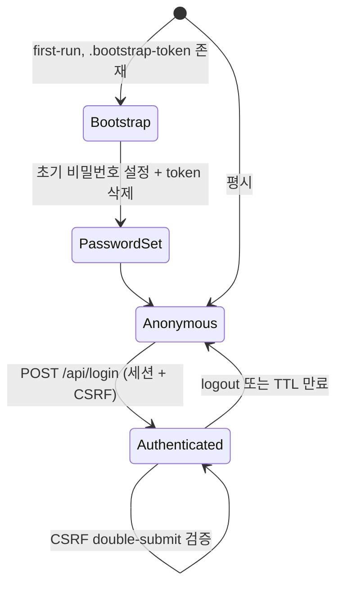

# TTTGate Software Requirements Specification

- **Version**: 1.0 (auto-generated)
- **Date**: 2026-04-24
- **Branch**: refactor/admin
- **Standard**: ISO/IEC/IEEE 29148:2018
- **Profile**: full
- **Generator**: snoworca-srs-from-code v1.0
- **Total requirements**: 366
- **Source files analyzed**: 97

---

## Table of Contents

1. Introduction
2. Stakeholders and Actors
3. System Overview
4. System Requirements
5. Verification
6. Appendices
7. Traceability Matrix

---

## 1. Introduction

### 1.1 Purpose

본 문서는 TTTGate 프로젝트의 **소프트웨어 요구사항 명세서 (SRS)** 이며, ISO/IEC/IEEE 29148:2018 full 프로파일 구조를 따른다.

> **Product intent (확정):** NAT 뒤에 위치한 내부 TCP/HTTP 서비스를 외부로 노출하는 터널링 게이트웨이.
>
> 구성: server(클라우드/외부 호스트), client(내부 NAT 내부), admin web console(관리자 UI).
>
> 보안 포스처: TLS/mTLS 기본, 제어 프로토콜 v1→v2 마이그레이션 진행 중, admin 은 127.0.0.1 바인딩 + bootstrap token 기반 초기화.

본 SRS 는 역공학(코드 기반) 방식으로 자동 생성되었으며, 총 366 개의 요구사항/속성 항목을 포함한다.

### 1.2 Scope

- 범위(In): 서버/클라이언트 런타임, 제어 프로토콜 v1·v2, 데이터 채널, 관리자 REST API, Svelte 기반 관리자 SPA, 인증/세션/CSRF, 인증서 관리, pkg 기반 바이너리 배포.
- 범위 외(Out): 부록 E (Out of scope) 참조.

### 1.3 Document conventions

- 요구사항 ID 규칙: `{카테고리}-{도메인}-{번호}` (예: `FR-SRV-TUN-001`).
- `[INFERRED 🔍]` 뱃지는 코드에 명시적으로 기술되지 않았지만 정황상 추론된 요구사항을 의미한다.
- Source 경로는 리포지토리 루트 기준 상대 경로이며 라인 범위는 `:Lstart-Lend` 표기이다.
- 우선순위: P0(핵심 보안) > P1(정상 운영) > P2(편의) > P3(향후).

### 1.4 References

- `README.md` — 프로젝트 개요 및 운영 가이드
- `CLAUDE.md` — 개발 환경/빌드 파이프라인/디렉터리 구조 설명
- `docs/plan/**`, `docs/analysis/**`, `docs/srs/**` — 기존 설계/분석 문서
- ISO/IEC/IEEE 29148:2018 — Systems and software engineering — Life cycle processes — Requirements engineering
- RTM: `docs/plan/srs/.TTTGate-work/rtm.md` 참조 (섹션 7)

### 1.5 Overview

TTTGate 는 외부 호스트에서 수신한 TCP/HTTP 트래픽을 내부 NAT 뒤 클라이언트로 중계하는 터널 게이트웨이이다. 서버는 관리자 콘솔(127.0.0.1 바인딩, TLS 필수)과 터널 제어 리스너(프로토콜 v1/v2 혼합 또는 mtls-strict)를 동시에 운영하며, 클라이언트는 서버 제어 채널에 연결한 뒤 데이터 채널을 개설하여 요청을 내부 서비스로 전달한다. 관리자는 Svelte 4 기반 SPA 에서 서버 옵션/터널 엔드포인트/인증서/세션 등을 제어한다.

## 2. Stakeholders and Actors

#### ACT-ADMIN-001 — 관리자 (Admin Console 사용자)

> **Type:** actor | **Confidence:** 0.95 | **Phase:** 2

AdminServer가 서빙하는 웹 SPA를 통해 서버옵션/터널옵션/인증서/세션을 관리하는 사용자. 세션 쿠키 + CSRF double-submit + bootstrap token 으로 인증.

**Source:** `src/server/admin/AdminServer.ts:L140-L293`, `src/server/admin/SessionStore.ts:L141-L222`, `admin/src/App.svelte:L18-L23`, `admin/src/layout/Login.svelte:L1-L60`

**Related:** FR-UI-LOGIN-001, FR-UI-SERVEROPT-FORM-001

#### ACT-BACKEND-001 — 내부 백엔드 서비스

> **Type:** actor | **Confidence:** 0.9 | **Phase:** 2 |  **[INFERRED 🔍 confidence: high]**

클라이언트가 터널을 통해 외부 요청을 중계할 대상이 되는 NAT 내부 TCP/HTTP 서비스. destinationAddress/destinationPort 로 지정됨.

**Source:** `src/types/TunnelingOption.ts`, `src/server/ServerOptionStore.ts`

**Related:** DATA-TUN-OPT-SRV-001

#### ACT-CLI-OPERATOR-001 — 클라이언트 운영자

> **Type:** actor | **Confidence:** 0.95 | **Phase:** 2

내부 NAT 뒤에서 TTTGate 클라이언트 프로세스를 CLI/YAML 로 기동/관리하는 운영자. config/client.yaml 과 CLI 옵션을 통해 서버 접속/인증/TLS/버퍼 한도를 구성한다.

**Source:** `src/client/ClientApp.ts:L111-L220`, `config/client.sample.yaml:L1-L18`

#### ACT-EXT-USER-001 — 외부 엔드 유저

> **Type:** actor | **Confidence:** 0.95 | **Phase:** 2

외부에서 tunnelingOption.forwardPort 로 접속해 서버가 터널을 통해 내부 destination 으로 중계하는 TCP/HTTP 클라이언트. AdminServer 와 무관.

**Source:** `src/server/ExternalPortServerPool.ts:L47-L120`

#### ACT-SRV-OPERATOR-001 — 서버 운영자 (CLI)

> **Type:** actor | **Confidence:** 0.95 | **Phase:** 2

TTTGate 서버 프로세스를 CLI로 시작/중지하고 운영 플래그를 지정하는 행위자. `server` 모드로 실행하며 admin 보안/TLS/레거시 허용 플래그를 제공한다.

**Source:** `src/app.ts:L12-L77`

#### ACT-THREAT-001 — 침입자/공격자 (threat actor)

> **Type:** actor | **Confidence:** 0.9 | **Phase:** 2 |  **[INFERRED 🔍 confidence: high]**

외부에서 Admin Console 또는 터널 제어 포트를 공격 대상으로 삼는 잠재적 위협 행위자. 로그인 브루트포스, CSRF, CORS 우회, 핸드셰이크 DoS, HTTP smuggling, path traversal 시도 대상.

**Source:** `src/server/admin/AdminServer.ts`, `src/server/TunnelHandshakePolicy.ts`

**Related:** NFR-SEC-LOGIN-BACKOFF-001, NFR-SEC-CSRF-001, NFR-AVAIL-HANDSHAKE-001, NFR-SEC-PATH-TRAVERSAL-001

#### ACT-TUNNEL-CLIENT-001 — 인증된 터널 클라이언트

> **Type:** actor | **Confidence:** 0.95 | **Phase:** 2

프로토콜 v2(clientId/secret + proof-of-possession) 또는 레거시 v1(shared key) 로 제어 핸드셰이크를 수행하는 내부 NAT 클라이언트.

**Source:** `src/server/TunnelServer.ts:L644-L737`

## 3. System Overview

### 3.1 System context

### 3.2 Key functions

- 외부 포트 리스닝 및 터널 세션 관리 (Server)
- 내부 서비스로의 TCP/HTTP 중계 (Client)
- 관리자 콘솔을 통한 런타임 옵션/인증서/세션 관리
- 제어 프로토콜 v1/v2 호환 운영 및 정책 기반 enforcement

### 3.3 User characteristics

_(운영자/관리자/터널 클라이언트 운영자 — 섹션 2 참조)_

### 3.4 Constraints

본 절은 설계·구현·배포에 영향을 주는 제약을 **카테고리별 개요**로 제시하며, 각 제약의 상세 본문(description/source/related)은 §4.8 Design and construction constraints 에만 단일 게재한다. 아래 목록은 ID → §4.8 해당 항목 으로의 링크 인덱스다.

**총 제약 수:** 36개 (전수 §4.8 에 상세 기술).

#### 3.4.1 Admin 기본값 (1)

Admin HTTPS 기본 포트/호스트/TLS/레거시 플래그 기본값.

- [CONSTR-ADMIN-DEFAULTS-001](#constr-admin-defaults-001-기본-포트호스트) — 기본 포트/호스트

#### 3.4.2 빌드/패키징 (2)

deploy.js 파이프라인, pkg 크로스플랫폼 타겟 빌드 규칙.

- [CONSTR-BUILD-PIPELINE-001](#constr-build-pipeline-001-deployjs-배포-파이프라인) — deploy.js 배포 파이프라인
- [CONSTR-BUILD-TARGETS-001](#constr-build-targets-001-pkg-빌드-타겟) — pkg 빌드 타겟

#### 3.4.3 런타임 (1)

Node.js 18+ 필수. engines.node 로 강제.

- [CONSTR-NODE-VERSION-001](#constr-node-version-001-node-18-필수) — Node 18+ 필수

#### 3.4.4 개발 스크립트 (1)

ts-node-dev 기반 server/client 핫리로드 실행 스크립트.

- [CONSTR-SCRIPT-DEV-001](#constr-script-dev-001-dev-스크립트-구성) — dev 스크립트 구성

#### 3.4.5 의존성 오버라이드 (1)

form-data 등 공급망 취약점 대응용 버전 override.

- [CONSTR-DEPS-OVERRIDE-001](#constr-deps-override-001-form-data-override-404) — form-data override ^4.0.4

#### 3.4.6 환경변수/개발 모드 (2)

TTTGATE_BUILD 스위치, -dev 개발 모드 동작 규칙.

- [CONSTR-ENV-BUILD-001](#constr-env-build-001-tttgate_build-환경변수) — TTTGATE_BUILD 환경변수
- [CONSTR-ENV-DEV-001](#constr-env-dev-001--dev-개발-모드) — -dev 개발 모드

#### 3.4.7 로깅 (1)

기본 로그 디렉터리 위치 및 생성 규칙.

- [CONSTR-LOG-DEFAULT-DIR-001](#constr-log-default-dir-001-기본-로그-디렉터리) — 기본 로그 디렉터리

#### 3.4.8 샘플 설정 (1)

server.sample.yaml 사용 지침 및 insecure 플래그 의미.

- [CONSTR-SAMPLE-YAML-001](#constr-sample-yaml-001-샘플-yaml-사용-지침) — 샘플 YAML 사용 지침

#### 3.4.9 CLI 인터페이스 (14)

서버/클라이언트 CLI 모드 토큰, 옵션 범위, 레거시 허용 플래그, 종료 코드, 사용법 갭.

- [CONSTR-CLI-CLI-DAEMON-001](#constr-cli-cli-daemon-001)
- [CONSTR-CLI-CLIENT-USAGE-GAP-001](#constr-cli-client-usage-gap-001)
- [CONSTR-CLI-EXIT78-001](#constr-cli-exit78-001-insecure-yaml-exit-code-78) — Insecure YAML exit code 78
- [CONSTR-CLI-MODE-001](#constr-cli-mode-001-cli-모드-토큰-server-client-stop) — CLI 모드 토큰: server | client | stop
- [CONSTR-CLI-OPT-RANGE-001](#constr-cli-opt-range-001-clientoption-범위-정규화) — ClientOption 범위 정규화
- [CONSTR-CLI-SRV-ADMINPORT-001](#constr-cli-srv-adminport-001-cli-옵션--adminport-port) — CLI 옵션: -adminPort [port]
- [CONSTR-CLI-SRV-DAEMON-001](#constr-cli-srv-daemon-001-cli-옵션--daemon) — CLI 옵션: -daemon
- [CONSTR-CLI-SRV-KEEPALIVE-001](#constr-cli-srv-keepalive-001-cli-옵션--keepalive-ms) — CLI 옵션: -keepAlive [ms]
- [CONSTR-CLI-SRV-LEGACYCTRLAUTH-001](#constr-cli-srv-legacyctrlauth-001-cli-옵션--allowlegacycontrolauth) — CLI 옵션: -allowLegacyControlAuth
- [CONSTR-CLI-SRV-LEGACYHTTP-001](#constr-cli-srv-legacyhttp-001-cli-옵션--allowlegacyadminhttp) — CLI 옵션: -allowLegacyAdminHttp
- [CONSTR-CLI-SRV-LEGACYREMOTE-001](#constr-cli-srv-legacyremote-001-cli-옵션--allowlegacyadminremote) — CLI 옵션: -allowLegacyAdminRemote
- [CONSTR-CLI-SRV-RESET-001](#constr-cli-srv-reset-001-cli-옵션--reset-truefalse) — CLI 옵션: -reset [true|false]
- [CONSTR-CLI-SRV-SECFLAGS-001](#constr-cli-srv-secflags-001-cli-옵션--trustxforwardedfor--requirecsrfheader) — CLI 옵션: -trustXForwardedFor / -requireCsrfHeader
- [CONSTR-CLI-SRV-USAGE-GAP-001](#constr-cli-srv-usage-gap-001)

#### 3.4.10 프로토콜 버전 (2)

Control 프로토콜 버전 상수와 v2 우선 협상 규칙.

- [CONSTR-PROTO-V2-FIRST-001](#constr-proto-v2-first-001-v2-우선-협상) — v2 우선 협상
- [CONSTR-PROTO-VERSION-001](#constr-proto-version-001-protocol-version-상수) — Protocol version 상수

#### 3.4.11 Control 스트리밍 (1)

CtrlPacketStreamer 기반 전송 필수.

- [CONSTR-CTRL-PACKET-STREAM-001](#constr-ctrl-packet-stream-001-ctrl-핸들러는-ctrlpacketstreamer-필수) — Ctrl 핸들러는 CtrlPacketStreamer 필수

#### 3.4.12 Endpoint 타임아웃 (1)

closeWait 60s/정리 10s 등 엔드포인트 수명 규칙.

- [CONSTR-ENDPOINT-CLOSE-WAIT-001](#constr-endpoint-close-wait-001-closewait-타임아웃-60s정리-간격-10s) — closeWait 타임아웃 60s/정리 간격 10s

#### 3.4.13 보안 유틸 (1)

secureRandomBytes 상한(n≤1024) 등 보안 원시 연산 제약.

- [CONSTR-SECURE-RANDOM-MAX-001](#constr-secure-random-max-001-securerandombytes-n1024) — secureRandomBytes n<=1024

#### 3.4.14 Insecure 플래그 (1)

YAML insecure 플래그 truthy 판정 규칙.

- [CONSTR-INSECURE-YAML-STR-BOOL-001](#constr-insecure-yaml-str-bool-001-insecure-플래그-truthy-판정) — insecure 플래그 truthy 판정

#### 3.4.15 스모크 테스트 (2)

smoke.mjs hard cap 30s, Windows taskkill 정리 규칙.

- [CONSTR-SMOKE-HARDCAP-001](#constr-smoke-hardcap-001-smoke-hard-cap-30s) — smoke hard cap 30s
- [CONSTR-SMOKE-TEARDOWN-001](#constr-smoke-teardown-001-smoke-windows-taskkill) — smoke Windows taskkill

#### 3.4.16 Admin UI 빌드 (4)

Vite 4+Svelte 4, crypto-js 의존, tsconfig 확장, 개발 프록시 /api→:9300.

- [CONSTR-UI-BUILD-001](#constr-ui-build-001-vite-4-svelte-4-빌드) — Vite 4 + Svelte 4 빌드
- [CONSTR-UI-CRYPTO-001](#constr-ui-crypto-001-프론트엔드-crypto-js-의존) — 프론트엔드 crypto-js 의존
- [CONSTR-UI-TSCONFIG-001](#constr-ui-tsconfig-001-admin-tsconfig-svelte-확장) — admin tsconfig: Svelte 확장
- [CONSTR-UI-VITE-PROXY-001](#constr-ui-vite-proxy-001-vite-개발-프록시-api-localhost9300) — Vite 개발 프록시 /api → localhost:9300

> 상세 제약 본문(Description/Source/Related)은 [§4.8 Design and construction constraints](#48-design-and-construction-constraints-constr-) 를 참조.

### 3.5 Assumptions

#### ASM-APP-BOOTSTRAP-001 — AppCompositionRoot 의존

> **Type:** assumption | **Confidence:** 0.85 | **Phase:** 2 |  **[INFERRED 🔍 confidence: high]**

클라이언트 시작 시 AppCompositionRoot.applyGlobalMemLimitMiB 를 통해 SocketHandler.GlobalMemCacheLimit 를 설정한다고 가정. 실제 정의는 src/bootstrap (Agent 1 범위).

**Source:** `src/client/ClientApp.ts:L10`, `src/client/ClientApp.ts:L218`

#### ASM-SENTINEL-EXT-001 — Sentinel/daemon 외부 정의

> **Type:** assumption | **Confidence:** 0.9 | **Phase:** 2 |  **[INFERRED 🔍 confidence: high]**

smoke.mjs 와 app.ts 에서 Sentinel 의 foreground PID 파일 bin/.pid_foreground 를 쓰는 것으로 언급되나 실제 구현은 Agent 1 담당(src/Sentinel.ts).

**Source:** `scripts/smoke.mjs:L233-L236`

#### ASM-SRV-SENTINEL-001 — sentinel이 죽으면 SIGTERM

> **Type:** assumption | **Confidence:** 0.8 | **Phase:** 2 |  **[INFERRED 🔍 confidence: high]**

find-process 에러 시 sentinel은 SIGTERM(자기 자신)과 process.kill(1)을 호출해 시스템 init 에 신호를 보내고 종료한다. 실제로 효과적일지는 OS마다 다름(추정).

**Source:** `src/Sentinel.ts:L217-L238`

#### ASM-SRV-TEST-001 — 테스트용 resetForTest 진입점

> **Type:** assumption | **Confidence:** 0.95 | **Phase:** 2

SessionStore/ServerOptionStore/CertificationStore 는 resetForTest 정적 메서드를 제공해 싱글턴을 재초기화한다. 런타임 프로덕션 경로에서 호출되지 않는다.

**Source:** `src/server/admin/SessionStore.ts:L50-L52`, `src/server/ServerOptionStore.ts:L179-L181`, `src/server/CertificationStore.ts:L76-L78`

#### ASM-THREAT-001 — 가정된 위협 모델

> **Type:** assumption | **Confidence:** 0.7 | **Phase:** 3 |  **[INFERRED 🔍 confidence: med]**

침입자는 (a) 관리자 쿠키/CSRF 토큰 탈취, (b) v2 clientSecret 탈취/추측, (c) HTTP 헤더 인젝션/스머글링, (d) JSON 프로토타입 오염, (e) 제어 채널 DoS, (f) nonce/token 리플레이를 시도할 수 있다고 가정한다. 물리적 호스트 침해 및 사이드채널은 범위 외.

**Source:** `README.md:L1-L103`, `src/server/TunnelServer.ts:L60-L230`, `src/server/admin/AdminServer.ts:L1-L200`

#### ASM-UI-ADMIN-BASE-001 — Admin 백엔드와 동일 origin

> **Type:** assumption | **Confidence:** 0.9 | **Phase:** 2 |  **[INFERRED 🔍 confidence: high]**

모든 API 호출이 /api/* 경로 상대 URL 로 수행되므로 프로덕션에선 Admin 서버가 동일 host:port 에서 정적 SPA 와 REST 를 서빙한다고 가정. 개발 환경은 vite proxy 로 localhost:9300 매핑.

**Source:** `admin/src/controller/LoginCtrl.ts:L9-L36`, `admin/vite.config.ts:L5-L18`

**Related:** CONSTR-UI-VITE-PROXY-001

#### ASM-UI-TYPES-DUP-001 — Types.ts vs Options.ts 중복 정의

> **Type:** assumption | **Confidence:** 0.8 | **Phase:** 2 |  **[INFERRED 🔍 confidence: high]**

ServerOption, HttpOption, CustomHeader 등이 Types.ts 와 Options.ts 에 서로 다른 필드 구성으로 중복 정의되어 있어 레이아웃별로 다른 파일을 import. Types.ts 의 ServerOption 이 최신(globalMemCacheLimit/keepAlive 포함)이며 Options.ts 는 tunneling 옵션 전용으로 보인다.

**Source:** `admin/src/controller/Types.ts:L14-L22`, `admin/src/controller/Options.ts:L37-L62`

**Related:** DATA-UI-SRV-OPTION-001, DATA-UI-TUN-OPT-001

## 4. System Requirements

### 4.1 Functional requirements

#### 4.1.1 Server (FR-SRV-*)

##### FR-SRV-ADMIN-LISTEN-001 — AdminServer.listen

> **Type:** functional_req | **Confidence:** 0.95 | **Phase:** 2

http/https 서버를 (host, port)에 바인드. 실제 포트 주소 로깅 후 _port/_bindHost 기록. 실패 시 에러 reject + 서버 close.

**Source:** `src/server/admin/AdminServer.ts:L1044-L1075`

##### FR-SRV-AUDIT-LOG-001 — runtime 경고/에러 로깅

> **Type:** functional_req | **Confidence:** 0.95 | **Phase:** 2

정책 경고는 logger.warn+console.warn, 정책 위반/기동 실패는 logger.error+console.error 후 exit 1.

**Source:** `src/server/ServerApp.ts:L77-L93`

##### FR-SRV-BINDING-TOKEN-001 — Data Binding Token 발급/소비

> **Type:** functional_req | **Confidence:** 0.95 | **Phase:** 2

IdentityRegistry.issueBindingToken: 24B CSPRNG hex 토큰을 clientId/ctrlID/handlerID/sessionID 와 함께 30s TTL로 저장. consumeBindingToken 으로 1회 일치 확인 후 즉시 제거.

**Source:** `src/server/IdentityRegistry.ts:L43-L76`

**Related:** DATA-DATA-STATE-PACKET-001

##### FR-SRV-BOOTSTRAP-GEN-001 — Bootstrap token 생성/보안

> **Type:** functional_req | **Confidence:** 0.95 | **Phase:** 2

_key가 비었을 때 .bootstrap-token 파일 부재 시 crypto.randomBytes(32).toString('hex') 로 생성, 0o600 로 저장, WARN 로그. 로그인 성공 시 clearBootstrapToken 으로 파일 삭제.

**Source:** `src/server/admin/SessionStore.ts:L187-L270`

##### FR-SRV-CERT-COMMIT-001 — Cert commit + 파일 저장

> **Type:** functional_req | **Confidence:** 0.95 | **Phase:** 2

commitAdminServerCert/commitExternalServerCert: prepare 검증 → 기존 파일 삭제 → 인증서 JSON(.adminCert.json/.externalCert.json) 저장 + PEM 파일 cert/key/ca 저장 + revision 증가.

**Source:** `src/server/CertificationStore.ts:L211-L273`

##### FR-SRV-CERT-LIFECYCLE-001 — 인증서 수명주기

> **Type:** functional_req | **Confidence:** 0.95 | **Phase:** 2

CertificationStore: 기동 시 tempCert(self-signed) 생성, admin/external cert 로드(.adminCert.json/.externalCert.json). Admin cert 없으면 새 CA 생성 후 저장. reset 시 인증서 디렉토리 전면 삭제.

**Source:** `src/server/CertificationStore.ts:L106-L337`

**Related:** BR-CERT-KEYPAIR-SRV-001

##### FR-SRV-PROTO-V2-CAPS-001 — v2 기본 capabilities 브로드캐스트

> **Type:** functional_req | **Confidence:** 0.95 | **Phase:** 2

SyncCtrlAckMeta.capabilities 에 DEFAULT_PROTOCOL_V2_CAPABILITIES(protocol-v2, proof-of-possession, client-identity, data-bind-token, wide-id) 포함.

**Source:** `src/commons/ProtocolV2.ts:L33-L42`

##### FR-SRV-RESTART-SCOPES-001 — runtime 적용 vs 재기동 예약

> **Type:** functional_req | **Confidence:** 0.95 | **Phase:** 2

applyServerOption: adminPort/adminBindHost/adminTls 변경은 재기동 예약(admin-server). port/tls/key/keepAlive/mode/legacyAuth/trustedClients 변경은 TunnelServer stop→create→start.

**Source:** `src/server/TTTServer.ts:L177-L241`

##### FR-SRV-SESSION-SWEEP-001 — 세션 만료 sweep

> **Type:** functional_req | **Confidence:** 0.95 | **Phase:** 2

SessionStore.sweepSession: 현재 시각 초과 세션 제거. isSessionValid 는 유효한 경우 timeout=now+12h 로 갱신. 대상은 관리자 로그인 세션(admin login session). 터널 데이터 세션 TTL(60s, MODE-SESSION-TTL-001)과 구분된다.

**Source:** `src/server/admin/SessionStore.ts:L87-L114`

##### FR-SRV-START-001 — 서버 기동 시퀀스

> **Type:** functional_req | **Confidence:** 0.95 | **Phase:** 2

ServerApp.start: CLI 파싱 → AdminSecurityPolicy 구성 → reset(옵션) → certStore.load → startupOptions 적용 → AdminServer.listen → tttServer.start → markLastKnownGood.

**Source:** `src/server/ServerApp.ts:L65-L95`

##### FR-SRV-STORE-REDACT-001 — 민감 옵션 redaction 로깅

> **Type:** functional_req | **Confidence:** 0.95 | **Phase:** 2

ServerOption 로깅 시 redactSecrets 적용. commitPreparedServerOption 의 updates 로깅도 redact.

**Source:** `src/server/ServerApp.ts:L28-L28`, `src/server/ServerOptionStore.ts:L88-L90`

##### FR-SRV-YAML-ATOMIC-001 — server.yaml 원자적 저장

> **Type:** functional_req | **Confidence:** 0.95 | **Phase:** 2

YAML.stringify(serverOption) 을 Files.writeAtomicSync 로 저장, 이어 chmod 0o600. 상태 JSON(.server.state.json) 도 동일.

**Source:** `src/server/ServerOptionStore.ts:L198-L207`, `src/server/ServerOptionStore.ts:L403-L408`

#### 4.1.2 Client (FR-CLI-*)

##### FR-CLI-APPLY-GLOBAL-MEM-001 — Global mem limit 적용

> **Type:** functional_req | **Confidence:** 0.95 | **Phase:** 2

ClientApp.start 초기 기본 128MiB 적용 후 clientOption.globalMemCacheLimit 재적용. AppCompositionRoot.applyGlobalMemLimitMiB 경유.

**Source:** `src/client/ClientApp.ts:L218`, `src/client/ClientApp.ts:L226-L229`

##### FR-CLI-CLIENT-OPTS-001 — 클라이언트 CLI 옵션 집합

> **Type:** functional_req | **Confidence:** 0.97 | **Phase:** 2

ClientApp._loadClientOption 는 다음 CLI 플래그를 수용한다: -key, -addr(host[:port]), -keepAlive, -tls, -name, -clientId, -clientSecret, -displayName, -serverName, -ca, -cert, -privateKey, -allowLegacyFallback, -allowInsecureTls, -bufferLimit, -save, -yes-insecure. YAML 저장된 값과 병합되며 CLI 가 우선한다.

**Source:** `src/client/ClientApp.ts:L124-L220`

##### FR-CLI-DATAHANDLER-BUFFER-LIMIT-001 — 데이터 핸들러 버퍼 한도 설정

> **Type:** functional_req | **Confidence:** 1 | **Phase:** 2

connectEndPoint 시 endPointConnectOpt.bufferLimit 를 setBufferSizeLimit 으로 주입. CloseSession 수신 시 setBufferSizeLimit(-1) 로 해제.

**Source:** `src/client/TunnelClient.ts:L443-L458`, `src/client/TunnelClient.ts:L344-L350`

##### FR-CLI-ENDPOINT-POOL-001 — EndPointClientPool 수명주기

> **Type:** functional_req | **Confidence:** 1 | **Phase:** 2

open(sessionID, connectOpt) 으로 내부 엔드포인트 연결 생성, send(id,data) 로 전송, close(id,endLength) 로 반종료(closeWait), dispose()/closeAll() 로 일괄 파기. 10초 주기로 closeWait 소켓을 60s 타임아웃 기준으로 강제 종료. 표기 정규화: closeWait 60초(60,000ms), 10초(10,000ms) 주기 스윕.

**Source:** `src/client/EndPointClientPool.ts:L22-L183`

##### FR-CLI-PARSE-001 — CLI 모드/옵션 파싱

> **Type:** functional_req | **Confidence:** 0.98 | **Phase:** 2

CLI 는 `server|client|stop|none` 모드와 `-key value` 또는 `-key=value` 형태의 단순 옵션을 파싱한다. mode 는 첫 번째 비-옵션 인자로 지정된다. 인자 없이 실행하거나 첫 번째 비-옵션 인자가 server|client|stop 중 어느 것과도 매칭되지 않을 경우 mode=none 이 반환되며, 상위 엔트리포인트는 usage 를 출력한다.

**Source:** `src/util/CLI.ts:L10-L56`

##### FR-CLI-RECONNECT-001 — 제어 채널 자동 재연결

> **Type:** functional_req | **Confidence:** 1 | **Phase:** 2

Ctrl 상태가 'closed' 로 전이되면 현재 EndPoint 풀을 닫고 reconnectIntervalMs(기본 5000ms) 후 start() 를 재호출한다. 단, stop() 된 경우는 재연결하지 않는다.

**Source:** `src/client/TTTClient.ts:L48-L74`, `src/client/TTTClientRuntime.ts:L13`

##### FR-CLI-SERVER-MESSAGE-LOG-001 — 서버 메시지(type=log) 수신 로그

> **Type:** functional_req | **Confidence:** 1 | **Phase:** 2

Ctrl Message 패킷 type=='log' 이면 payload 를 info 레벨로 기록.

**Source:** `src/client/TunnelClient.ts:L363-L368`

##### FR-CLI-START-001 — TTTClient 시작/정지

> **Type:** functional_req | **Confidence:** 1 | **Phase:** 2

TTTClient.start 는 EndPointClientPool/TunnelClient 를 초기화하고 서버에 연결을 시도한다. stop 은 재연결 타이머를 취소하고 풀/터널 핸들을 파기한다.

**Source:** `src/client/TTTClient.ts:L32-L84`

##### FR-CLI-SYSINFO-REPORT-001 — 클라이언트 sysinfo 전송

> **Type:** functional_req | **Confidence:** 1 | **Phase:** 2

sendAckCtrl 성공 후 SystemInfoProviderRegistry.current().sysInfo() 로 시스템 정보를 수집해 Message(type=sysinfo) 로 서버에 전송.

**Source:** `src/client/TunnelClient.ts:L510-L519`

#### 4.1.3 Admin UI (FR-UI-*)

##### FR-UI-BOOT-001 — SPA 부트스트랩 및 세션 유효성 확인

> **Type:** functional_req | **Confidence:** 0.98 | **Phase:** 2

App.svelte 가 onMount 시 LoginCtrl.validateSession() 을 호출하여 세션 상태(Checking/Valid/Invalid)에 따라 ServerSetLayout+ServerStatusLayout+TunnelOptionSetLayout 또는 Login 화면을 분기 렌더링한다. 세션 확인 실패(연결 불가) 시 'Offline server...' 표기.

**Source:** `admin/src/App.svelte:L12-L52`

**Related:** MODE-UI-SESSION-001

##### FR-UI-CERT-ADMIN-001 — Admin TLS 인증서 관리 UI

> **Type:** functional_req | **Confidence:** 0.96 | **Phase:** 2

ServerSetLayout 에서 adminTls 체크 시 InputCertFile 컴포넌트를 렌더링하여 key/cert/ca PEM 파일 선택을 받고 update 이벤트로 _updateAdminCert 를 호출(CertificationCtrl.updateAdminCert).

**Source:** `admin/src/layout/ServerSetLayout.svelte:L75-L102`, `admin/src/layout/ServerSetLayout.svelte:L215-L217`

**Related:** FR-UI-CERT-INPUT-001

##### FR-UI-CERT-INPUT-001 — InputCertFile 컴포넌트 인증서 업로드

> **Type:** functional_req | **Confidence:** 0.96 | **Phase:** 2

key/cert/ca 3개의 파일 input (accept=.pem/.crt/.cer) 제공. 파일 선택 시 FileReader 로 텍스트 읽고 PEM 형식 및 키 쌍 검증 후 update 이벤트 디스패치. ca 는 X 버튼으로 제거 가능.

**Source:** `admin/src/layout/InputCertFile.svelte:L204-L277`, `admin/src/layout/InputCertFile.svelte:L281-L305`

**Related:** BR-UI-CERT-VALID-001, BR-UI-KEYPAIR-CHECK-001

##### FR-UI-LOGIN-001 — 관리자 로그인 화면

> **Type:** functional_req | **Confidence:** 0.98 | **Phase:** 2

Login.svelte 는 비밀번호 입력 + OK 버튼(엔터 키 지원)을 제공하고 LoginCtrl.login() 을 호출한다. 성공 시 location.href='/' 으로 재로딩.

**Source:** `admin/src/layout/Login.svelte:L18-L47`, `admin/src/layout/Login.svelte:L51-L63`

**Related:** UC-UI-LOGIN-001

##### FR-UI-LOGIN-002 — 초기 비밀번호 설정 모드 UI

> **Type:** functional_req | **Confidence:** 0.95 | **Phase:** 2

onMount 에서 LoginCtrl.isEmptyKey() 호출 후 true 이면 'No password has been set.' 메시지를 표시하고 이후 입력을 새 비밀번호 등록용으로 사용. [UI-BACKEND 간극] 현재 UI(LoginCtrl.login) 는 {key: hash} 만 전송하며 bootstrapToken 을 절대 보내지 않는다(admin/src/controller/LoginCtrl.ts:27-39). 따라서 최초 비밀번호 설정(UC-UI-BOOTSTRAP-PW-001) 흐름을 UI 만으로는 완료할 수 없으며, 관리자는 API 직접 호출 등 별도 경로로 초기화해야 한다.

**Source:** `admin/src/layout/Login.svelte:L10-L16`

**Related:** API-ADMIN-EMPTY-KEY-001, BR-UI-PW-POLICY-001

##### FR-UI-SERVEROPT-APPLY-001 — 서버 옵션 저장 Apply 플로우

> **Type:** functional_req | **Confidence:** 0.96 | **Phase:** 2

_apply 는 updateServerOption 호출 후 _checkServerRestart 로 1초 간격 폴링하여 새 옵션 해시 변경을 감지하면 'The server has been restarted' 알림 후 새 adminPort/adminTls 로 location.href 를 재이동.

**Source:** `admin/src/layout/ServerSetLayout.svelte:L120-L173`

**Related:** UC-UI-SERVER-OPT-EDIT-001

##### FR-UI-SERVEROPT-FORM-001 — 서버 옵션 편집 폼

> **Type:** functional_req | **Confidence:** 0.97 | **Phase:** 2

ServerSetLayout 는 key(인증 키), adminPort, adminTls, port, tls, globalMemCacheLimit, keepAlive 를 입력/체크박스 폼으로 제공한다. 값 변경 시 _isNewValue reactivity 로 Apply 버튼 활성화.

**Source:** `admin/src/layout/ServerSetLayout.svelte:L56-L58`, `admin/src/layout/ServerSetLayout.svelte:L194-L246`

**Related:** DATA-UI-SRV-OPTION-001

##### FR-UI-SERVEROPT-MINMAX-001 — 입력 min/max 강제 정규화

> **Type:** functional_req | **Confidence:** 0.95 | **Phase:** 2

_enforceMinMax(keyup) 는 input.min/max 범위를 벗어난 value 를 자동으로 min/max 값으로 보정. 0~65535 포트, 1~99999 버퍼/keepAlive 등에 적용.

**Source:** `admin/src/layout/ServerSetLayout.svelte:L63-L73`, `admin/src/layout/ServerSetLayout.svelte:L204-L236`

**Related:** BR-UI-PORT-RANGE-001

##### FR-UI-SERVEROPT-RESET-001 — Reset 버튼으로 미적용 변경 되돌림

> **Type:** functional_req | **Confidence:** 0.9 | **Phase:** 2

_reset 는 _lastServerOption/_originalAdminCert 로 상태를 되돌리고, 인증서가 변경되었으면 updateAdminCert 를 재호출.

**Source:** `admin/src/layout/ServerSetLayout.svelte:L175-L182`

**Related:** FR-UI-SERVEROPT-FORM-001, FR-UI-CERT-ADMIN-001

##### FR-UI-STATUS-CLIENTLIST-001 — 클라이언트 리스트 및 Uptime 표시

> **Type:** functional_req | **Confidence:** 0.97 | **Phase:** 2

_clientStatuses(id/name/address/uptime/activeSessionCount) 리스트와 _usage.uptime 을 _timeToDMH 로 'Xd Yh Zm Ws' 포맷 표시.

**Source:** `admin/src/layout/ServerStatusLayout.svelte:L120-L127`, `admin/src/layout/ServerStatusLayout.svelte:L173-L188`

##### FR-UI-STATUS-GAUGE-001 — Gauge 메트릭 표시 (CPU/Memory/Heap/Buffer)

> **Type:** functional_req | **Confidence:** 0.97 | **Phase:** 2

Usage 객체에서 cpu.process, memory.process/total, heap.used/total, totalBuffer.used/total 값을 Gauge 컴포넌트로 표시. bytes 는 TiB/GiB/MiB/KiB/B 단위로 포맷.

**Source:** `admin/src/layout/ServerStatusLayout.svelte:L80-L96`, `admin/src/layout/ServerStatusLayout.svelte:L155-L170`

**Related:** IF-UI-GAUGE-001, DATA-UI-USAGE-001

##### FR-UI-STATUS-POLL-001 — 서버 상태 폴링(1초)

> **Type:** functional_req | **Confidence:** 0.98 | **Phase:** 2

ServerStatusLayout 는 onMount 에 1초 setInterval 로 getSysUsage + getClientStatus 를 호출하고, InvalidSession 발생 시 세션 만료 알림으로 중단.

**Source:** `admin/src/layout/ServerStatusLayout.svelte:L28-L57`

**Related:** NFR-UI-POLLING-001

##### FR-UI-STATUS-SYSINFO-001 — INFO 클릭 시 시스템 상세 팝업

> **Type:** functional_req | **Confidence:** 0.96 | **Phase:** 2

CPU 아이콘 클릭 시 getSysInfo() 호출 → SysinfoPopup 에 HW Info(CPU/Cores/RAM), OS Info, Network 인터페이스 상세 표시. 클라이언트 ID 클릭 시 getClientSysInfo(id) 호출.

**Source:** `admin/src/layout/ServerStatusLayout.svelte:L98-L118`, `admin/src/layout/SysinfoPopup.svelte:L41-L89`

**Related:** API-ADMIN-CLIENT-SYSINFO-002

##### FR-UI-SYSINFO-POPUP-001 — SysinfoPopup 팝업 표시

> **Type:** functional_req | **Confidence:** 0.95 | **Phase:** 2

show prop 으로 표시되며 sysInfo.osInfo/cpuInfo/ram/network 를 계층적으로 렌더링. 네트워크는 interface 별로 address/netmask/mac/internal/family/cidr 나열.

**Source:** `admin/src/layout/SysinfoPopup.svelte:L46-L82`

**Related:** DATA-UI-SYSINFO-001

##### FR-UI-TUNNEL-ACTIVATION-001 — 튜널 Activation 토글

> **Type:** functional_req | **Confidence:** 0.94 | **Phase:** 2

_onChangeActive: Switch/Timer 이벤트 시 activeExternalPortServer(active, port, timeout) 호출 후 상태 재로드. 실패 시 oldActive 값으로 복원.

**Source:** `admin/src/layout/TunnelOptionSetLayout.svelte:L418-L462`

**Related:** API-ADMIN-TUNNEL-ACTIVE-002

##### FR-UI-TUNNEL-ADD-001 — 튜널 추가(Add tunneling service)

> **Type:** functional_req | **Confidence:** 0.95 | **Phase:** 2

_addEmptyOption 이 랜덤 forwardPort (10~65544) + 기본 httpOption + destinationAddress='127.0.0.1':8080 으로 빈 옵션을 목록에 추가(isSync=false). Apply 버튼 라벨은 'Start'.

**Source:** `admin/src/layout/TunnelOptionSetLayout.svelte:L193-L221`, `admin/src/layout/TunnelOptionSetLayout.svelte:L651-L662`

**Related:** UC-UI-TUNNEL-ADD-001

##### FR-UI-TUNNEL-ALLOWEDNAMES-001 — allowedClientNames 세미콜론 입력 포맷

> **Type:** functional_req | **Confidence:** 0.95 | **Phase:** 2

allowedClientNamesQuery 문자열(';'로 구분)을 trim/filter 후 allowedClientNames 배열로 송신. 로드 시 배열을 ';' 구분 문자열로 변환.

**Source:** `admin/src/layout/TunnelOptionSetLayout.svelte:L100-L106`, `admin/src/layout/TunnelOptionSetLayout.svelte:L293`

**Related:** DATA-UI-TUN-OPT-001

##### FR-UI-TUNNEL-APPLY-001 — 튜널 Apply/Start

> **Type:** functional_req | **Confidence:** 0.96 | **Phase:** 2

_onClickApply: allowedClientNamesQuery 를 ';' 로 분리해 allowedClientNames 배열 구성 → _removeOldServerPort 로 과거 포트 정리 → tls 이고 certInfo 있으면 updateExternalServerCert → updateTunnelingOption. 성공 시 타이머 reset 및 _originTunnelOptions 동기화.

**Source:** `admin/src/layout/TunnelOptionSetLayout.svelte:L290-L332`

**Related:** API-ADMIN-EXT-CERT-POST-002, BR-UI-TUNNEL-VALID-001

##### FR-UI-TUNNEL-CLEANUP-001 — 과거 포트 정리

> **Type:** functional_req | **Confidence:** 0.9 | **Phase:** 2

_removeOldServerPort 는 _originTunnelOptions 와 _tunnelOptions 를 비교해 삭제된 forwardPort 의 외부 인증서(certInfo 있는 경우)와 튜널을 DELETE 로 정리.

**Source:** `admin/src/layout/TunnelOptionSetLayout.svelte:L272-L288`

**Related:** API-ADMIN-EXT-CERT-DEL-002

##### FR-UI-TUNNEL-HTTPOPT-001 — HTTP/HTTPS 부가 옵션 UI

> **Type:** functional_req | **Confidence:** 0.9 | **Phase:** 2

protocol in [http,https] 일 때 'Replace Host in text body', 'Replace Access-Control-Allow-Origin', HeaderAppender(request/response), BodyReplaceAppender 를 표시.

**Source:** `admin/src/layout/TunnelOptionSetLayout.svelte:L606-L642`

**Related:** DATA-UI-HTTP-OPT-001

##### FR-UI-TUNNEL-LOAD-001 — 튜널 설정 목록 로드 및 표시

> **Type:** functional_req | **Confidence:** 0.97 | **Phase:** 2

TunnelOptionSetLayout onMount 에서 _loadTunnelingOption 호출 → GET /api/tunnelingOption → 각 튜널에 isSync=true, updatable=true, allowedClientNamesQuery 조립. _loadCertInfoAll 로 각 포트별 외부 인증서도 로드.

**Source:** `admin/src/layout/TunnelOptionSetLayout.svelte:L44-L52`, `admin/src/layout/TunnelOptionSetLayout.svelte:L96-L130`

**Related:** API-ADMIN-EXT-CERT-GET-002

##### FR-UI-TUNNEL-NORMALIZE-001 — 버퍼/포트 값 정규화

> **Type:** functional_req | **Confidence:** 0.96 | **Phase:** 2

reactive $ 블록에서 destinationPort/forwardPort 는 0~65535, bufferLimitOnClient/Server 는 -1~1048576 범위로 클램프.

**Source:** `admin/src/layout/TunnelOptionSetLayout.svelte:L55-L85`

**Related:** BR-UI-PORT-RANGE-001, BR-UI-BUFFER-RANGE-001

##### FR-UI-TUNNEL-PROTOCOL-001 — protocol 선택과 TLS 연동

> **Type:** functional_req | **Confidence:** 0.93 | **Phase:** 2

_onChangeProtocol: protocol='https' 시 tls=true 로 강제, 새로 켜진 경우 _onChangeSecureTunneling(=_loadCertInfo)로 인증서 로드. tcp 이외에서 tls 체크박스 disabled.

**Source:** `admin/src/layout/TunnelOptionSetLayout.svelte:L226-L236`, `admin/src/layout/TunnelOptionSetLayout.svelte:L363-L370`, `admin/src/layout/TunnelOptionSetLayout.svelte:L545-L548`

**Related:** FR-UI-CERT-INPUT-001

##### FR-UI-TUNNEL-REMOVE-001 — 튜널 Remove/Stop

> **Type:** functional_req | **Confidence:** 0.95 | **Phase:** 2

_onClickRemove: isSync true 면 DELETE /api/tunnelingOption 호출 후 splice 로 목록 제거 및 'external server has been shut down' 알림. isSync false(신규 미저장)면 클라이언트 배열에서만 제거.

**Source:** `admin/src/layout/TunnelOptionSetLayout.svelte:L238-L270`

##### FR-UI-TUNNEL-STATUSCARD-001 — 튜널별 상태 카드 표시

> **Type:** functional_req | **Confidence:** 0.95 | **Phase:** 2

각 튜널에 대해 _externalServerStatuses 에서 online/offline 판단, Uptime, Sessions, RX, TX 값 및 Activation Switch, Timeout Timer 를 렌더링.

**Source:** `admin/src/layout/TunnelOptionSetLayout.svelte:L478-L537`

**Related:** IF-UI-SWITCH-001, IF-UI-TIMER-001

##### FR-UI-VERSION-001 — 버전 정보 표시

> **Type:** functional_req | **Confidence:** 0.95 | **Phase:** 2

앱 우하단에 서버에서 가져온 버전(name)과 빌드(build)를 표기한다. ServerStatusCtrl.getVersion()이 캐시된 후 재사용.

**Source:** `admin/src/App.svelte:L16-L20`, `admin/src/App.svelte:L56-L62`, `admin/src/controller/ServerStatusCtrl.ts:L43-L53`

#### 4.1.4 Tunnel common (FR-TUN-*)

##### FR-TUN-HANDSHAKE-V2-CLI-001 — v2 핸드셰이크

> **Type:** functional_req | **Confidence:** 1 | **Phase:** 2

SyncCtrlAck 수신 시 syncCtrlAckMeta 가 있고 clientId/clientSecret 가 설정되면 buildHandshakeProof(clientSecret, clientId, controlID, challengeNonce) 로 proof 를 생성해 AckCtrl 에 v2 메타(protocolVersion=CONTROL_PROTOCOL_V2, capabilities, controlID, clientId, displayName, proof) 를 실어 보낸다.

**Source:** `src/client/TunnelClient.ts:L295-L318`

**Related:** BR-TUN-LEGACY-FALLBACK-CLI-001

##### FR-TUN-STATE-MACHINE-001 — Ctrl 상태 머신

> **Type:** functional_req | **Confidence:** 0.97 | **Phase:** 2

None → Connecting(connect() 성공) → Syncing(SyncCtrl 송신 성공) → Connected(AckCtrl 전송 성공) → None(연결 종료). 그 외 상태 전이는 오류로 간주.

**Source:** `src/client/TunnelClient.ts:L17-L22`, `src/client/TunnelClient.ts:L125-L156`, `src/client/TunnelClient.ts:L482-L508`

#### 4.1.5 Other functional requirements

##### FR-CLOCK-RNG-001 — ClockRng 추상화

> **Type:** functional_req | **Confidence:** 1 | **Phase:** 2

DefaultClockRng 는 Date.now/Math.random 과 crypto.randomBytes 기반 secureRandomBytes(n). n<=1024 만 허용. ClockRngProvider.configure 는 shape 검증.

**Source:** `src/util/ClockRng.ts:L1-L85`

##### FR-FILECACHE-SPILL-001 — 버퍼 파일 스필

> **Type:** functional_req | **Confidence:** 1 | **Phase:** 2

QueueLimiter 가 shouldSpillToFile 를 true 로 판정하면 FileCache.writeSync 로 디스크에 적재. writeCapacity/global 초과 시 destroy.

**Source:** `src/util/SocketHandler.ts:L503-L555`, `src/util/QueueLimiter.ts:L1-L35`, `src/util/FileCache.ts:L1-L80`

##### FR-PORT-CHECKER-001 — 사용 가능 포트 탐색

> **Type:** functional_req | **Confidence:** 1 | **Phase:** 2

UsablePortChecker.check/checkPorts/findUsablePort/findUsablePorts/findUsedPorts. 0~65535 범위 검증.

**Source:** `src/util/UsablePortChecker.ts:L1-L74`

##### FR-SECRET-REDACTOR-001 — 민감 필드/문자열 redact

> **Type:** functional_req | **Confidence:** 1 | **Phase:** 2

redactSecrets 는 객체 키가 key/clientSecret/cert/ca/password/sessionKey/bootstrapToken 또는 *secret/*token/*password/*privateKey 이면 '[REDACTED]' 치환. redactSecretString 은 PEM 블록, Authorization 헤더, key|token|secret|password|authkey=... , bcrypt 해시($2a|2b|2y), hex 64자 이상을 치환.

**Source:** `src/util/SecretRedactor.ts:L1-L66`

##### FR-SOCKET-HANDLER-001 — SocketHandler 단일화

> **Type:** functional_req | **Confidence:** 1 | **Phase:** 2

net/tls 소켓을 통일 API 로 감싸 connect/bound 양방향 지원. sendData, end_, endImmediate, destroy, setTimeout, pauseRead/resumeRead, addOnceDrainListener, addOncePressureReliefListener.

**Source:** `src/util/SocketHandler.ts:L232-L790`

##### FR-SOCKET-HANDLER-DRAIN-001 — Drain/압력해소 리스너

> **Type:** functional_req | **Confidence:** 1 | **Phase:** 2

addOnceDrainListener: 버퍼 완전 비움 시 1회 호출. addOncePressureReliefListener: 백프레셔 해제 시 1회 호출. end_() 는 버퍼가 남아있으면 _endWaitingState=true 로 전환 후 드레인 완료 시 socket.end().

**Source:** `src/util/SocketHandler.ts:L160-L174`, `src/util/SocketHandler.ts:L445-L465`, `src/util/SocketHandler.ts:L731-L742`

##### FR-SOCKET-HANDLER-TIMEOUT-001 — 소켓 타임아웃

> **Type:** functional_req | **Confidence:** 1 | **Phase:** 2

setTimeout(ms) 설정 시 socket.on('timeout') 에 end_() 호출. clearTimeout 으로 0(비활성).

**Source:** `src/util/SocketHandler.ts:L194-L229`

##### FR-TCPSERVER-001 — TCPServer 리스너

> **Type:** functional_req | **Confidence:** 1 | **Phase:** 2

options.tls 에 따라 net/tls 서버 생성. applyTlsCertificateHotSwap 지원. start/stop + 상태 콜백(Bound/Listen/Closed).

**Source:** `src/util/TCPServer.ts:L23-L208`

##### FR-TIMING-SAFE-EQ-001 — 상수시간 문자열 비교

> **Type:** functional_req | **Confidence:** 1 | **Phase:** 2

timingSafeStringEqual(a,b,encoding='hex',expectedLength?) 는 길이 불일치/hex format 불일치에도 dummy timingSafeEqual 을 수행해 분기 없는 경로를 유지. expectedLength 비정수/0 이하는 RangeError.

**Source:** `src/util/timingSafeStringEqual.ts:L41-L89`

##### FR-TLS-HOTSWAP-001 — TLS 인증서 핫스왑

> **Type:** functional_req | **Confidence:** 1 | **Phase:** 2

TCPServer.applyTlsCertificateHotSwap 이 tls.Server.setSecureContext 로 cert/key/ca 를 교체. net.Server/종료된 서버/비-TLS 는 false.

**Source:** `src/util/TCPServer.ts:L132-L158`

### 4.2 Usability requirements (NFR-USAB-*)

##### NFR-UI-POLLING-001 — 상태 폴링 주기 1초

> **Type:** nonfunctional_req | **Confidence:** 0.97 | **Phase:** 2

ServerStatusLayout 및 TunnelOptionSetLayout 모두 1000ms setInterval 로 서버 상태와 외부 서버 상태를 갱신. 실패 시 interval 중단.

**Source:** `admin/src/layout/ServerStatusLayout.svelte:L37-L42`, `admin/src/layout/TunnelOptionSetLayout.svelte:L151-L161`

**Related:** FR-UI-STATUS-POLL-001, FR-UI-TUNNEL-STATUSCARD-001

##### NFR-UI-RESTART-TIMEOUT-001 — 서버 옵션 재시작 감지 타임아웃

> **Type:** nonfunctional_req | **Confidence:** 0.96 | **Phase:** 2

checkChangeServerOption 은 1초 주기로 serverOptionHash 폴링하며 120초(120000ms) 내에 해시 변화가 없으면 실패 처리.

**Source:** `admin/src/controller/ServerOptionCtrl.ts:L67-L99`

**Related:** FR-UI-SERVEROPT-APPLY-001

##### NFR-USAB-UI-FEEDBACK-001 — 사용자 피드백(로딩/알림)

> **Type:** nonfunctional_req | **Confidence:** 0.92 | **Phase:** 2

긴 비동기 작업은 Loading 오버레이와 Alert 모달로 진행/결과를 전달. Retry 버튼으로 재시도 가능.

**Source:** `admin/src/layout/ServerSetLayout.svelte:L96-L102`, `admin/src/layout/ServerSetLayout.svelte:L136-L140`, `admin/src/layout/TunnelOptionSetLayout.svelte:L335-L339`

**Related:** IF-UI-LOADING-001, IF-UI-ALERT-001

##### NFR-USAB-UI-RESPONSIVE-001 — 반응형 레이아웃(모바일 대응)

> **Type:** nonfunctional_req | **Confidence:** 0.9 | **Phase:** 2

Gauge/Login/TunnelOption 에서 media query(max-width 400px/480px/580px)로 폰트 크기와 레이아웃을 축소.

**Source:** `admin/src/layout/Login.svelte:L118-L139`, `admin/src/component/Gauge.svelte:L253-L285`, `admin/src/layout/TunnelOptionSetLayout.svelte:L741-L753`

### 4.3 Performance requirements (NFR-PERF-*)

##### NFR-PERF-ADMIN-HTTP-001 — Admin HTTP 타임아웃/본문 상한

> **Type:** nonfunctional_req | **Confidence:** 0.95 | **Phase:** 2

headersTimeout=15s, requestTimeout=30s, idle=10s, JSON body <=1MiB(1048576B). 초과 시 code=E_BODY_TOO_LARGE → 413, E_REQ_TIMEOUT → 408.

**Source:** `src/server/admin/AdminServer.ts:L40-L44`, `src/server/admin/AdminServer.ts:L180-L204`, `src/server/admin/AdminServer.ts:L902-L951`

##### NFR-PERF-FILECACHE-001 — 파일 캐시 per-handler/global 한도

> **Type:** nonfunctional_req | **Confidence:** 1 | **Phase:** 2

fileCachePerHandlerLimitBytes=32MiB, fileCacheGlobalLimitBytes=256MiB 기본. 초과 시 write 실패 + 소켓 destroy.

**Source:** `src/util/ResourcePolicy.ts:L14-L21`, `src/util/SocketHandler.ts:L522-L544`, `src/util/SocketHandler.ts:L759-L764`

##### NFR-PERF-HTTP-DECOMPRESS-001 — HTTP rewrite 압축해제 상한

> **Type:** nonfunctional_req | **Confidence:** 0.9 | **Phase:** 2

httpRewriteDecompressLimitBytes=8MiB. 재작성 시 압축해제 후 데이터 크기 상한.

**Source:** `src/util/ResourcePolicy.ts:L14-L21`

##### NFR-PERF-MEM-LIMIT-SRV-001 — 글로벌 소켓 버퍼 128MiB

> **Type:** nonfunctional_req | **Confidence:** 0.95 | **Phase:** 2

SocketHandler.GlobalMemCacheLimit = globalMemCacheLimit MiB (기본 128, 음수는 0). 변경 시 applyGlobalMemLimitMiB 호출.

**Source:** `src/bootstrap/AppCompositionRoot.ts:L22-L24`, `src/server/ServerOptionStore.ts:L253-L260`

##### NFR-PERF-MEMBUF-001 — 글로벌 메모리 버퍼 상한

> **Type:** nonfunctional_req | **Confidence:** 1 | **Phase:** 2

SocketHandler.MaxGlobalMemoryBufferSize(기본 128MiB) 를 넘어서면 추가 쓰기는 파일 캐시로 spill. clientOption.globalMemCacheLimit 로 동적 설정. 상한 도달 시 로컬/글로벌 두 축 모두 검사.

**Source:** `src/util/SocketHandler.ts:L39-L125`, `src/util/SocketHandler.ts:L491-L553`, `src/client/ClientApp.ts:L218`

##### NFR-PERF-PAYLOAD-001 — CtrlPacket 최대 페이로드 64000B

> **Type:** nonfunctional_req | **Confidence:** 0.95 | **Phase:** 2

MAX_PAYLOAD_SIZE=64000. 송수신 양쪽에서 검사. 송신 초과 시 RangeError, 수신 초과 시 파싱 error로 종료.

**Source:** `src/commons/CtrlPacket.ts:L55-L56`, `src/commons/CtrlPacket.ts:L344-L357`

##### NFR-PERF-POOL-QUEUE-001 — 세션/풀 큐 상한(WaitBuffer)

> **Type:** nonfunctional_req | **Confidence:** 1 | **Phase:** 2

TunnelClient waitBufferQueueMap 은 per-session limitBytes(=handler.bufferSizeLimit) 와 글로벌 defaultPoolQueueLimitBytes(64MiB 기본)에 의해 양방향 제한. 초과 시 해당 세션을 강제 close.

**Source:** `src/client/TunnelClient.ts:L601-L635`, `src/util/ResourcePolicy.ts:L14-L21`

##### NFR-PERF-STREAMER-001 — CtrlPacketStreamer pending 상한

> **Type:** nonfunctional_req | **Confidence:** 0.95 | **Phase:** 2

불완전 패킷 누적 DoS 방지. DEFAULT_MAX_PENDING_BYTES = HEADER_LEN + MAX_PAYLOAD*2. 초과 시 overflow callback 또는 RangeError throw.

**Source:** `src/commons/CtrlPacket.ts:L367-L458`

##### NFR-PERF-WATERMARK-001 — 백프레셔 워터마크

> **Type:** nonfunctional_req | **Confidence:** 1 | **Phase:** 2

highWatermarkRatio=0.75, lowWatermarkRatio=0.5 (0.05~0.95 로 clamp). waitQueueBytes>=high 에서 pauseRead, <=low 에서 resumeRead. computeWatermarkBytes 제공.

**Source:** `src/util/ResourcePolicy.ts:L14-L21`, `src/util/ResourcePolicy.ts:L130-L141`, `src/util/SocketHandler.ts:L143-L149`, `src/util/SocketHandler.ts:L766-L775`

#### 4.3.1 Security requirements (NFR-SEC-*)

##### NFR-SEC-020 — 리플레이 공격 방어 (nonce + 30s 바인딩 토큰)

> **Type:** nonfunctional_req | **Confidence:** 0.82 | **Phase:** 3

제어 프로토콜 v2 핸드셰이크에서 서버가 발급한 proof nonce 와 30초 수명 binding token 을 사용해 동일 인증 증거의 재사용을 차단한다. 만료 또는 재사용 시 핸드셰이크 거부.

**Source:** `src/server/TunnelHandshakePolicy.ts:L1-L48`, `src/commons/ProtocolV2.ts:L1-L76`

##### NFR-SEC-021 — 프로토타입 오염 방어 (SAFE_REVIVER)

> **Type:** nonfunctional_req | **Confidence:** 0.78 | **Phase:** 3 |  **[INFERRED 🔍 confidence: med]**

JSON.parse 시 SAFE_REVIVER 를 적용해 __proto__/constructor/prototype 키를 제거하여 config/요청 바디 로드 시 Object.prototype 오염을 방지한다.

**Source:** `src/commons/CtrlMetaGuards.ts:L1-L123`

##### NFR-SEC-022 — HTTP 요청 스머글링 방어 (CR/LF/NUL 금지)

> **Type:** nonfunctional_req | **Confidence:** 0.85 | **Phase:** 3

customRequestHeaders/customResponseHeaders 및 HTTP 리라이팅 경로에서 헤더 이름/값에 CR(0x0D), LF(0x0A), NUL(0x00) 문자 포함 시 즉시 거부하여 request smuggling 및 헤더 인젝션을 차단한다.

**Source:** `src/server/http/HttpUtil.ts:L1-L495`, `src/server/http/HttpHandler.ts:L1-L598`

##### NFR-SEC-023 — 제어 채널 DoS 방어 (pending bytes 상한)

> **Type:** nonfunctional_req | **Confidence:** 0.8 | **Phase:** 3

CtrlPacket 조립 과정에서 단일 연결의 누적 pending 바이트가 상한을 초과하면 연결을 절단해 메모리 고갈형 DoS 를 방어한다. QueueLimiter 는 내부 큐 적체를 제한한다.

**Source:** `src/commons/CtrlPacket.ts:L1-L479`, `src/util/QueueLimiter.ts:L1-L35`

##### NFR-SEC-024 — 가짜 클라이언트 인증 시도 탐지/차단

> **Type:** nonfunctional_req | **Confidence:** 0.88 | **Phase:** 3

v2 clientId 는 알려졌지만 clientSecret 이 틀린 경우, 또는 allowedClientIds 에 없는 clientId 로 터널 점유를 시도할 때 timing-safe 비교 후 인증 실패를 기록하고 연결을 즉시 종료한다.

**Source:** `src/server/IdentityRegistry.ts:L1-L99`, `src/util/timingSafeStringEqual.ts:L1-L91`

##### NFR-SEC-ADMIN-BIND-001 — Admin Loopback Bind 강제

> **Type:** nonfunctional_req | **Confidence:** 0.95 | **Phase:** 2

adminBindHost가 127.0.0.1/::1/localhost 가 아니면 -allowLegacyAdminRemote 없이 exit 1. 기본 바인드 127.0.0.1.

**Source:** `src/server/AdminSecurityPolicy.ts:L36-L96`, `src/server/ServerOptionStore.ts:L411-L425`

##### NFR-SEC-ADMIN-TLS-001 — Admin HTTPS 강제

> **Type:** nonfunctional_req | **Confidence:** 0.95 | **Phase:** 2

adminTls=false일 경우 -allowLegacyAdminHttp 없이는 프로세스를 거부(exit 1). HTTPS 바인드 시 HSTS `max-age=63072000; includeSubDomains` 설정.

**Source:** `src/server/AdminSecurityPolicy.ts:L71-L117`, `src/server/admin/AdminServer.ts:L148-L153`

##### NFR-SEC-BCRYPT-001 — 관리자 비밀번호 bcrypt cost 12

> **Type:** nonfunctional_req | **Confidence:** 0.95 | **Phase:** 2

bcrypt.hash(password, 12). 최소 비밀번호 길이 8자. 기존 레거시 SHA-512 해시는 로그인 성공 시 bcrypt로 자동 마이그레이션(timingSafeStringEqual 비교).

**Source:** `src/server/admin/SessionStore.ts:L22-L22`, `src/server/admin/SessionStore.ts:L145-L235`

##### NFR-SEC-CLIENT-SECRET-HANDLING-001 — clientSecret 처리

> **Type:** nonfunctional_req | **Confidence:** 1 | **Phase:** 2

clientSecret 은 HMAC proof 생성 입력으로만 사용(buildHandshakeProof)하고 직접 전송하지 않는다. 로그/옵션 출력 시 redactSecrets 가 '[REDACTED]' 치환.

**Source:** `src/client/TunnelClient.ts:L301-L309`, `src/util/SecretRedactor.ts:L1-L38`

##### NFR-SEC-CSRF-001 — CSRF double-submit 강제

> **Type:** nonfunctional_req | **Confidence:** 0.95 | **Phase:** 2

CSRF 강제 조건: HTTP 메서드가 POST/PUT/DELETE(상태변경)이고 요청 URL 이 /api/login 이 아닐 때만 적용된다. 세션 존재 시 csrfToken 쿠키와 X-CSRF-Token 헤더가 timingSafeStringEqual 로 일치해야 하며, 초기 로그인(/api/login)은 세션이 아직 없으므로 토큰 비교를 건너뛴다. GET 요청은 CSRF 검증 대상이 아니다.

**Source:** `src/server/admin/AdminServer.ts:L153-L162`, `src/server/admin/AdminServer.ts:L1308-L1375`

##### NFR-SEC-FILE-PERM-001 — 민감 파일 0o600 / 0o700

> **Type:** nonfunctional_req | **Confidence:** 0.95 | **Phase:** 2

.key, .bootstrap-token, server.yaml, .server.state.json, .cert.state.json 및 인증서 파일은 0o600, 인증서 디렉토리는 0o700.

**Source:** `src/server/admin/SessionStore.ts:L272-L294`, `src/server/ServerOptionStore.ts:L198-L207`, `src/server/CertificationStore.ts:L450-L460`

##### NFR-SEC-HSTS-001 — HSTS max-age 2년

> **Type:** nonfunctional_req | **Confidence:** 0.95 | **Phase:** 2

TLS 활성 시 모든 응답에 `Strict-Transport-Security: max-age=63072000; includeSubDomains` 헤더 설정.

**Source:** `src/server/admin/AdminServer.ts:L148-L150`

##### NFR-SEC-JSON-GUARD-001 — CtrlPacket JSON meta 가드 (R2-REQ-04)

> **Type:** nonfunctional_req | **Confidence:** 0.95 | **Phase:** 2

6곳 JSON.parse 경로에 assert 가드 + SAFE_REVIVER로 __proto__/constructor/prototype 드롭. O(필드수) 경량 검사, 실패 시 Error throw → 호출자 패킷 폐기.

**Source:** `src/commons/CtrlMetaGuards.ts:L1-L123`, `src/commons/CtrlPacket.ts:L113-L341`

##### NFR-SEC-LOGIN-BACKOFF-001 — 로그인 실패 지수 백오프

> **Type:** nonfunctional_req | **Confidence:** 0.95 | **Phase:** 2

computeBackoffMs(n) = min(2^n*100, 5000)ms. 60초 창 기준 5회 실패 시 60초 블록. (account=hash, networkBucket=IPv4/24|IPv6/64) 튜플로 키.

**Source:** `src/server/admin/loginBackoff.ts:L12-L26`, `src/server/admin/AdminServer.ts:L33-L44`, `src/server/admin/AdminServer.ts:L1214-L1253`

##### NFR-SEC-NO-CACHE-001 — GET 응답 no-cache

> **Type:** nonfunctional_req | **Confidence:** 0.95 | **Phase:** 2

GET 라우팅 초입에 `Cache-Control: no-cache, no-store, must-revalidate` 설정. 민감 정보 캐싱 방지.

**Source:** `src/server/admin/AdminServer.ts:L240-L243`

##### NFR-SEC-ORIGIN-001 — Self-Origin CORS 화이트리스트

> **Type:** nonfunctional_req | **Confidence:** 0.95 | **Phase:** 2

Origin 헤더가 있으면 URL host가 bindHost 또는 127.0.0.1/::1/localhost, 포트가 listen 포트와 일치해야 함. 불일치 시 403. 항상 Vary: Origin 응답.

**Source:** `src/server/admin/AdminServer.ts:L1259-L1299`

##### NFR-SEC-PATH-TRAVERSAL-001 — 웹 자산 path traversal 차단

> **Type:** nonfunctional_req | **Confidence:** 0.95 | **Phase:** 2

onGetWebResource: Path.resolve 후 relativePath.startsWith('..') 또는 Path.isAbsolute 시 404. 확장자 화이트리스트(.html/.js/.css/.png/.jpg/.gif/.svg/.ico/.json/.ttf) 외 + non-index.html 은 404. Windows 대소문자 무시 대응(basenameLower=='index.html').

**Source:** `src/server/admin/AdminServer.ts:L294-L340`, `src/server/admin/AdminServer.ts:L1099-L1123`

##### NFR-SEC-REDACT-001 — 로그/에러 출력 시 민감정보 보호

> **Type:** nonfunctional_req | **Confidence:** 1 | **Phase:** 2

LogWriter.makeLogLine 및 Errors.toString/serialize/printError/printStackTrace 가 redactSecretString 으로 post-processing.

**Source:** `src/util/logger/LogWriter.ts:L152-L160`, `src/util/Errors.ts:L1-L92`

##### NFR-SEC-SESSION-COOKIE-001 — 세션 쿠키 보안 속성

> **Type:** nonfunctional_req | **Confidence:** 0.95 | **Phase:** 2

sessionKey: HttpOnly + SameSite=Strict + Secure(TLS시) + Max-Age 12h. csrfToken: non-HttpOnly(JS 접근 필요), SameSite=Strict. 여기서 세션은 관리자 로그인 세션(admin login session)이며, 터널 데이터 세션과 별개 개념이다. 기본 12h = 43,200,000ms.

**Source:** `src/server/admin/AdminServer.ts:L845-L894`, `src/server/admin/SessionStore.ts:L19-L19`

##### NFR-SEC-TIMING-002 — 인증 비교 상수시간

> **Type:** nonfunctional_req | **Confidence:** 1 | **Phase:** 2

authKey/proof/token/secret/hmac 비교는 ===/!= 금지 → timingSafeStringEqual 사용 유도. lint-auth-compare.mjs 가 보조 린트.

**Source:** `src/util/timingSafeStringEqual.ts:L1-L40`, `scripts/lint-auth-compare.mjs:L1-L231`

##### NFR-SEC-TIMING-SAFE-001 — 상수시간 비교 일원화 (P3-T4 / REQ-04)

> **Type:** nonfunctional_req | **Confidence:** 0.95 | **Phase:** 2

인증 관련 비교(부트스트랩 토큰, bcrypt/레거시 해시, v2 proof, v1 auth key, clientId, CSRF 토큰)는 timingSafeStringEqual 사용.

**Source:** `src/server/TunnelServer.ts:L681-L711`, `src/server/IdentityRegistry.ts:L58-L75`, `src/server/admin/SessionStore.ts:L213-L235`

##### NFR-SEC-TLS-CLIENT-001 — 클라이언트 기본 TLS 검증

> **Type:** nonfunctional_req | **Confidence:** 0.95 | **Phase:** 2

기본 정책은 서버 인증서 검증 활성(rejectUnauthorized=true). allowInsecureTls 는 명시 오버라이드이며 설정 파일 영구저장 금지(BR-CLIENT-INSECURE-YAML-001).

**Source:** `src/client/TunnelClient.ts:L121`, `src/util/TlsOptionsFactory.ts:L22-L46`

##### NFR-SEC-TLS-SERVER-001 — 서버 TLS 보안 프로파일

> **Type:** nonfunctional_req | **Confidence:** 1 | **Phase:** 2

취약 cipher(RC4/3DES/CBC-legacy/DSS/anon/NULL/EXPORT) 배제. TLS1.0/1.1 거부.

**Source:** `src/util/TlsOptionsFactory.ts:L66-L82`

##### NFR-SEC-XFF-001 — X-Forwarded-For 신뢰 기본 false

> **Type:** nonfunctional_req | **Confidence:** 0.95 | **Phase:** 2

trustXForwardedFor=true 일 때만 XFF 최좌측 IP 사용. 기본값은 socket.remoteAddress.

**Source:** `src/server/AdminSecurityPolicy.ts:L60-L69`, `src/server/admin/AdminServer.ts:L1164-L1175`

#### 4.3.2 Reliability requirements (NFR-REL-*)

##### NFR-AVAIL-BINDING-TTL-001 — BindingToken TTL 30s

> **Type:** nonfunctional_req | **Confidence:** 0.95 | **Phase:** 2

IdentityRegistry.issueBindingToken 은 24B CSPRNG 토큰을 30초 TTL로 발급, pruneExpiredBindingTokens 로 만료 정리. 1회 consume.

**Source:** `src/server/IdentityRegistry.ts:L23-L92`

##### NFR-AVAIL-HANDSHAKE-001 — 터널 핸드셰이크 타임아웃/최대 비인증 연결

> **Type:** nonfunctional_req | **Confidence:** 0.95 | **Phase:** 2

TunnelHandshakePolicy: timeoutMs 기본 5000, maxUnauthenticatedConnections 기본 32. 초과 시 handler destroy.

**Source:** `src/server/TunnelHandshakePolicy.ts:L1-L48`, `src/server/TunnelServer.ts:L402-L415`

##### NFR-AVAIL-RESOURCE-STRICT-001 — ResourcePolicy strict 모드

> **Type:** nonfunctional_req | **Confidence:** 1 | **Phase:** 2

RESOURCE_POLICY_STRICT=1 env 또는 configureStrict(true) 시 비가역 입력(비유한수/0 이하/비율 0.05~0.95 외)을 RangeError 로 처리. 기본은 WARN+clamp(하위 호환).

**Source:** `src/util/ResourcePolicy.ts:L23-L68`, `src/util/ResourcePolicy.ts:L118-L128`

#### 4.3.3 Maintainability (NFR-MAINT-*)

##### NFR-MAINT-FOREACH-001 — for...of 비동기 안전 반복 (REQ-16)

> **Type:** nonfunctional_req | **Confidence:** 0.95 | **Phase:** 2

SessionStore.sweepSession/isSessionValid 에서 async-unsafe forEach 대신 for...of 사용. AdminServer cookie 파싱도 indexOf('=')로 첫 분리자만 사용해 값 내 '=' 안전 처리.

**Source:** `src/server/admin/SessionStore.ts:L87-L137`, `src/server/admin/AdminServer.ts:L385-L404`

##### NFR-MAINT-LISTENER-PRESERVE-001 — 영구 error 핸들러 보존 (REQ-19)

> **Type:** nonfunctional_req | **Confidence:** 0.95 | **Phase:** 2

AdminServer._permanentErrorHandler 는 명명 함수 참조로 한 번 등록하고, close 시에도 removeAllListeners 금지. listening/request 리스너만 선별 제거.

**Source:** `src/server/admin/AdminServer.ts:L69-L107`, `src/server/admin/AdminServer.ts:L1077-L1097`

##### NFR-MAINT-LOG-DAILY-ROLL-001 — 로그 자정 롤오버

> **Type:** nonfunctional_req | **Confidence:** 1 | **Phase:** 2

pushMessage 시 day 비교로 다음 파일(nextLogFile) 전환. 각 파일별 재-sweepOldFiles.

**Source:** `src/util/logger/LogWriter.ts:L132-L211`

##### NFR-MAINT-LOG-ROTATION-001 — 로그 파일 로테이션/보존

> **Type:** nonfunctional_req | **Confidence:** 0.95 | **Phase:** 2

LoggerConfig.appendWriteConfig history 기본 30일, 파일명 패턴 `<name>-yyyy.MM.dd.log`. daysSince > history 파일 삭제. 파일 스트림 오류 시 isUnwritable=true 로 파일 기록 비활성, console 로 전환.

**Source:** `src/util/logger/LoggerConfig.ts:L71-L88`, `src/util/logger/LogWriter.ts:L62-L127`, `src/util/logger/LogWriter.ts:L162-L204`

#### 4.3.5 Other NFR

##### BR-AUTH-005 — 관리자 세션 TTL (기본 12시간)

> **Type:** nonfunctional_req | **Confidence:** 0.95 | **Phase:** 3

SessionStore 는 로그인 성공 시 세션 엔트리를 생성하고 기본 12시간(43,200,000ms) 후 만료시킨다. 만료된 sessionKey 쿠키로 보호 엔드포인트 접근 시 401 반환. 본 항목의 세션은 관리자 로그인 세션(admin login session)을 의미한다(터널 데이터 세션과 구분).

**Source:** `src/server/admin/SessionStore.ts:L1-L304`

### 4.4 System interfaces

#### 4.4.1 Admin REST API (API-ADMIN-*)

##### API-ADMIN-ADMIN-CERT-GET-001 — GET /api/adminCert

> **Type:** api_contract | **Confidence:** 0.95 | **Phase:** 2

현재 Admin 인증서(CertInfo)와 revisionState 반환. 세션 필수.

**Source:** `src/server/admin/AdminServer.ts:L682-L689`, `admin/src/controller/CertificationCtrl.ts:L32-L42`

**Related:** FR-UI-CERT-ADMIN-001

##### API-ADMIN-ADMIN-CERT-POST-001 — POST /api/adminCert

> **Type:** api_contract | **Confidence:** 0.95 | **Phase:** 2

Admin TLS 인증서 갱신. 검증 후 setSecureContext 핫스왑 시도 → 실패 시 admin-cert 재기동 예약.

**Source:** `src/server/admin/AdminServer.ts:L342-L372`, `admin/src/controller/CertificationCtrl.ts:L17-L30`

**Related:** FR-UI-CERT-ADMIN-001

##### API-ADMIN-CLIENT-STATUS-001 — GET /api/clientStatus

> **Type:** api_contract | **Confidence:** 0.95 | **Phase:** 2

현재 연결된 터널 클라이언트 목록 상태. 세션 필수.

**Source:** `src/server/admin/AdminServer.ts:L995-L1001`, `admin/src/controller/ServerStatusCtrl.ts:L96-L107`

**Related:** FR-UI-STATUS-CLIENTLIST-001

##### API-ADMIN-CLIENT-SYSINFO-001 — GET /api/clientSysInfo/:id

> **Type:** api_contract | **Confidence:** 0.95 | **Phase:** 2

특정 클라이언트 ID의 SysInfo. 세션 필수. 없으면 400.

**Source:** `src/server/admin/AdminServer.ts:L803-L812`

##### API-ADMIN-CLIENT-SYSINFO-002 — GET /api/clientSysInfo/{id}

> **Type:** api_contract | **Confidence:** 0.94 | **Phase:** 2

응답 SysInfo (success=false 시 message throw). 클라이언트 ID 별 시스템 정보.

**Source:** `admin/src/controller/ServerStatusCtrl.ts:L71-L93`

**Related:** FR-UI-STATUS-SYSINFO-001

##### API-ADMIN-CSRF-TOKEN-001 — GET /api/csrfToken

> **Type:** api_contract | **Confidence:** 0.95 | **Phase:** 2

유효한 세션에 대해 새 CSRF 토큰을 발급(csrfToken 쿠키 갱신). 세션 미유효 시 401.

**Source:** `src/server/admin/AdminServer.ts:L658-L671`

##### API-ADMIN-EMPTY-KEY-001 — GET /api/emptyKey

> **Type:** api_contract | **Confidence:** 0.97 | **Phase:** 2

초기 비밀번호 미설정 여부 조회. 응답 {emptyKey:boolean}. [구현 현황] 본 엔드포인트는 AdminServer.onGetEmptyKey 가 현재 404(스텁)만 반환하고 GET 라우트 스위치(src/server/admin/AdminServer.ts:244-283)에도 /api/emptyKey 가 등록되어 있지 않다. 따라서 UI(LoginCtrl.isEmptyKey)는 의미 있는 응답을 받지 못하며, emptyKey 추론은 실패 상태로 간주된다. 향후 구현 예정.

**Source:** `admin/src/controller/LoginCtrl.ts:L8-L15`, `src/server/admin/AdminServer.ts:L841-L843`

**Related:** FR-UI-LOGIN-002

##### API-ADMIN-EXT-CERT-DEL-001 — DELETE /api/externalCert/:port

> **Type:** api_contract | **Confidence:** 0.95 | **Phase:** 2

외부 포트 인증서 매핑 제거. 이후 임시 CA 인증서가 사용된다.

**Source:** `src/server/admin/AdminServer.ts:L728-L733`

##### API-ADMIN-EXT-CERT-DEL-002 — DELETE /api/externalCert/{port}

> **Type:** api_contract | **Confidence:** 0.95 | **Phase:** 2

응답 {success, message}. 포트 제거 시 호출.

**Source:** `admin/src/controller/CertificationCtrl.ts:L71-L80`

**Related:** FR-UI-TUNNEL-CLEANUP-001

##### API-ADMIN-EXT-CERT-GET-001 — GET /api/externalCert/:port

> **Type:** api_contract | **Confidence:** 0.95 | **Phase:** 2

해당 외부 포트에 매핑된 CertInfo 반환(없으면 임시 인증서 주입).

**Source:** `src/server/admin/AdminServer.ts:L790-L800`

##### API-ADMIN-EXT-CERT-GET-002 — GET /api/externalCert/{port}

> **Type:** api_contract | **Confidence:** 0.95 | **Phase:** 2

응답 {certInfo:CertInfo} — 특정 외부 포트 전용 인증서.

**Source:** `admin/src/controller/CertificationCtrl.ts:L44-L54`

**Related:** FR-UI-TUNNEL-LOAD-001

##### API-ADMIN-EXT-CERT-POST-001 — POST /api/externalCert/:port

> **Type:** api_contract | **Confidence:** 0.95 | **Phase:** 2

외부 포트 TLS 인증서 갱신. applyExternalServerCert(핫스왑 우선) → commit.

**Source:** `src/server/admin/AdminServer.ts:L735-L782`

##### API-ADMIN-EXT-CERT-POST-002 — POST /api/externalCert/{port}

> **Type:** api_contract | **Confidence:** 0.95 | **Phase:** 2

요청 body: {certInfo:CertInfo}. 응답 {success, message}.

**Source:** `admin/src/controller/CertificationCtrl.ts:L56-L69`

**Related:** FR-UI-TUNNEL-APPLY-001

##### API-ADMIN-EXT-STATUSES-001 — GET /api/externalServerStatuses

> **Type:** api_contract | **Confidence:** 0.95 | **Phase:** 2

모든 외부 포트 리스너 상태 리스트 반환. 세션 필수.

**Source:** `src/server/admin/AdminServer.ts:L1016-L1022`, `admin/src/controller/ServerOptionCtrl.ts:L180-L190`, `admin/src/layout/TunnelOptionSetLayout.svelte:L151-L190`

**Related:** FR-UI-TUNNEL-STATUSCARD-001

##### API-ADMIN-LOGIN-001 — POST /api/login

> **Type:** api_contract | **Confidence:** 0.95 | **Phase:** 2

관리자 로그인. 비밀번호(key)와 초기화 시 bootstrapToken을 받아 세션 쿠키와 CSRF 쿠키를 발급. 실패 시 지수 백오프 지연(100ms~5000ms) 후 401/403/429 응답. 랜덤 지연(100ms~5000ms)은 타이밍 공격 완화(jitter) 목적이다.

**Source:** `src/server/admin/AdminServer.ts:L845-L894`, `admin/src/controller/LoginCtrl.ts:L27-L39`

**Related:** FR-UI-LOGIN-001, BR-UI-PW-HASH-001

##### API-ADMIN-SERVER-OPT-GET-001 — GET /api/serverOption

> **Type:** api_contract | **Confidence:** 0.95 | **Phase:** 2

현재 ServerOption(tunnelingOptions 제외)과 revisionState 반환. 자기-오리진 CORS 화이트리스트 적용. 세션 필수.

**Source:** `src/server/admin/AdminServer.ts:L963-L976`, `admin/src/controller/ServerOptionCtrl.ts:L39-L51`

**Related:** FR-UI-SERVEROPT-FORM-001

##### API-ADMIN-SERVER-OPT-HASH-001 — GET /api/serverOptionHash

> **Type:** api_contract | **Confidence:** 0.95 | **Phase:** 2

pureServerOption + adminCert 의 SHA-512 해시 반환. 클라이언트 폴링용. 세션 필수 + 자기-오리진 CORS.

**Source:** `src/server/admin/AdminServer.ts:L1025-L1041`, `admin/src/controller/ServerOptionCtrl.ts:L102-L128`

**Related:** FR-UI-SERVEROPT-APPLY-001

##### API-ADMIN-SERVER-OPT-POST-001 — POST /api/serverOption

> **Type:** api_contract | **Confidence:** 0.95 | **Phase:** 2

ServerOption을 검증/정책평가/포트 충돌 체크 후 runtime apply(applyServerOption) + commitPreparedServerOption. 실패 시 recordRollback + 400/500.

**Source:** `src/server/admin/AdminServer.ts:L406-L535`, `admin/src/controller/ServerOptionCtrl.ts:L131-L145`

**Related:** FR-UI-SERVEROPT-APPLY-001

##### API-ADMIN-SYSINFO-001 — GET /api/sysInfo

> **Type:** api_contract | **Confidence:** 0.95 | **Phase:** 2

OS/CPU/RAM/NIC 정보. 세션 필수.

**Source:** `src/server/admin/AdminServer.ts:L979-L985`, `admin/src/controller/ServerStatusCtrl.ts:L55-L69`

**Related:** FR-UI-STATUS-SYSINFO-001

##### API-ADMIN-SYSUSAGE-001 — GET /api/sysUsage

> **Type:** api_contract | **Confidence:** 0.95 | **Phase:** 2

CPU/메모리/heap/buffer 사용률. 세션 필수.

**Source:** `src/server/admin/AdminServer.ts:L987-L993`, `admin/src/controller/ServerStatusCtrl.ts:L28-L40`

**Related:** FR-UI-STATUS-GAUGE-001

##### API-ADMIN-TUNNEL-ACTIVE-001 — POST /api/tunneling/active/:port

> **Type:** api_contract | **Confidence:** 0.95 | **Phase:** 2

외부 리스너 활성/비활성 전환. body {active, timeout}. 세션 필수.

**Source:** `src/server/admin/AdminServer.ts:L706-L726`

##### API-ADMIN-TUNNEL-ACTIVE-002 — POST /api/tunneling/active/{port}

> **Type:** api_contract | **Confidence:** 0.95 | **Phase:** 2

요청 body: {active:boolean, timeout:number(초)}. 응답 {success, message}. 포트별 외부 서버 활성/비활성 및 자동 해제 타임아웃.

**Source:** `admin/src/controller/ServerOptionCtrl.ts:L192-L208`

**Related:** FR-UI-TUNNEL-ACTIVATION-001

##### API-ADMIN-TUNNEL-OPT-DEL-001 — DELETE /api/tunnelingOption

> **Type:** api_contract | **Confidence:** 0.95 | **Phase:** 2

forwardPort 기반 TunnelingOption 제거. 해당 외부 리스너 stop 후 commit.

**Source:** `src/server/admin/AdminServer.ts:L595-L641`, `admin/src/controller/ServerOptionCtrl.ts:L163-L177`

**Related:** FR-UI-TUNNEL-REMOVE-001, FR-UI-TUNNEL-CLEANUP-001

##### API-ADMIN-TUNNEL-OPT-GET-001 — GET /api/tunnelingOption

> **Type:** api_contract | **Confidence:** 0.95 | **Phase:** 2

등록된 TunnelingOption 목록 반환(keepAlive 기본치 주입). 세션 필수.

**Source:** `src/server/admin/AdminServer.ts:L1004-L1014`, `admin/src/controller/ServerOptionCtrl.ts:L54-L65`

**Related:** FR-UI-TUNNEL-LOAD-001

##### API-ADMIN-TUNNEL-OPT-POST-001 — POST /api/tunnelingOption

> **Type:** api_contract | **Confidence:** 0.95 | **Phase:** 2

TunnelingOption 추가/갱신. 신규면 forwardPort usable 체크. applyTunnelingOption 성공 시 commit.

**Source:** `src/server/admin/AdminServer.ts:L538-L593`, `admin/src/controller/ServerOptionCtrl.ts:L147-L161`

**Related:** FR-UI-TUNNEL-APPLY-001

##### API-ADMIN-VALIDATE-SESSION-001 — GET /api/validateSession

> **Type:** api_contract | **Confidence:** 0.95 | **Phase:** 2

현재 세션 쿠키 유효성을 확인. 유효하지 않으면 401 반환.

**Source:** `src/server/admin/AdminServer.ts:L644-L651`, `admin/src/controller/LoginCtrl.ts:L17-L25`

**Related:** FR-UI-BOOT-001

##### API-ADMIN-VERSION-001 — GET /api/version

> **Type:** api_contract | **Confidence:** 0.95 | **Phase:** 2

서버 빌드/버전 정보 반환. 세션 불요(확정): 라우터가 GET /api/version 을 checkSession 없이 onGetVersion 핸들러로 직결한다(src/server/admin/AdminServer.ts:280-282, 784-787).

**Source:** `src/server/admin/AdminServer.ts:L784-L787`, `admin/src/controller/ServerStatusCtrl.ts:L43-L53`

**Related:** FR-UI-VERSION-001

##### API-ADMIN-WEB-ASSET-001 — GET /{path} (정적 자산)

> **Type:** api_contract | **Confidence:** 0.95 | **Phase:** 2

/api/ 접두사가 아닌 GET 은 웹 루트(Environment.path.webDir)의 정적 자산을 서빙. path traversal 차단, index.html 기본 응답, 확장자 기반 content-type.

**Source:** `src/server/admin/AdminServer.ts:L283-L340`

#### 4.4.2 Control protocol (IF-CTRL-*)

##### IF-CTRL-CAPS-001 — ProtocolCapability 목록

> **Type:** interface | **Confidence:** 0.95 | **Phase:** 2

v2 capability 토큰: protocol-v2, proof-of-possession, client-identity, data-bind-token, wide-id.

**Source:** `src/commons/ProtocolV2.ts:L5-L42`

##### IF-CTRL-DELIM-001 — 패킷 타입 디스크리미네이터

> **Type:** interface | **Confidence:** 0.95 | **Phase:** 2

터널 connection 첫 바이트 'C'(CtrlPacket) 또는 'D'(DataStatePacket)로 handler type 판별. 그 외면 error 로그 후 end_().

**Source:** `src/commons/CtrlPacket.ts:L59-L59`, `src/commons/DataStatePacket.ts:L6-L6`, `src/server/TunnelServer.ts:L462-L490`

#### 4.4.3 Data channel (IF-DATA-*)

_(none)_

#### 4.4.4 UI interfaces (IF-UI-*)

##### IF-UI-ALERT-001 — AlertLayout 모달 컴포넌트

> **Type:** interface | **Confidence:** 0.98 | **Phase:** 2

show/button props 와 close 이벤트, 슬롯 컨텐츠 기반 범용 모달. 전역 피드백(세션 만료, 연결 실패, 저장 성공 등)에 사용.

**Source:** `admin/src/component/AlertLayout.svelte:L1-L32`

**Related:** FR-UI-STATUS-SYSINFO-001, FR-UI-TUNNEL-REMOVE-001

##### IF-UI-BODY-REPLACE-001 — BodyReplaceAppender 바디 치환 규칙 편집

> **Type:** interface | **Confidence:** 0.93 | **Phase:** 2

from/to 쌍 배열 편집. 'From' 에 JavaScript 정규식 허용(주석 기반 안내문). Add/Remove 버튼으로 관리.

**Source:** `admin/src/layout/BodyReplaceAppender.svelte:L1-L76`

**Related:** DATA-UI-HTTP-OPT-001

##### IF-UI-GAUGE-001 — Gauge 컴포넌트

> **Type:** interface | **Confidence:** 0.95 | **Phase:** 2

min/max/value 입력을 -82°~+82° 니들 각도로 매핑(ExMath.map)하고 Animation API 로 duration 동안 부드럽게 회전. title/message/percent 표시.

**Source:** `admin/src/component/Gauge.svelte:L7-L95`

**Related:** FR-UI-STATUS-GAUGE-001

##### IF-UI-HEADER-APPENDER-001 — HeaderAppender 커스텀 헤더 편집

> **Type:** interface | **Confidence:** 0.95 | **Phase:** 2

name/value/replace(체크박스) 배열 편집, +/- 버튼으로 항목 추가/삭제, 최소 1 항목 보장. 배경 컬러는 랜덤 pastel.

**Source:** `admin/src/layout/HeaderAppender.svelte:L1-L74`

**Related:** DATA-UI-HTTP-OPT-001

##### IF-UI-LOADING-001 — Loading 오버레이 컴포넌트

> **Type:** interface | **Confidence:** 0.95 | **Phase:** 2

show 가 true 면 반투명 배경 + 200ms 간격 45도 회전 이미지. transition prop 로 opacity 0 처리 모드 지원.

**Source:** `admin/src/component/Loading.svelte:L1-L34`

##### IF-UI-SWITCH-001 — Switch 토글 컴포넌트

> **Type:** interface | **Confidence:** 0.95 | **Phase:** 2

on prop 바인딩, 상태 변경 시 change 이벤트({on}) 디스패치. 튜널 활성화 토글에 사용.

**Source:** `admin/src/component/Switch.svelte:L1-L42`

**Related:** FR-UI-TUNNEL-ACTIVATION-001

##### IF-UI-TIMER-001 — Timer 컴포넌트(활성 타임아웃)

> **Type:** interface | **Confidence:** 0.93 | **Phase:** 2

clock 위젯으로 남은 시간(d/h/m/s)을 표시. reset/update 메서드로 외부 제어 가능. _startTime<=0 은 무한(infinity) 모드. 클릭 시 AlertLayout 기반 day/hour/min 입력 창을 열고 변경 시 change 이벤트 디스패치.

**Source:** `admin/src/component/Timer.svelte:L42-L95`, `admin/src/component/Timer.svelte:L138-L175`, `admin/src/component/Timer.svelte:L198-L211`

**Related:** FR-UI-TUNNEL-ACTIVATION-001, API-ADMIN-TUNNEL-ACTIVE-002

#### 4.4.5 Other interfaces

##### IF-API-ADMIN-ENVELOPE-001 — Admin API 응답 봉투

> **Type:** interface | **Confidence:** 0.95 | **Phase:** 2

모든 응답은 {success, partial, failedScopes[], warnings[], message, ...payload} 표준 envelope 사용. sendApiSuccess/sendApiFailure/sendApiEnvelope 헬퍼.

**Source:** `src/server/admin/AdminServer.ts:L1125-L1144`

##### IF-BUFFER-IO-001 — BufferReader / BufferWriter

> **Type:** interface | **Confidence:** 1 | **Phase:** 2

공통 바이너리 I/O. readInt/UInt 8/16/32/64, Float/Double, LE/BE 명시 접미사 제공. readString(UInt16 length prefix).

**Source:** `src/util/BufferReader.ts:L1-L194`, `src/util/BufferWriter.ts:L1-L50`

##### IF-CACERT-001 — CACertGenerator

> **Type:** interface | **Confidence:** 0.95 | **Phase:** 2

RSA 2048(forge.pki) 로 자체 서명 CA 생성, SHA-256 fingerprint 를 base64 로 반환. 유효기간 -1일~+1년. 기본 commonName='Testing CA - DO NOT TRUST'.

**Source:** `src/commons/CACertGenerator.ts:L1-L64`

##### IF-CLI-USAGE-001 — 서버 CLI Usage 출력

> **Type:** interface | **Confidence:** 0.95 | **Phase:** 2

인자 없이 실행 시 server/client/stop 사용법을 표준출력으로 출력한다. `TTTGate v<ver> (<build>)` 로깅 후.

**Source:** `src/app.ts:L13-L70`

##### IF-CLIENT-APP-TEST-001 — ClientApp __testInternals

> **Type:** interface | **Confidence:** 1 | **Phase:** 2

테스트 전용 export: loadClientOptionFromFile, loadClientOption, INSECURE_FIELD_NAMES, INSECURE_YAML_EXIT_CODE, CLIENT_OPTION_FILE_NAME. production 경로에서는 사용 금지.

**Source:** `src/client/ClientApp.ts:L239-L245`

##### IF-CLIENT-STATUS-SRV-001 — ClientStatus

> **Type:** interface | **Confidence:** 0.95 | **Phase:** 2

TunnelServer.clientStatuses() 반환 구조. {id,name,clientId,protocolVersion,controlProtocolMode,legacy,uptime,address,activeSessionCount}.

**Source:** `src/server/TunnelServer.ts:L43-L53`, `src/server/TunnelServer.ts:L241-L258`

##### IF-COMPOSITION-ROOT-001 — AppCompositionRoot

> **Type:** interface | **Confidence:** 0.95 | **Phase:** 2

서버 기동 의존성 주입 지점. useServerCacheDir(SocketHandler.fileCacheDirPath=serverCacheDir), applyGlobalMemLimitMiB(기본 128), serverStores() 싱글턴 접근.

**Source:** `src/bootstrap/AppCompositionRoot.ts:L7-L33`

##### IF-CONSTRUCTOR-CONSUMER-001 — ConstructorConsumerHandler<T>

> **Type:** interface | **Confidence:** 0.9 | **Phase:** 2

큐 기반 순차 소비자. stackCutter(기본 100000) 로 재귀 스택 방지.

**Source:** `src/util/ConstructorConsumerHandler.ts:L1-L30`

##### IF-DEQUEUE-001 — Dequeue<T>

> **Type:** interface | **Confidence:** 1 | **Phase:** 2

pushBack/pushFront/popFront/remove(filter)/clear. SocketHandler waitQueue/WaitBufferState 에서 사용.

**Source:** `src/util/Dequeue.ts:L1-L30`, `src/util/SocketHandler.ts:L7-L56`

##### IF-ENV-PATHS-001 — Environment.path 구조

> **Type:** interface | **Confidence:** 0.95 | **Phase:** 2

rootDir 기준 logDir/configDir/serverCacheDir/clientCacheDir/certDir/adminCertDir/externalCertDir/webDir/binDir. dev 모드(-dev 인자) 시 binDir==rootDir. TTTGATE_BUILD 환경변수로 빌드ID override.

**Source:** `src/Environment.ts:L1-L67`

##### IF-EXT-STATUS-SRV-001 — ExternalPortServerStatus

> **Type:** interface | **Confidence:** 0.95 | **Phase:** 2

외부 리스너 상태. {port,online,sessions,uptime,active,activeStart,activeTimeout,rx,tx}. 10초 주기 SESSION_CLEANUP 로 close-wait 정리. 표기 정규화: 10초(10,000ms) 주기로 SESSION_CLEANUP 이 실행된다.

**Source:** `src/server/ExternalPortServerPool.ts:L31-L106`

##### IF-HTTP-PIPE-STATES-001 — HttpPipe ParseState

> **Type:** interface | **Confidence:** 0.95 | **Phase:** 2

SEARCHING_FOR_HEADER→HEADER→(UPGRADE|CONTENT_LENGTH_BODY|CHUNKED_SIZE→CHUNKED_DATA→CHUNKED_TRAILER|UNKNOWN_LENGTH_BODY)→END. 헤더 최대 8MiB, 재귀 호출 1000회 제한.

**Source:** `src/server/http/HttpPipe.ts:L14-L77`

##### IF-LOG-WRITER-001 — LogWriter

> **Type:** interface | **Confidence:** 1 | **Phase:** 2

WriteConfig 기반 파일+콘솔 동시 쓰기. end()/close() 수명주기. pattern 기본 '%d{yyyy-MM-dd hh:mm:ss.SSS} [%p] %c - %m%n'.

**Source:** `src/util/logger/LogWriter.ts:L15-L236`, `src/util/logger/LoggerConfig.ts:L76`

##### IF-LOGGER-001 — LoggerFactory / Logger API

> **Type:** interface | **Confidence:** 1 | **Phase:** 2

LoggerFactory.getLogger(name, module) 로 Logger 취득. debug/info/warn/error. name 기준으로 LogWriter 매핑. 기본 defaultWriteConfig 는 console only, level='debug'.

**Source:** `src/util/logger/LoggerFactory.ts:L1-L82`, `src/util/logger/Logger.ts:L1-L59`, `src/util/logger/LoggerConfig.ts:L17-L113`

##### IF-LOGGER-CFG-001 — Logger 구성

> **Type:** interface | **Confidence:** 0.95 | **Phase:** 2

AppCompositionRoot.configureLogger: logDir=Environment.path.logDir, 'server' 로그는 console+file(history=2일), 'client'·'boot'는 console 전용.

**Source:** `src/bootstrap/AppCompositionRoot.ts:L8-L15`

##### IF-OBJECT-UTIL-UTIL-001 — ObjectUtil.findUpdates

> **Type:** interface | **Confidence:** 0.8 | **Phase:** 2 |  **[INFERRED 🔍 confidence: high]**

설정 diff 계산. 관리자 설정 업데이트 시 사용 추정.

**Source:** `src/util/ObjectUtil.ts:L1-L20`

##### IF-OPTIONAL-001 — Optional<T>

> **Type:** interface | **Confidence:** 1 | **Phase:** 2

Java 유사 Optional. empty/of/ofNullable.

**Source:** `src/util/Optional.ts:L1-L20`

##### IF-PUBSUB-001 — PubSub 토픽 브로커

> **Type:** interface | **Confidence:** 0.9 | **Phase:** 2

싱글톤 + create(). tickPublish(setTimeout 0) 옵션. 내부 이벤트 브로드캐스트용.

**Source:** `src/util/PubSub.ts:L1-L40`

##### IF-QUEUE-LIMITER-001 — QueueLimiter

> **Type:** interface | **Confidence:** 1 | **Phase:** 2

shouldSpillToFile(input) 으로 메모리→파일 전환 결정. Registry 로 테스트 대체 가능.

**Source:** `src/util/QueueLimiter.ts:L1-L35`

##### IF-RESOURCE-POLICY-001 — ResourcePolicyRegistry

> **Type:** interface | **Confidence:** 1 | **Phase:** 2

configure/current/reset + configureStrict. RESOURCE_POLICY_STRICT=1 환경변수로 strict 자동 활성(잘못된 입력 RangeError).

**Source:** `src/util/ResourcePolicy.ts:L1-L128`

##### IF-SCHEDULER-001 — SchedulerRegistry

> **Type:** interface | **Confidence:** 1 | **Phase:** 2

setTimeout/setInterval/setImmediate wrapper. TTTClient 재연결/ EndPointClientPool cleanup 테스트에서 DI 로 대체.

**Source:** `src/util/Scheduler.ts:L1-L49`

##### IF-SENTINEL-PID-001 — Sentinel PID 파일

> **Type:** interface | **Confidence:** 0.95 | **Phase:** 2

binDir 하위 `.pid_app`, `.pid_sentinel`, `.pid_foreground` 에 PID 기록. `stop` 모드에서 모두 kill.

**Source:** `src/Sentinel.ts:L157-L205`

##### IF-SENTINEL-WATCH-001 — Sentinel 프로세스 감시

> **Type:** interface | **Confidence:** 0.95 | **Phase:** 2

3초 간격 find('pid', APP_PID) 로 앱 프로세스 존재 확인. 사라지면 3초 후 restartApp. find 실패 시 sentinel 자체 종료(process.kill(1)).

**Source:** `src/Sentinel.ts:L206-L239`

##### IF-SYSINFO-PROVIDER-001 — SystemInfoProviderRegistry

> **Type:** interface | **Confidence:** 0.95 | **Phase:** 2

SysInfo 공급자 추상화. current/configure/reset 으로 테스트 주입 가능. 기본은 SysMonitor.instance.sysInfo().

**Source:** `src/commons/SystemInfoProvider.ts:L1-L27`

##### IF-SYSMON-001 — SysMonitor.usage() / sysInfo()

> **Type:** interface | **Confidence:** 0.95 | **Phase:** 2

프로세스/시스템 CPU·메모리·업타임·heap·글로벌 버퍼 사용량(usage), OS/CPU/RAM/네트워크 인터페이스(sysInfo). usage 500ms 캐시. Admin /api/sysUsage, /api/sysInfo 에 노출.

**Source:** `src/commons/SysMonitor.ts:L59-L213`

##### IF-TLS-FACTORY-001 — TlsOptionsFactoryRegistry

> **Type:** interface | **Confidence:** 1 | **Phase:** 2

TLS 옵션 생성을 DI 로 교체 가능. createClientSocketOptions/createServerTlsOptions.

**Source:** `src/util/TlsOptionsFactory.ts:L1-L106`

##### IF-TTTCLIENT-RUNTIME-REG-001 — TTTClientRuntimeRegistry

> **Type:** interface | **Confidence:** 1 | **Phase:** 2

current/configure/reset. reconnectIntervalMs 및 scheduler 를 테스트에서 override.

**Source:** `src/client/TTTClientRuntime.ts:L16-L32`

### 4.5 System operations

_(운영 시나리오는 부록 B Use cases 참조)_

### 4.6 System modes and states (MODE-*)

**Control protocol state machine (요약):**

**Admin login / session lifecycle:**

#### MODE-ADMIN-BOOTSTRAP-001 — Admin Bootstrap 상태

> **Type:** system_mode | **Confidence:** 0.95 | **Phase:** 2

초기 비밀번호 미설정 상태(_key=='')에서는 .bootstrap-token 파일에 32B CSPRNG hex 토큰이 생성되고, 최초 POST /api/login 에 {key, bootstrapToken}가 필요. 성공 시 bcrypt(12) 해시 저장 후 토큰 파일 삭제.

**Source:** `src/server/admin/SessionStore.ts:L141-L270`

#### MODE-CTRL-PROTO-001 — controlProtocolMode 상태 (legacy/mixed/mtls-strict)

> **Type:** system_mode | **Confidence:** 0.95 | **Phase:** 2

서버가 허용하는 제어 프로토콜 세트. legacy=v1만, mixed=v1+v2 혼용(기본), mtls-strict=v2 + 검증된 TLS 클라이언트 인증서 필수.

**Source:** `src/commons/ProtocolV2.ts:L4-L4`, `src/server/TunnelServer.ts:L644-L737`, `src/server/ServerOptionStore.ts:L427-L432`

#### MODE-CTRL-STATE-CLI-001 — TunnelClient CtrlState

> **Type:** system_mode | **Confidence:** 1 | **Phase:** 2

Ctrl 제어 채널의 enum 기반 상태. 상태 enum: CONNECTING → HANDSHAKING → ACTIVE → RECONNECTING → CLOSED. TunnelClient 가 제어 채널 소켓의 현재 상태를 노출하며 재연결 정책의 기준값이다.

**Source:** `src/client/TunnelClient.ts:L17-L22`

#### MODE-CTRL-STATE-SRV-001 — TunnelControlHandler.ctrlState

> **Type:** system_mode | **Confidence:** 0.8 | **Phase:** 2 |  **[INFERRED 🔍 confidence: high]**

단일 제어 소켓 상태 머신. Unknown→Syncing→Connected. destroy/에러 시 풀 제거.

**Source:** `src/server/TunnelServer.ts:L402-L459`

#### MODE-DATA-HANDLER-STATE-001 — DataHandlerState

> **Type:** system_mode | **Confidence:** 1 | **Phase:** 2

터널 데이터 핸들러 수명주기. 상태: INIT(생성) → READY(엔드포인트 연결 성공) → ACTIVE(데이터 송수신 중) → CLOSING(close 요청 수신 또는 closeWait 진입) → CLOSED(자원 해제). 전이 조건은 TunnelHandler 인터페이스와 TunnelClient 의 handler 관리 로직에서 강제된다.

**Source:** `src/types/TunnelHandler.ts:L12-L18`, `src/client/TunnelClient.ts:L388-L433`

#### MODE-ENDPOINT-CLOSE-001 — EndPoint 반종료(half-close) 처리

> **Type:** system_mode | **Confidence:** 1 | **Phase:** 2

close 요청 시 closeWait=true 설정. 이후 endLength <= sendLength 이고 isOutputDrained 이면 end_() 호출, 아니면 주기적 검사.

**Source:** `src/client/EndPointClientPool.ts:L82-L104`

#### MODE-PROC-001 — 프로세스 실행 모드 (foreground/daemon/sentinel/execute/stop)

> **Type:** system_mode | **Confidence:** 0.95 | **Phase:** 2

app.ts는 CLI 파싱 결과와 Sentinel 상태에 따라 foreground 실행, 데몬 부팅, sentinel 감시, 자식 execute, stop 중 하나의 모드로 진입한다. EXECUTE_MODE 환경변수로 자식 프로세스 역할 구분.

**Source:** `src/app.ts:L12-L73`, `src/Sentinel.ts:L14-L277`

#### MODE-SESSION-TTL-001 — 터널 세션 TTL/heartbeat

> **Type:** system_mode | **Confidence:** 0.95 | **Phase:** 2

세션별 마지막 활동 기록. 기본 60초(DEFAULT_SESSION_TTL_MS) 무응답 시 강제 종료. configureSessionTtl로 범위 검증([1000,3600000]ms) 후 조정. 본 항목의 "세션"은 터널 데이터 세션(tunnel data session, DEFAULT_SESSION_TTL_MS)을 의미하며, 관리자 로그인 세션(12시간)과는 무관하다.

**Source:** `src/server/TunnelServer.ts:L64-L230`

#### MODE-SOCKET-STATE-001 — SocketState

> **Type:** system_mode | **Confidence:** 1 | **Phase:** 2

SocketHandler/TCPServer 공용 소켓 상태 enum.

**Source:** `src/util/SocketState.ts:L1-L17`

#### MODE-UI-SESSION-001 — 세션 상태(Checking/Valid/Invalid)

> **Type:** system_mode | **Confidence:** 0.96 | **Phase:** 2

App.svelte 의 SessionState 타입으로 초기 Checking, validateSession 결과에 따라 Valid 또는 Invalid. 모든 Ctrl 는 401 응답 시 InvalidSession 예외 throw → 레이아웃이 세션 만료 알림 후 '/' 로 이동.

**Source:** `admin/src/App.svelte:L12-L20`, `admin/src/controller/InvalidSession.ts:L1-L6`, `admin/src/layout/ServerSetLayout.svelte:L185-L189`

**Related:** FR-UI-BOOT-001

### 4.7 Physical requirements (플랫폼/런타임)

- Node.js 18+ 필수 (`pkg` targets: node18-linux-x64, node18-linux-arm64, node18-win-x64, node18-win-arm64, node18-alpine-x64)
- 메모리: 기본 globalMemCacheLimit 128 MiB 상한 (TunnelingOption)
- 파일시스템: `logs/`, `config/`, `cache/`, `certs/`, `web/` 디렉터리 쓰기 권한 필요

### 4.8 Design and construction constraints (CONSTR-*)

#### CONSTR-ADMIN-DEFAULTS-001 — 기본 포트/호스트

> **Type:** constraint | **Confidence:** 0.95 | **Phase:** 2

adminPort=9300, adminBindHost='127.0.0.1', adminTls=true, port=9126, tls=false, controlProtocolMode='mixed', allowLegacyControlAuth=false.

**Source:** `src/server/ServerOptionStore.ts:L411-L425`

#### CONSTR-BUILD-PIPELINE-001 — deploy.js 배포 파이프라인

> **Type:** constraint | **Confidence:** 1 | **Phase:** 2

1) dist/dist.js rimraf 정리 2) admin build 3) admin/dist → dist/web 4) tsc -b 5) build/src → dist.js, admin/dist → dist.js/web, package-build.json → dist.js/package.json 6) npm run pkg.

**Source:** `deploy.js:L1-L35`

#### CONSTR-BUILD-TARGETS-001 — pkg 빌드 타겟

> **Type:** constraint | **Confidence:** 1 | **Phase:** 2

node18-linux-x64/arm64, node18-win-x64/arm64, node18-alpine-x64. pkg.scripts='build/**/*.js', outputPath='dist/bin/', --no-bytecode --public-packages '*' --public.

**Source:** `package.json:L9-L19`, `package.json:L26-L27`

#### CONSTR-CLI-CLI-DAEMON-001 — 

> **Type:** constraint | **Confidence:** 0.9 | **Phase:** 4

클라이언트 CLI 의 -daemon 플래그: ClientApp 도 -daemon 을 수용하며 Sentinel 기반 백그라운드(데몬) 실행에 진입한다. 부모 감시자(sentinel) 프로세스가 클라이언트 자식을 재시작한다.

**Source:** `src/app.ts:L51-L77`, `src/Sentinel.ts:L1-L200`

**Related:** CONSTR-CLI-SRV-DAEMON-001

#### CONSTR-CLI-CLIENT-USAGE-GAP-001 — 

> **Type:** constraint | **Confidence:** 0.95 | **Phase:** 4

클라이언트 CLI 의 -cert, -privateKey, --yes-insecure 플래그는 ClientApp._loadClientOption(src/client/ClientApp.ts:176-181)에서 수용되지만 src/app.ts usage(51-67) 및 README.md(58-74)에 노출되지 않는다. mTLS 클라이언트 인증서 경로가 실질적으로 은닉되어 있어 문서화 갭에 해당한다.

**Source:** `src/app.ts:L51-L67`, `src/client/ClientApp.ts:L176-L220`, `README.md:L58-L74`

**Related:** FR-CLI-CLIENT-OPTS-001

#### CONSTR-CLI-EXIT78-001 — Insecure YAML exit code 78

> **Type:** constraint | **Confidence:** 1 | **Phase:** 2

REFUSE-INSECURE-YAML 검출 시 프로세스 종료 코드 78.

**Source:** `src/client/ClientApp.ts:L41`, `src/client/ClientApp.ts:L91`

#### CONSTR-CLI-MODE-001 — CLI 모드 토큰: server | client | stop

> **Type:** constraint | **Confidence:** 0.95 | **Phase:** 2

첫 번째 positional 인자가 모드를 결정. stop이면 Sentinel.stop() 호출해 app/sentinel/foreground PID 파일의 프로세스를 종료한다.

**Source:** `src/app.ts:L15-L22`, `src/Sentinel.ts:L121-L125`

#### CONSTR-CLI-OPT-RANGE-001 — ClientOption 범위 정규화

> **Type:** constraint | **Confidence:** 1 | **Phase:** 2

port 1~65535 벗어나면 9126 fallback + WARN; keepAlive 음수→0 fallback + WARN; globalMemCacheLimit >=16MiB 또는 -1 sentinel, 아니면 128 fallback + WARN. bufferLimit 파싱 실패(NaN) 시 ClientApp 은 globalMemCacheLimit 를 238(MiB)로 설정한다(src/client/ClientApp.ts:188-193). 이 값은 legacy 매직넘버로 의도적 fallback 이며 일반 기본 128 과는 별개 경로이다.

**Source:** `src/types/TunnelingOption.ts:L88-L176`

**Related:** DATA-CFG-CLI-001

#### CONSTR-CLI-SRV-ADMINPORT-001 — CLI 옵션: -adminPort [port]

> **Type:** constraint | **Confidence:** 0.95 | **Phase:** 2

Admin 서버 포트를 지정한다. 1~65535 범위 외면 즉시 프로세스 종료(exit 1). ServerOptionStore에 영속화.

**Source:** `src/app.ts:L42-L43`, `src/server/ServerApp.ts:L38-L47`

#### CONSTR-CLI-SRV-DAEMON-001 — CLI 옵션: -daemon

> **Type:** constraint | **Confidence:** 0.95 | **Phase:** 2

백그라운드(데몬) 실행 + sentinel 감시. Sentinel.isDaemonMode 로 감지. [정정] 실제로 -daemon 플래그는 server 와 client 양쪽 CLI 에서 모두 지원되며 Sentinel.isDaemonMode() 가 모드 구분 없이 감지한다(src/app.ts:67 client usage 참조). 본 항목은 서버 프레임이지만 동일 플래그가 클라이언트에도 적용됨을 기록한다.

**Source:** `src/app.ts:L49-L49`, `src/Sentinel.ts:L20-L30`

#### CONSTR-CLI-SRV-KEEPALIVE-001 — CLI 옵션: -keepAlive [ms]

> **Type:** constraint | **Confidence:** 0.95 | **Phase:** 2

Control listener의 TCP keepalive 간격(ms). 0 미만이면 종료. ServerOptionStore에 영속화.

**Source:** `src/app.ts:L44-L44`, `src/server/ServerApp.ts:L48-L57`

#### CONSTR-CLI-SRV-LEGACYCTRLAUTH-001 — CLI 옵션: -allowLegacyControlAuth

> **Type:** constraint | **Confidence:** 0.95 | **Phase:** 2

레거시 v1 shared-key 제어 인증 허용. ServerOption.allowLegacyControlAuth 로 영속화. mtls-strict 모드에서는 무시되며 거부.

**Source:** `src/app.ts:L47-L47`, `src/server/ServerApp.ts:L58-L62`, `src/server/TunnelServer.ts:L700-L707`

**Related:** BR-AUTH-LEGACY-001

#### CONSTR-CLI-SRV-LEGACYHTTP-001 — CLI 옵션: -allowLegacyAdminHttp

> **Type:** constraint | **Confidence:** 0.95 | **Phase:** 2

1회 실행 한정으로 Admin HTTP(non-TLS) 리스너 허용. 기본은 거부(exit). AdminSecurityPolicy 게이트.

**Source:** `src/app.ts:L45-L45`, `src/server/AdminSecurityPolicy.ts:L60-L117`

**Related:** NFR-SEC-ADMIN-TLS-001

#### CONSTR-CLI-SRV-LEGACYREMOTE-001 — CLI 옵션: -allowLegacyAdminRemote

> **Type:** constraint | **Confidence:** 0.95 | **Phase:** 2

1회 실행 한정으로 비-loopback 바인드 허용. 기본은 127.0.0.1/::1/localhost만 허용.

**Source:** `src/app.ts:L46-L46`, `src/server/AdminSecurityPolicy.ts:L60-L117`

**Related:** NFR-SEC-ADMIN-BIND-001

#### CONSTR-CLI-SRV-RESET-001 — CLI 옵션: -reset [true|false]

> **Type:** constraint | **Confidence:** 0.95 | **Phase:** 2

영속화된 서버 상태(config 디렉토리/인증서)를 리셋 후 기동. shouldResetServerState=true 시 Files.deleteAll + reset 실행.

**Source:** `src/app.ts:L48-L48`, `src/server/ServerCliOptions.ts:L1-L27`, `src/server/ServerApp.ts:L70-L74`

#### CONSTR-CLI-SRV-SECFLAGS-001 — CLI 옵션: -trustXForwardedFor / -requireCsrfHeader

> **Type:** constraint | **Confidence:** 0.95 | **Phase:** 2

AdminSecurityAllowances: trustXForwardedFor 기본 false(리버스프록시 뒤에서만 true), requireCsrfHeader 기본 true(상태변경 API에 CSRF 토큰 헤더 강제).

**Source:** `src/server/AdminSecurityPolicy.ts:L60-L69`

**Related:** NFR-SEC-CSRF-001, NFR-SEC-XFF-001

#### CONSTR-CLI-SRV-USAGE-GAP-001 — 

> **Type:** constraint | **Confidence:** 0.95 | **Phase:** 4

서버 CLI 의 -trustXForwardedFor, -requireCsrfHeader 플래그는 AdminSecurityPolicy 에서 파싱되지만(src/server/AdminSecurityPolicy.ts:60-69) src/app.ts usage 블록(40-49) 및 README.md(32-40)에 노출되지 않는 "숨겨진 플래그" 다. 문서화 갭이며 운영자 가시성 저하 요인.

**Source:** `src/app.ts:L40-L49`, `src/server/AdminSecurityPolicy.ts:L60-L69`, `README.md:L32-L40`

**Related:** CONSTR-CLI-SRV-SECFLAGS-001, NFR-SEC-CSRF-001

#### CONSTR-CTRL-PACKET-STREAM-001 — Ctrl 핸들러는 CtrlPacketStreamer 필수

> **Type:** constraint | **Confidence:** 1 | **Phase:** 2

onReceiveFromCtrlHandler 는 handler.packetStreamer 가 undefined 이면 수신 처리 중단(error 로그). connect() 는 packetStreamer 를 new CtrlPacketStreamer() 로 반드시 주입.

**Source:** `src/client/TunnelClient.ts:L143-L145`, `src/client/TunnelClient.ts:L287-L291`

#### CONSTR-DEPS-OVERRIDE-001 — form-data override ^4.0.4

> **Type:** constraint | **Confidence:** 0.9 | **Phase:** 2

공급망 픽스드 pin. supply-chain 라운드에서 지정됨.

**Source:** `package.json:L65-L67`

#### CONSTR-ENDPOINT-CLOSE-WAIT-001 — closeWait 타임아웃 60s/정리 간격 10s

> **Type:** constraint | **Confidence:** 1 | **Phase:** 2

_closeWaitTimeout=60000ms, SESSION_CLEANUP_INTERVAL=10000ms. 표기 정규화: _closeWaitTimeout=60초(60,000ms), SESSION_CLEANUP_INTERVAL=10초(10,000ms).

**Source:** `src/client/EndPointClientPool.ts:L22-L32`

#### CONSTR-ENV-BUILD-001 — TTTGATE_BUILD 환경변수

> **Type:** constraint | **Confidence:** 0.95 | **Phase:** 2

빌드 ID 환경변수로 override. 미설정 시 '20250117'. 버전 name은 package.json 에서 읽음(없으면 '0.0.0-dev').

**Source:** `src/Environment.ts:L7-L43`

#### CONSTR-ENV-DEV-001 — -dev 개발 모드

> **Type:** constraint | **Confidence:** 0.95 | **Phase:** 2

process.argv 에 '-dev' 있으면 Environment.devMode=true. Sentinel 실행 시 ts-node 경유 스폰.

**Source:** `src/Environment.ts:L5-L22`, `src/Sentinel.ts:L49-L56`

#### CONSTR-INSECURE-YAML-STR-BOOL-001 — insecure 플래그 truthy 판정

> **Type:** constraint | **Confidence:** 1 | **Phase:** 2

true/1/'true'/'1'/'yes'/'on' (case-insensitive) 만 게이트 트리거. false/null/undefined/0/'false'/'0'/'no'/'off' 는 미트리거. 객체/배열은 보수적으로 truthy.

**Source:** `src/client/ClientApp.ts:L49-L59`

#### CONSTR-LOG-DEFAULT-DIR-001 — 기본 로그 디렉터리

> **Type:** constraint | **Confidence:** 0.9 | **Phase:** 2 |  **[INFERRED 🔍 confidence: high]**

LoggerFactory 초기 _loggerConfig 의 path 는 Path.join(__dirname,'logs'). 실제 경로는 Environment 모듈이 재설정(Agent1 담당).

**Source:** `src/util/logger/LoggerFactory.ts:L9`

#### CONSTR-NODE-VERSION-001 — Node 18+ 필수

> **Type:** constraint | **Confidence:** 1 | **Phase:** 2

pkg target 이 node18 계열로만 구성되어 있어 Node 18 이상 런타임 가정.

**Source:** `package.json:L11-L17`

#### CONSTR-PROTO-V2-FIRST-001 — v2 우선 협상

> **Type:** constraint | **Confidence:** 0.95 | **Phase:** 2

클라이언트는 항상 SyncCtrlAck 의 v2 meta 를 선호하며 v1 은 폴백 경로.

**Source:** `src/client/TunnelClient.ts:L295-L318`

#### CONSTR-PROTO-VERSION-001 — Protocol version 상수

> **Type:** constraint | **Confidence:** 0.95 | **Phase:** 2

CONTROL_PROTOCOL_V1=1, CONTROL_PROTOCOL_V2=2. AckCtrlV2Meta.protocolVersion 기본 2.

**Source:** `src/commons/ProtocolV2.ts:L33-L34`

#### CONSTR-SAMPLE-YAML-001 — 샘플 YAML 사용 지침

> **Type:** constraint | **Confidence:** 1 | **Phase:** 2

config/*.sample.yaml 를 그대로 사용하지 말고 런타임 파일명(server.yaml/client.yaml)으로 복사 후 placeholder 비밀을 교체해야 한다.

**Source:** `config/README.md:L8-L13`, `config/client.sample.yaml:L1-L3`, `config/server.sample.yaml:L1-L3`

#### CONSTR-SCRIPT-DEV-001 — dev 스크립트 구성

> **Type:** constraint | **Confidence:** 1 | **Phase:** 2

npm scripts: server='tsnd --respawn src/app.ts server -dev', client='tsnd --respawn src/app.ts client -dev', build='tsc -b', test='jest --detectOpenHandles --forceExit', lint='node scripts/lint-auth-compare.mjs src --strict', smoke='node scripts/smoke.mjs'.

**Source:** `package.json:L20-L31`

#### CONSTR-SECURE-RANDOM-MAX-001 — secureRandomBytes n<=1024

> **Type:** constraint | **Confidence:** 1 | **Phase:** 2

SECURE_RANDOM_BYTES_MAX=1024 초과 시 RangeError. 이벤트 루프 블록 방지.

**Source:** `src/util/ClockRng.ts:L23-L44`

#### CONSTR-SMOKE-HARDCAP-001 — smoke hard cap 30s

> **Type:** constraint | **Confidence:** 1 | **Phase:** 2

HARD_CAP_MS=30_000; 초과 시 hardcap timer 가 finalize(1).

**Source:** `scripts/smoke.mjs:L33-L34`, `scripts/smoke.mjs:L439-L443`

#### CONSTR-SMOKE-TEARDOWN-001 — smoke Windows taskkill

> **Type:** constraint | **Confidence:** 1 | **Phase:** 2

win32 에서는 SIGTERM 대신 `taskkill /T /F /PID` 동기 실행으로 자식 프로세스 정리. 그 외 플랫폼은 SIGTERM.

**Source:** `scripts/smoke.mjs:L386-L413`

#### CONSTR-UI-BUILD-001 — Vite 4 + Svelte 4 빌드

> **Type:** constraint | **Confidence:** 0.98 | **Phase:** 2

admin/package.json 은 vite ^4.4.5, svelte ^4.0.5, @sveltejs/vite-plugin-svelte 2.x, typescript ^5.0.2 사용. script 는 dev/build/preview/check(svelte-check).

**Source:** `admin/package.json:L6-L20`

#### CONSTR-UI-CRYPTO-001 — 프론트엔드 crypto-js 의존

> **Type:** constraint | **Confidence:** 0.92 | **Phase:** 2

admin/package.json 이 crypto-js 4.2.0 과 node-forge 1.4.0 에 의존. LoginCtrl/InputCertFile 내에서 SHA-512 및 RSA 키 쌍 검증에 사용. 백엔드는 node-forge 로 표준화되었지만 관리 UI 는 여전히 crypto-js 사용.

**Source:** `admin/package.json:L21-L26`, `admin/src/controller/LoginCtrl.ts:L1-L2`, `admin/src/layout/InputCertFile.svelte:L2-L3`

**Related:** BR-UI-PW-HASH-001

#### CONSTR-UI-TSCONFIG-001 — admin tsconfig: Svelte 확장

> **Type:** constraint | **Confidence:** 0.98 | **Phase:** 2

@tsconfig/svelte 베이스 확장, target/module=ESNext, allowJs/checkJs/isolatedModules=true, useDefineForClassFields=true. include 에 .ts/.js/.svelte.

**Source:** `admin/tsconfig.json:L1-L20`

#### CONSTR-UI-VITE-PROXY-001 — Vite 개발 프록시 /api → localhost:9300

> **Type:** constraint | **Confidence:** 0.98 | **Phase:** 2

vite.config.ts 가 '/api' 요청을 http://localhost:9300/api 로 proxy 하며 changeOrigin:true, rewrite 로 prefix 제거, secure:false, ws:true. 개발 환경에서 admin 백엔드(9300)가 실행되어야 한다.

**Source:** `admin/vite.config.ts:L5-L18`

### 4.9 Precedence and criticality

본 절은 전체 요구사항(ID 기반) 을 우선순위 P0~P3 로 전수 분류한다. 분류 규칙은 다음과 같다.

- **P0 (핵심 보안/권한):** NFR-SEC-*, BR-AUTH-*, BR-TLS-*, BR-CERT-*, BR-ADMIN-*, ACT-THREAT-*, FR-TLS-*, FR-SECRET-*, FR-TIMING-*, FR-CLOCK-*, IF-TLS-*, 보안 관련 VER-* (세션/인증/스모크/린트/Admin 정책).
- **P1 (정상 운영 필수):** FR-SRV-*, FR-CLI-*, FR-TUN-*, FR-SOCKET-*, FR-TCPSERVER-*, FR-PORT-*, FR-FILECACHE-*, IF-CTRL-*, IF-CLIENT-*, IF-HTTP-*, IF-API-*, IF-EXT-*, IF-CLI-*, 기타 백엔드 IF-*, DATA-CFG/CTRL/TUN/HTTP/CERT/REVISION/TRUSTED/CLIENT/CLI/CONNECT/WAIT/DATA, MODE-CTRL/SESSION/PROC/DATA/SOCKET/ENDPOINT/ADMIN, BR-HTTP-*, BR-TUN-*, BR-CONFIG-*, BR-CLI-*, NFR-AVAIL-*, API-ADMIN-* (login/session/csrf/option/tunnel/cert/key 등 운영계), UC-CROSS-*, UC-CLI-*, VER-* 일반.
- **P2 (편의/UI/성능튜닝):** FR-UI-*, BR-UI-*, IF-UI-*, DATA-UI-*, MODE-UI-*, NFR-UI-*, NFR-USAB-*, NFR-PERF-*, NFR-MAINT-*, UC-UI-*, UC-SRV-*, API-ADMIN-* (모니터링/상태 조회), CONSTR-* (일반 빌드/런타임/스크립트/로그/UI 제약).
- **P3 (백로그/문서화 갭/미구현):** OOS-*, CONSTR-*-USAGE-GAP (문서화 공백).

**부록성·참조용으로 매트릭스에서 제외된 항목 (총 35):**
- GLOSS-* : 21개 (용어사전, Appendix A)
- ACT-*   : 7개 (액터 정의, §2)
- ASM-*   : 7개 (가정, §3.5)

**매트릭스 분류 대상 총계: 331개 (= 전체 366 − 부록성 35).**

| Priority | 정의 | 항목 수 | 비중 |
|---|---|---|---|
| **P0** | 핵심 보안/권한 (보안 불변식, 인증, 인증서, 세션, TLS) | 46 | 13.9% |
| **P1** | 정상 운영 필수 (터널/컨트롤/Admin API 핵심/데이터모델/상태머신) | 153 | 46.2% |
| **P2** | 편의/UI/성능튜닝/일반 제약 | 124 | 37.5% |
| **P3** | 백로그/문서화 갭/범위 외 | 8 | 2.4% |
| **합계** | — | **331** | 100% |

#### 4.9.1 P0 — 핵심 보안/권한 (46)

| 범주 | 항목 수 | ID 목록 |
|---|---|---|
| BR-ADMIN-* | 2 | BR-ADMIN-LOGIN-001, BR-ADMIN-PORT-CONFLICT-001 |
| BR-AUTH-* | 6 | BR-AUTH-005, BR-AUTH-006, BR-AUTH-LEGACY-001, BR-AUTH-MTLS-STRICT-001, BR-AUTH-MTLS-STRICT-002, BR-AUTH-V2-001 |
| BR-CERT-* | 3 | BR-CERT-HOTSWAP-ADMIN-001, BR-CERT-HOTSWAP-EXT-001, BR-CERT-KEYPAIR-SRV-001 |
| BR-TLS-* | 2 | BR-TLS-CLIENT-KEEPALIVE-001, BR-TLS-SERVER-MIN-VERSION-001 |
| FR-CLOCK-* | 1 | FR-CLOCK-RNG-001 |
| FR-SECRET-* | 1 | FR-SECRET-REDACTOR-001 |
| FR-TIMING-* | 1 | FR-TIMING-SAFE-EQ-001 |
| FR-TLS-* | 1 | FR-TLS-HOTSWAP-001 |
| IF-TLS-* | 1 | IF-TLS-FACTORY-001 |
| NFR-SEC-* | 24 | NFR-SEC-020, NFR-SEC-021, NFR-SEC-022, NFR-SEC-023, NFR-SEC-024, NFR-SEC-ADMIN-BIND-001, NFR-SEC-ADMIN-TLS-001, NFR-SEC-BCRYPT-001, NFR-SEC-CLIENT-SECRET-HANDLING-001, NFR-SEC-CSRF-001, NFR-SEC-FILE-PERM-001, NFR-SEC-HSTS-001, NFR-SEC-JSON-GUARD-001, NFR-SEC-LOGIN-BACKOFF-001, NFR-SEC-NO-CACHE-001, NFR-SEC-ORIGIN-001, NFR-SEC-PATH-TRAVERSAL-001, NFR-SEC-REDACT-001, NFR-SEC-SESSION-COOKIE-001, NFR-SEC-TIMING-002, NFR-SEC-TIMING-SAFE-001, NFR-SEC-TLS-CLIENT-001, NFR-SEC-TLS-SERVER-001, NFR-SEC-XFF-001 |
| VER-ADMIN-* | 1 | VER-ADMIN-UPDATE-POLICY-001 |
| VER-LINT-* | 1 | VER-LINT-AUTH-001 |
| VER-SESSION-* | 1 | VER-SESSION-001 |
| VER-SMOKE-* | 1 | VER-SMOKE-001 |

#### 4.9.2 P1 — 정상 운영 필수 (153)

| 범주 | 항목 수 | ID 목록 |
|---|---|---|
| API-ADMIN-* | 20 | API-ADMIN-ADMIN-CERT-GET-001, API-ADMIN-ADMIN-CERT-POST-001, API-ADMIN-CSRF-TOKEN-001, API-ADMIN-EMPTY-KEY-001, API-ADMIN-EXT-CERT-DEL-001, API-ADMIN-EXT-CERT-DEL-002, API-ADMIN-EXT-CERT-GET-001, API-ADMIN-EXT-CERT-GET-002, API-ADMIN-EXT-CERT-POST-001, API-ADMIN-EXT-CERT-POST-002, API-ADMIN-LOGIN-001, API-ADMIN-SERVER-OPT-GET-001, API-ADMIN-SERVER-OPT-HASH-001, API-ADMIN-SERVER-OPT-POST-001, API-ADMIN-TUNNEL-ACTIVE-001, API-ADMIN-TUNNEL-ACTIVE-002, API-ADMIN-TUNNEL-OPT-DEL-001, API-ADMIN-TUNNEL-OPT-GET-001, API-ADMIN-TUNNEL-OPT-POST-001, API-ADMIN-VALIDATE-SESSION-001 |
| BR-CLI-* | 6 | BR-CLI-CONNECT-RACE-001, BR-CLI-INSECURE-YAML-001, BR-CLI-NAME-RANDOM-001, BR-CLI-OPT-PRINT-REDACT-001, BR-CLI-REJECT-UNAUTHORIZED-001, BR-CLI-SAVE-001 |
| BR-CONFIG-* | 3 | BR-CONFIG-COMMIT-001, BR-CONFIG-PORT-USABLE-001, BR-CONFIG-ROLLBACK-001 |
| BR-HTTP-* | 8 | BR-HTTP-COMPRESS-LEVEL-001, BR-HTTP-CORS-LEGACY-001, BR-HTTP-CORS-REPLACE-001, BR-HTTP-DECOMP-LIMIT-001, BR-HTTP-INJECT-001, BR-HTTP-REWRITE-HOST-001, BR-HTTP-REWRITE-RULE-001, BR-HTTP-WS-UPGRADE-001 |
| BR-TUN-* | 3 | BR-TUN-LEGACY-FALLBACK-CLI-001, BR-TUN-POOL-FILTER-001, BR-TUN-SESSION-MAP-001 |
| DATA-CERT-* | 1 | DATA-CERT-INFO-SRV-001 |
| DATA-CFG-* | 4 | DATA-CFG-003, DATA-CFG-004, DATA-CFG-CLI-001, DATA-CFG-SRV-001 |
| DATA-CLI-* | 1 | DATA-CLI-PARSED-001 |
| DATA-CLIENT-* | 1 | DATA-CLIENT-RUNTIME-001 |
| DATA-CONFIG-* | 1 | DATA-CONFIG-PATHS-001 |
| DATA-CONNECT-* | 1 | DATA-CONNECT-OPT-001 |
| DATA-CTRL-* | 5 | DATA-CTRL-ACKV2-META-001, DATA-CTRL-CMD-001, DATA-CTRL-NEW-HANDLER-META-001, DATA-CTRL-PACKET-001, DATA-CTRL-SYNC-ACK-META-001 |
| DATA-DATA-* | 1 | DATA-DATA-STATE-PACKET-001 |
| DATA-HTTP-* | 2 | DATA-HTTP-OPT-CLI-001, DATA-HTTP-OPT-SRV-001 |
| DATA-REVISION-* | 1 | DATA-REVISION-STATE-001 |
| DATA-TRUSTED-* | 1 | DATA-TRUSTED-CLIENT-001 |
| DATA-TUN-* | 2 | DATA-TUN-OPT-CLI-001, DATA-TUN-OPT-SRV-001 |
| DATA-TUNNEL-* | 1 | DATA-TUNNEL-NAMES-001 |
| DATA-WAIT-* | 1 | DATA-WAIT-BUFFER-STATE-001 |
| FR-CLI-* | 9 | FR-CLI-APPLY-GLOBAL-MEM-001, FR-CLI-CLIENT-OPTS-001, FR-CLI-DATAHANDLER-BUFFER-LIMIT-001, FR-CLI-ENDPOINT-POOL-001, FR-CLI-PARSE-001, FR-CLI-RECONNECT-001, FR-CLI-SERVER-MESSAGE-LOG-001, FR-CLI-START-001, FR-CLI-SYSINFO-REPORT-001 |
| FR-FILECACHE-* | 1 | FR-FILECACHE-SPILL-001 |
| FR-PORT-* | 1 | FR-PORT-CHECKER-001 |
| FR-SOCKET-* | 3 | FR-SOCKET-HANDLER-001, FR-SOCKET-HANDLER-DRAIN-001, FR-SOCKET-HANDLER-TIMEOUT-001 |
| FR-SRV-* | 12 | FR-SRV-ADMIN-LISTEN-001, FR-SRV-AUDIT-LOG-001, FR-SRV-BINDING-TOKEN-001, FR-SRV-BOOTSTRAP-GEN-001, FR-SRV-CERT-COMMIT-001, FR-SRV-CERT-LIFECYCLE-001, FR-SRV-PROTO-V2-CAPS-001, FR-SRV-RESTART-SCOPES-001, FR-SRV-SESSION-SWEEP-001, FR-SRV-START-001, FR-SRV-STORE-REDACT-001, FR-SRV-YAML-ATOMIC-001 |
| FR-TCPSERVER-* | 1 | FR-TCPSERVER-001 |
| FR-TUN-* | 2 | FR-TUN-HANDSHAKE-V2-CLI-001, FR-TUN-STATE-MACHINE-001 |
| IF-API-* | 1 | IF-API-ADMIN-ENVELOPE-001 |
| IF-BUFFER-* | 1 | IF-BUFFER-IO-001 |
| IF-CACERT-* | 1 | IF-CACERT-001 |
| IF-CLI-* | 1 | IF-CLI-USAGE-001 |
| IF-CLIENT-* | 2 | IF-CLIENT-APP-TEST-001, IF-CLIENT-STATUS-SRV-001 |
| IF-COMPOSITION-* | 1 | IF-COMPOSITION-ROOT-001 |
| IF-CONSTRUCTOR-* | 1 | IF-CONSTRUCTOR-CONSUMER-001 |
| IF-CTRL-* | 2 | IF-CTRL-CAPS-001, IF-CTRL-DELIM-001 |
| IF-DEQUEUE-* | 1 | IF-DEQUEUE-001 |
| IF-ENV-* | 1 | IF-ENV-PATHS-001 |
| IF-EXT-* | 1 | IF-EXT-STATUS-SRV-001 |
| IF-HTTP-* | 1 | IF-HTTP-PIPE-STATES-001 |
| IF-LOG-* | 1 | IF-LOG-WRITER-001 |
| IF-LOGGER-* | 2 | IF-LOGGER-001, IF-LOGGER-CFG-001 |
| IF-OBJECT-* | 1 | IF-OBJECT-UTIL-UTIL-001 |
| IF-OPTIONAL-* | 1 | IF-OPTIONAL-001 |
| IF-PUBSUB-* | 1 | IF-PUBSUB-001 |
| IF-QUEUE-* | 1 | IF-QUEUE-LIMITER-001 |
| IF-RESOURCE-* | 1 | IF-RESOURCE-POLICY-001 |
| IF-SCHEDULER-* | 1 | IF-SCHEDULER-001 |
| IF-SENTINEL-* | 2 | IF-SENTINEL-PID-001, IF-SENTINEL-WATCH-001 |
| IF-SYSINFO-* | 1 | IF-SYSINFO-PROVIDER-001 |
| IF-SYSMON-* | 1 | IF-SYSMON-001 |
| IF-TTTCLIENT-* | 1 | IF-TTTCLIENT-RUNTIME-REG-001 |
| MODE-ADMIN-* | 1 | MODE-ADMIN-BOOTSTRAP-001 |
| MODE-CTRL-* | 3 | MODE-CTRL-PROTO-001, MODE-CTRL-STATE-CLI-001, MODE-CTRL-STATE-SRV-001 |
| MODE-DATA-* | 1 | MODE-DATA-HANDLER-STATE-001 |
| MODE-ENDPOINT-* | 1 | MODE-ENDPOINT-CLOSE-001 |
| MODE-PROC-* | 1 | MODE-PROC-001 |
| MODE-SESSION-* | 1 | MODE-SESSION-TTL-001 |
| MODE-SOCKET-* | 1 | MODE-SOCKET-STATE-001 |
| NFR-AVAIL-* | 3 | NFR-AVAIL-BINDING-TTL-001, NFR-AVAIL-HANDSHAKE-001, NFR-AVAIL-RESOURCE-STRICT-001 |
| UC-CLI-* | 4 | UC-CLI-BOOTSTRAP-001, UC-CLI-RECONNECT-001, UC-CLI-SESSION-CLOSE-001, UC-CLI-SESSION-OPEN-001 |
| UC-CROSS-* | 8 | UC-CROSS-001, UC-CROSS-002, UC-CROSS-003, UC-CROSS-004, UC-CROSS-005, UC-CROSS-006, UC-CROSS-007, UC-CROSS-008 |
| VER-CONFIG-* | 1 | VER-CONFIG-KEY-REQUIRED-001 |
| VER-CTRL-* | 3 | VER-CTRL-CMD-RANGE-001, VER-CTRL-PREFIX-001, VER-CTRL-SYNCCTRL-EMPTY-001 |
| VER-DATASTATE-* | 1 | VER-DATASTATE-PREFIX-001 |
| VER-JEST-* | 1 | VER-JEST-001 |
| VER-TTL-* | 1 | VER-TTL-RANGE-001 |
| VER-TUNNEL-* | 1 | VER-TUNNEL-OPT-001 |
| VER-UI-* | 1 | VER-UI-KEYPAIR-001 |

#### 4.9.3 P2 — 편의/UI/일반 제약 (124)

| 범주 | 항목 수 | ID 목록 |
|---|---|---|
| API-ADMIN-* | 8 | API-ADMIN-CLIENT-STATUS-001, API-ADMIN-CLIENT-SYSINFO-001, API-ADMIN-CLIENT-SYSINFO-002, API-ADMIN-EXT-STATUSES-001, API-ADMIN-SYSINFO-001, API-ADMIN-SYSUSAGE-001, API-ADMIN-VERSION-001, API-ADMIN-WEB-ASSET-001 |
| BR-UI-* | 8 | BR-UI-BUFFER-RANGE-001, BR-UI-CERT-VALID-001, BR-UI-KEYPAIR-CHECK-001, BR-UI-PORT-RANGE-001, BR-UI-PW-HASH-001, BR-UI-PW-POLICY-001, BR-UI-SESSION-COOKIE-001, BR-UI-TUNNEL-VALID-001 |
| CONSTR-ADMIN-* | 1 | CONSTR-ADMIN-DEFAULTS-001 |
| CONSTR-BUILD-* | 2 | CONSTR-BUILD-PIPELINE-001, CONSTR-BUILD-TARGETS-001 |
| CONSTR-CLI-* | 12 | CONSTR-CLI-CLI-DAEMON-001, CONSTR-CLI-EXIT78-001, CONSTR-CLI-MODE-001, CONSTR-CLI-OPT-RANGE-001, CONSTR-CLI-SRV-ADMINPORT-001, CONSTR-CLI-SRV-DAEMON-001, CONSTR-CLI-SRV-KEEPALIVE-001, CONSTR-CLI-SRV-LEGACYCTRLAUTH-001, CONSTR-CLI-SRV-LEGACYHTTP-001, CONSTR-CLI-SRV-LEGACYREMOTE-001, CONSTR-CLI-SRV-RESET-001, CONSTR-CLI-SRV-SECFLAGS-001 |
| CONSTR-CTRL-* | 1 | CONSTR-CTRL-PACKET-STREAM-001 |
| CONSTR-DEPS-* | 1 | CONSTR-DEPS-OVERRIDE-001 |
| CONSTR-ENDPOINT-* | 1 | CONSTR-ENDPOINT-CLOSE-WAIT-001 |
| CONSTR-ENV-* | 2 | CONSTR-ENV-BUILD-001, CONSTR-ENV-DEV-001 |
| CONSTR-INSECURE-* | 1 | CONSTR-INSECURE-YAML-STR-BOOL-001 |
| CONSTR-LOG-* | 1 | CONSTR-LOG-DEFAULT-DIR-001 |
| CONSTR-NODE-* | 1 | CONSTR-NODE-VERSION-001 |
| CONSTR-PROTO-* | 2 | CONSTR-PROTO-V2-FIRST-001, CONSTR-PROTO-VERSION-001 |
| CONSTR-SAMPLE-* | 1 | CONSTR-SAMPLE-YAML-001 |
| CONSTR-SCRIPT-* | 1 | CONSTR-SCRIPT-DEV-001 |
| CONSTR-SECURE-* | 1 | CONSTR-SECURE-RANDOM-MAX-001 |
| CONSTR-SMOKE-* | 2 | CONSTR-SMOKE-HARDCAP-001, CONSTR-SMOKE-TEARDOWN-001 |
| CONSTR-UI-* | 4 | CONSTR-UI-BUILD-001, CONSTR-UI-CRYPTO-001, CONSTR-UI-TSCONFIG-001, CONSTR-UI-VITE-PROXY-001 |
| DATA-UI-* | 9 | DATA-UI-CERT-INFO-001, DATA-UI-CLIENT-STATUS-001, DATA-UI-HTTP-OPT-001, DATA-UI-SRV-OPTION-001, DATA-UI-SYSINFO-001, DATA-UI-TUN-OPT-001, DATA-UI-TUN-STATUS-001, DATA-UI-USAGE-001, DATA-UI-VERSION-001 |
| FR-UI-* | 26 | FR-UI-BOOT-001, FR-UI-CERT-ADMIN-001, FR-UI-CERT-INPUT-001, FR-UI-LOGIN-001, FR-UI-LOGIN-002, FR-UI-SERVEROPT-APPLY-001, FR-UI-SERVEROPT-FORM-001, FR-UI-SERVEROPT-MINMAX-001, FR-UI-SERVEROPT-RESET-001, FR-UI-STATUS-CLIENTLIST-001, FR-UI-STATUS-GAUGE-001, FR-UI-STATUS-POLL-001, FR-UI-STATUS-SYSINFO-001, FR-UI-SYSINFO-POPUP-001, FR-UI-TUNNEL-ACTIVATION-001, FR-UI-TUNNEL-ADD-001, FR-UI-TUNNEL-ALLOWEDNAMES-001, FR-UI-TUNNEL-APPLY-001, FR-UI-TUNNEL-CLEANUP-001, FR-UI-TUNNEL-HTTPOPT-001, FR-UI-TUNNEL-LOAD-001, FR-UI-TUNNEL-NORMALIZE-001, FR-UI-TUNNEL-PROTOCOL-001, FR-UI-TUNNEL-REMOVE-001, FR-UI-TUNNEL-STATUSCARD-001, FR-UI-VERSION-001 |
| IF-UI-* | 7 | IF-UI-ALERT-001, IF-UI-BODY-REPLACE-001, IF-UI-GAUGE-001, IF-UI-HEADER-APPENDER-001, IF-UI-LOADING-001, IF-UI-SWITCH-001, IF-UI-TIMER-001 |
| MODE-UI-* | 1 | MODE-UI-SESSION-001 |
| NFR-MAINT-* | 4 | NFR-MAINT-FOREACH-001, NFR-MAINT-LISTENER-PRESERVE-001, NFR-MAINT-LOG-DAILY-ROLL-001, NFR-MAINT-LOG-ROTATION-001 |
| NFR-PERF-* | 9 | NFR-PERF-ADMIN-HTTP-001, NFR-PERF-FILECACHE-001, NFR-PERF-HTTP-DECOMPRESS-001, NFR-PERF-MEM-LIMIT-SRV-001, NFR-PERF-MEMBUF-001, NFR-PERF-PAYLOAD-001, NFR-PERF-POOL-QUEUE-001, NFR-PERF-STREAMER-001, NFR-PERF-WATERMARK-001 |
| NFR-UI-* | 2 | NFR-UI-POLLING-001, NFR-UI-RESTART-TIMEOUT-001 |
| NFR-USAB-* | 2 | NFR-USAB-UI-FEEDBACK-001, NFR-USAB-UI-RESPONSIVE-001 |
| UC-SRV-* | 5 | UC-SRV-CERT-ROTATE-001, UC-SRV-CLIENT-HANDSHAKE-001, UC-SRV-CONFIG-UPDATE-001, UC-SRV-EXT-SESSION-OPEN-001, UC-SRV-SESSION-TTL-001 |
| UC-UI-* | 9 | UC-UI-BOOTSTRAP-PW-001, UC-UI-CERT-UPDATE-001, UC-UI-LOGIN-001, UC-UI-SERVER-OPT-EDIT-001, UC-UI-STATUS-MONITOR-001, UC-UI-TUNNEL-ACTIVATION-001, UC-UI-TUNNEL-ADD-001, UC-UI-TUNNEL-DELETE-001, UC-UI-TUNNEL-UPDATE-001 |

#### 4.9.4 P3 — 백로그/범위 외/문서화 갭 (8)

| 범주 | 항목 수 | ID 목록 |
|---|---|---|
| CONSTR-CLI-* | 2 | CONSTR-CLI-CLIENT-USAGE-GAP-001, CONSTR-CLI-SRV-USAGE-GAP-001 |
| OOS-AGENT1-* | 3 | OOS-AGENT1-CLIENT-001, OOS-AGENT1-REF-001, OOS-AGENT1-SPA-001 |
| OOS-UI-* | 3 | OOS-UI-BOOTSTRAP-PW-001, OOS-UI-COUNTER-001, OOS-UI-ROUTING-001 |

> 각 ID 의 상세 본문은 해당 요구사항 섹션(§4.1 FR, §4.2~§4.3 NFR, §4.4 IF/DATA/API, §4.6 MODE, §4.8 CONSTR, §5 VER, Appendix B UC, Appendix D BR, Appendix E OOS) 을 참조한다.

## 5. Verification

본 섹션은 주요 요구사항을 어떤 방식(Test/Inspection/Analysis/Demonstration)으로 검증하는지 정의한다. 각 VER-* 항목은 연관된 FR/NFR 과 `related_ids` 로 연결된다.

#### VER-ADMIN-UPDATE-POLICY-001 — Admin 정책 위반 시 설정 거부

> **Type:** verification | **Confidence:** 0.95 | **Phase:** 2

POST /api/serverOption 에서 evaluateAdminSecurityPolicy 가 !allowed 이면 400 + legacyFlagsRequired 반환. HTTP/비-loopback 전환을 런타임에 강제할 수 없도록 차단.

**Source:** `src/server/admin/AdminServer.ts:L452-L460`

#### VER-CONFIG-KEY-REQUIRED-001 — ServerOption 필수 필드

> **Type:** verification | **Confidence:** 0.95 | **Phase:** 2

key/adminPort/port 누락 시 verificationServerOption 실패. adminPort/port 범위 0~65535. globalMemCacheLimit 음수 → 0 clamp.

**Source:** `src/server/ServerOptionStore.ts:L248-L297`

#### VER-CTRL-CMD-RANGE-001 — CtrlCmd 범위 검증

> **Type:** verification | **Confidence:** 0.95 | **Phase:** 2

cmd < SyncCtrl(0) 또는 >= NonExistent(10) 이면 `Invalid command` Error.

**Source:** `src/commons/CtrlPacket.ts:L271-L274`

#### VER-CTRL-PREFIX-001 — CTRL prefix 불일치 에러

> **Type:** verification | **Confidence:** 0.95 | **Phase:** 2

buffer 의 첫 4바이트가 'CTRL' 가 아니면 ParsedState.Error `Invalid prefix`.

**Source:** `src/commons/CtrlPacket.ts:L266-L270`

#### VER-CTRL-SYNCCTRL-EMPTY-001 — SyncCtrl 은 빈 페이로드 필수

> **Type:** verification | **Confidence:** 0.95 | **Phase:** 2

cmd==SyncCtrl 이고 dataLength!=0 이면 ParsedState.Error `SyncCtrl must have empty data` 반환.

**Source:** `src/commons/CtrlPacket.ts:L282-L284`

#### VER-DATASTATE-PREFIX-001 — DATA_STATE prefix 불일치 에러

> **Type:** verification | **Confidence:** 0.95 | **Phase:** 2

DataStatePacket.fromBuffer 에서 prefix 문자열이 'DATA_STATE' 가 아니면 Error throw.

**Source:** `src/commons/DataStatePacket.ts:L52-L56`

#### VER-JEST-001 — Jest 테스트 실행

> **Type:** verification | **Confidence:** 1 | **Phase:** 2

`npm test` = jest --detectOpenHandles --forceExit. coverage 는 `npm run test:coverage`. 테스트 디렉터리는 unit/component/e2e/stress/security/supply-chain/commons.

**Source:** `package.json:L21-L22`

#### VER-LINT-AUTH-001 — lint-auth-compare 검증

> **Type:** verification | **Confidence:** 1 | **Phase:** 2

authKey|proof|token|secret|hmac|bindingToken|challengeNonce|sessionId 식별자가 ===/!==/==/!= 로 비교되는 라인을 감지. false positive 필터: undefined/null/true/false/숫자/Enum.Member, 문자열 리터럴 제외. `lint-auth-compare-allow` 주석 화이트리스트. STRICT=1 또는 --strict 시 위반 존재하면 exit 1, 그 외 exit 0. reports/auth-compare.json 출력, --report-dir 로 재지정.

**Source:** `scripts/lint-auth-compare.mjs:L1-L231`

#### VER-SESSION-001 — 세션 TTL 및 CSRF 방어 검증

> **Type:** verification | **Confidence:** 0.8 | **Phase:** 3 |  **[INFERRED 🔍 confidence: high]**

테스트: (a) 12h+ 경과 sessionKey 로 /api/serverOption POST → 401 (b) 유효 세션이라도 CSRF 헤더 누락/불일치 시 403 (c) Origin 화이트리스트 외 요청 거부.

**Source:** `src/server/admin/AdminServer.ts:L1308-L1375`, `src/server/admin/SessionStore.ts:L87-L114`

#### VER-SMOKE-001 — smoke.mjs 배포 스모크

> **Type:** verification | **Confidence:** 1 | **Phase:** 2

hard cap 30s. 임시 cwd 에 server.yaml 기록 후 `node build/src/app.js server` 기동. 동적 포트(adminPort, ttServerPort) 사용. 검증 항목: (1) admin TLS handshake, (2) TTT control port TCP reach, (a) /api/serverOptionHash 401/403, (b) /api/serverOption 외부 Origin POST 403, (c) cert fingerprint 2회 동일, (d) CL/TE smuggling 거부, (e) Vary:Origin 헤더 + 외부 Origin ACAO 미반영.

**Source:** `scripts/smoke.mjs:L1-L448`

#### VER-TTL-RANGE-001 — configureSessionTtl 범위 검증

> **Type:** verification | **Confidence:** 0.95 | **Phase:** 2

ttlMs∈[1000,3600000], checkIntervalMs∈[100,60000], checkInterval<ttl 이어야 함. 범위 밖이면 RangeError.

**Source:** `src/server/TunnelServer.ts:L160-L179`

#### VER-TUNNEL-OPT-001 — TunnelingOption 필수 필드

> **Type:** verification | **Confidence:** 0.95 | **Phase:** 2

forwardPort/protocol/destinationAddress 필수. destinationPort 범위. https 시 tls 강제 true. 실패 시 {success:false, message}.

**Source:** `src/server/ServerOptionStore.ts:L299-L354`

#### VER-UI-KEYPAIR-001 — 잘못된 키 쌍 차단

> **Type:** verification | **Confidence:** 0.95 | **Phase:** 2

_checkKeyPair 가 'Fail' 이면 _clearKeyAndCert 로 key/cert/ca 상태와 파일 input value 를 초기화하고 'Invalid Key Pair' 알림을 띄움.

**Source:** `admin/src/layout/InputCertFile.svelte:L104-L117`, `admin/src/layout/InputCertFile.svelte:L244-L254`

**Related:** BR-UI-KEYPAIR-CHECK-001

## 6. Appendices

### Appendix A. Glossary (GLOSS-*)

#### GLOSS-ADMIN-CONSOLE-001 — Admin Console

> **Type:** glossary | **Confidence:** 0.95 | **Phase:** 2

Svelte SPA + AdminServer REST API 로 구성된 관리자 웹 UI. 기본 127.0.0.1:9300 TLS 바인드.

**Source:** `admin/src/App.svelte`, `src/server/admin/AdminServer.ts`

#### GLOSS-BACKPRESSURE-001 — Backpressure (SocketHandler)

> **Type:** glossary | **Confidence:** 1 | **Phase:** 2

waitQueueBytes 가 high watermark 이상 → pauseRead, low 이하 → resumeRead. limit<=0 이면 항상 false.

**Source:** `src/util/SocketHandler.ts:L143-L149`, `src/util/SocketHandler.ts:L744-L775`

#### GLOSS-BOOTSTRAP-TOKEN-001 — Bootstrap Token

> **Type:** glossary | **Confidence:** 0.98 | **Phase:** 2

최초 관리자 비밀번호가 미설정일 때 config/.bootstrap-token 에 32B CSPRNG hex 로 1회 생성되는 토큰. 최초 POST /api/login 에 수반되며 성공 시 즉시 삭제.

**Source:** `src/server/admin/SessionStore.ts:L141-L270`

**Related:** MODE-ADMIN-BOOTSTRAP-001, FR-SRV-BOOTSTRAP-GEN-001

#### GLOSS-CLOCKRNG-001 — ClockRng

> **Type:** glossary | **Confidence:** 1 | **Phase:** 2

시간/난수 추상화. now(), random()(지터용 Math.random), secureRandomBytes(n)(토큰/세션용 crypto.randomBytes, n<=1024).

**Source:** `src/util/ClockRng.ts:L1-L85`

#### GLOSS-CONTROL-PROTOCOL-001 — Control Protocol v1/v2

> **Type:** glossary | **Confidence:** 0.95 | **Phase:** 2

제어 채널 프로토콜. v1=shared-key 기반 레거시, v2=clientId+HMAC-SHA256 proof-of-possession+challengeNonce 기반. controlProtocolMode 로 허용 범위 제어.

**Source:** `src/commons/ProtocolV2.ts`, `src/server/TunnelServer.ts`

**Related:** MODE-CTRL-PROTO-001, BR-AUTH-V2-001, BR-AUTH-LEGACY-001

#### GLOSS-CSRF-001 — CSRF (double-submit)

> **Type:** glossary | **Confidence:** 0.95 | **Phase:** 2

쿠키에 저장된 csrfToken 과 X-CSRF-Token 헤더를 timingSafeStringEqual 로 비교하여 상태변경 API 보호.

**Source:** `src/server/admin/AdminServer.ts:L1308-L1375`

**Related:** NFR-SEC-CSRF-001

#### GLOSS-HANDLERTYPE-001 — HandlerType

> **Type:** glossary | **Confidence:** 1 | **Phase:** 2

터널 핸들러의 역할 구분. Control(제어 채널) / Data(세션별 데이터 채널) / Unknown.

**Source:** `src/types/TunnelHandler.ts:L20-L24`

#### GLOSS-HTTP-PIPE-001 — HTTP Pipe

> **Type:** glossary | **Confidence:** 0.9 | **Phase:** 2 |  **[INFERRED 🔍 confidence: high]**

HTTP 터널 프로토콜 파서/재작성 파이프라인. 헤더/바디/청크/웹소켓 업그레이드 상태머신으로 동작.

**Source:** `src/server/http/HttpPipe.ts`

**Related:** IF-HTTP-PIPE-STATES-001

#### GLOSS-INVALID-SESSION-001 — InvalidSession

> **Type:** glossary | **Confidence:** 0.98 | **Phase:** 2

admin Ctrl 들이 401/무응답 시 throw 하는 커스텀 Error. 각 레이아웃의 _sessionOut 핸들러가 알림 후 '/' 로 이동시킨다.

**Source:** `admin/src/controller/InvalidSession.ts:L1-L6`

**Related:** MODE-UI-SESSION-001

#### GLOSS-LEGACY-FALLBACK-SRV-001 — Legacy Fallback

> **Type:** glossary | **Confidence:** 0.95 | **Phase:** 2

controlProtocolMode!=mtls-strict 이고 allowLegacyControlAuth==true 일 때 v1 shared-key 인증 경로를 허용하는 호환 모드. mixed 모드에서만 의미.

**Source:** `src/server/TunnelServer.ts:L696-L726`

#### GLOSS-MTLS-001 — mTLS / mtls-strict

> **Type:** glossary | **Confidence:** 0.95 | **Phase:** 2

상호 TLS. controlProtocolMode='mtls-strict' 는 클라이언트 인증서 검증(handler.isSecure())이 필수.

**Source:** `src/server/TunnelServer.ts:L662-L665`

**Related:** BR-AUTH-MTLS-STRICT-001

#### GLOSS-PACKET-DELIM-001 — PACKET_DELIMITER

> **Type:** glossary | **Confidence:** 0.95 | **Phase:** 2

연결 초기 디스크리미네이터: 'C'=CtrlPacket, 'D'=DataStatePacket. 그 외면 handler end_.

**Source:** `src/commons/CtrlPacket.ts:L59-L59`, `src/commons/DataStatePacket.ts:L6-L6`

#### GLOSS-PENDING-RESTART-001 — Pending Restart Scopes

> **Type:** glossary | **Confidence:** 0.95 | **Phase:** 2

설정 변경 후 runtime apply가 불가능한 항목들의 스코프 태그(admin-server/admin-cert). RevisionState.pendingRestartScopes 에 기록되며, markLastKnownGood=false 로 LKG 동결.

**Source:** `src/server/TTTServer.ts:L177-L207`, `src/server/RevisionState.ts:L9-L16`

#### GLOSS-REVISION-STATE-001 — Revision State

> **Type:** glossary | **Confidence:** 0.95 | **Phase:** 2

서버옵션/인증서 변경 내역과 LKG 앵커, pendingRestartScopes 를 기록하는 상태. .server.state.json 에 저장.

**Source:** `src/server/RevisionState.ts`

**Related:** DATA-REVISION-STATE-001

#### GLOSS-SESSION-001 — Session

> **Type:** glossary | **Confidence:** 0.95 | **Phase:** 2

외부 사용자 1건 연결이 터널을 통해 내부 엔드포인트로 중계되는 단위. sessionID(uint32) 로 식별. TTL/heartbeat 적용.

**Source:** `src/server/TunnelServer.ts:L64-L230`

**Related:** MODE-SESSION-TTL-001

#### GLOSS-TRUSTED-CLIENT-001 — Trusted Client

> **Type:** glossary | **Confidence:** 0.97 | **Phase:** 2

서버 서버옵션에 사전 등록된 v2 클라이언트(clientId/clientSecret). HMAC proof 검증 및 allowedClientIds 화이트리스트에 사용.

**Source:** `src/types/TunnelingOption.ts:L46-L50`, `src/server/IdentityRegistry.ts`

**Related:** DATA-TRUSTED-CLIENT-001

#### GLOSS-TUNNEL-001 — Tunnel

> **Type:** glossary | **Confidence:** 0.9 | **Phase:** 2 |  **[INFERRED 🔍 confidence: high]**

외부 포트(서버) ↔ 내부 엔드포인트(클라이언트) 를 양방향으로 중계하는 데이터 채널. 제어 채널의 허가 후 per-session 으로 생성.

**Source:** `src/server/TunnelServer.ts`, `src/client/TunnelClient.ts`

#### GLOSS-UI-EXMATH-001 — ExMath

> **Type:** glossary | **Confidence:** 0.98 | **Phase:** 2

map/floor/ceil/round 산술 헬퍼. Gauge 각도 매핑, byte 단위 반올림에 사용.

**Source:** `admin/src/controller/ExMath.ts:L1-L23`

**Related:** IF-UI-GAUGE-001, FR-UI-STATUS-GAUGE-001

#### GLOSS-UI-GLOBAL-COUNTER-001 — GlobalCounter

> **Type:** glossary | **Confidence:** 0.95 | **Phase:** 2

모듈 전역 숫자 카운터. Timer 컴포넌트 인스턴스마다 고유 id 부여용으로 사용(incrementAndGet).

**Source:** `admin/src/controller/GlobalCounter.ts:L1-L24`, `admin/src/component/Timer.svelte:L30-L30`

**Related:** IF-UI-TIMER-001

#### GLOSS-UI-OBJECT-UTIL-001 — ObjectUtil

> **Type:** glossary | **Confidence:** 0.95 | **Phase:** 2

findUpdates(변경 필드 추출), equalsDeep(재귀적 동등성 비교) 제공. Gauge 이전 값 비교와 ServerSetLayout 변경 감지에 사용.

**Source:** `admin/src/controller/ObjectUtil.ts:L10-L106`

**Related:** FR-UI-SERVEROPT-FORM-001, IF-UI-GAUGE-001

#### GLOSS-WAITBUFFER-001 — WaitBuffer

> **Type:** glossary | **Confidence:** 1 | **Phase:** 2

TunnelClient 에서 데이터 핸들러가 OnlineSession 이 되기 전에 도착한 서버→엔드포인트 바이트를 임시로 보관하는 per-session queue. bufferSizeLimit 및 defaultPoolQueueLimitBytes 이중 한도.

**Source:** `src/client/TunnelClient.ts:L49-L53`, `src/client/TunnelClient.ts:L601-L651`

### Appendix B. Use cases (UC-*)

#### UC-CLI-BOOTSTRAP-001 — 클라이언트 첫 기동

> **Type:** use_case | **Confidence:** 1 | **Phase:** 2

1) CLI 파싱 2) client.yaml 로드(있으면) 3) insecure YAML gate 4) CLI 오버라이드 5) 옵션 정규화(범위 검증) 6) --save 시 YAML 기록(insecure 제거) 7) globalMemCacheLimit 적용 8) TTTClient.start → TunnelClient.connect 9) Sync/SyncSync 교환 10) Ack 후 Connected.

**Source:** `src/client/ClientApp.ts:L111-L232`, `src/client/TTTClient.ts:L32-L46`, `src/client/TunnelClient.ts:L125-L156`, `src/client/TunnelClient.ts:L482-L508`

#### UC-CLI-RECONNECT-001 — 재연결 시나리오

> **Type:** use_case | **Confidence:** 1 | **Phase:** 2

Ctrl closed 이벤트 수신 시 endPointClientPool.closeAll 후 reconnectIntervalMs 뒤 start() 재호출. stop() 호출 시 재연결 타이머 취소.

**Source:** `src/client/TTTClient.ts:L48-L84`

#### UC-CLI-SESSION-CLOSE-001 — 세션 종료

> **Type:** use_case | **Confidence:** 1 | **Phase:** 2

서버 CloseSession 수신 시 drain listener 로 bufferSizeLimit=-1 후 콜백 통지, 혹은 클라이언트 측에서 closeEndPointSession → sendCloseSession 으로 서버에 통지.

**Source:** `src/client/TunnelClient.ts:L338-L351`, `src/client/TunnelClient.ts:L527-L586`

#### UC-CLI-SESSION-OPEN-001 — 세션 오픈

> **Type:** use_case | **Confidence:** 1 | **Phase:** 2

서버가 NewDataHandler → connectDataHandler (waitBuffer 선할당, DataStatePacket 송신) → 서버가 OpenSession → connectEndPoint (onConnectEndPointCallback → EndPointClientPool.open) → EndPoint Connected → syncEndpointSession (resultOfOpenSession(success=true)) → SuccessOfOpenSessionAck → flushWaitBuffer → OnlineSession.

**Source:** `src/client/TunnelClient.ts:L287-L361`, `src/client/TunnelClient.ts:L173-L230`, `src/client/EndPointClientPool.ts:L66-L80`

#### UC-CROSS-001 — 클라이언트 최초 등록→서버 Trusted Client 기록→연결 성공

> **Type:** use_case | **Confidence:** 0.9 | **Phase:** 2 |  **[INFERRED 🔍 confidence: high]**

1) 관리자가 관리 UI(혹은 server.yaml)에서 trustedClients 에 clientId/clientSecret 추가 → 2) 서버 재기동 또는 runtime apply → 3) 클라이언트 운영자가 ClientOption 의 clientId/clientSecret 를 동일하게 설정하고 기동 → 4) SyncCtrlAck 에 v2 capability 포함 → 5) 클라이언트가 HMAC proof 생성해 AckCtrl → 6) 서버 proof 검증 성공 → ClientHandlerPool 생성.

**Source:** `src/server/IdentityRegistry.ts`, `src/server/TunnelServer.ts:L650-L694`, `src/client/TunnelClient.ts:L295-L318`

**Related:** BR-AUTH-V2-001, FR-TUN-HANDSHAKE-V2-CLI-001, DATA-TRUSTED-CLIENT-001

#### UC-CROSS-002 — 외부 요청→서버 External Port→튜널→클라이언트→내부 엔드포인트

> **Type:** use_case | **Confidence:** 0.92 | **Phase:** 2

1) 외부 사용자가 forwardPort 에 TCP/HTTP 연결 → 2) ExternalPortServerPool 이 세션 생성 → 3) TunnelServer 가 allowedClientIds/Names 로 pool 선택 → 4) OpenSession 패킷 송신 + NewDataHandler 요청 → 5) 클라이언트가 EndPointClientPool.open 으로 내부 destination 연결 → 6) DataStatePacket ack → 7) 양방향 데이터 중계 시작 (http 의 경우 HttpPipe 가 호스트/헤더/바디 재작성).

**Source:** `src/server/TTTServer.ts:L111-L121`, `src/server/TunnelServer.ts:L323-L336`, `src/client/TunnelClient.ts:L287-L361`, `src/client/EndPointClientPool.ts:L66-L80`

**Related:** UC-SRV-EXT-SESSION-OPEN-001, UC-CLI-SESSION-OPEN-001

#### UC-CROSS-003 — mtls-strict 롤아웃 절차

> **Type:** use_case | **Confidence:** 0.88 | **Phase:** 2 |  **[INFERRED 🔍 confidence: high]**

1) tls=true 구성 → 2) trustedClients 등록 → 3) 클라이언트가 clientId/Secret+cert/key/ca 로 접속 성공(mixed 모드에서 검증) → 4) controlProtocolMode 를 mtls-strict 로 전환(POST /api/serverOption) → 5) verificationServerOption 에서 tls==true 검증 → 6) 제어 리스너 재기동 → 7) v1 클라이언트/비-TLS 연결은 즉시 rejectHandshake.

**Source:** `src/server/ServerOptionStore.ts:L280-L284`, `src/server/TunnelServer.ts:L662-L665`, `src/server/TTTServer.ts:L177-L241`

**Related:** BR-AUTH-MTLS-STRICT-001, BR-AUTH-MTLS-STRICT-002, MODE-CTRL-PROTO-001

#### UC-CROSS-004 — 인증서 핫스왑→실패 시 재기동 예약

> **Type:** use_case | **Confidence:** 0.92 | **Phase:** 2

1) POST /api/adminCert 또는 /api/externalCert/{port} → 2) 키페어 검증 → 3) setSecureContext/applyTlsCertificateHotSwap 시도 → 4) 성공 시 markLastKnownGood, 실패 시 pendingRestartScopes 에 admin-cert 또는 해당 포트 기록 → 5) 관리자에게 restartRequiredScopes 로 알림 → 6) 서버 재기동 시 새 인증서 적용.

**Source:** `src/server/admin/AdminServer.ts:L342-L372`, `src/server/TTTServer.ts:L289-L353`, `src/util/TCPServer.ts:L132-L158`

**Related:** BR-CERT-HOTSWAP-ADMIN-001, BR-CERT-HOTSWAP-EXT-001, FR-TLS-HOTSWAP-001, UC-SRV-CERT-ROTATE-001

#### UC-CROSS-005 — v1 클라이언트 폴백/거부

> **Type:** use_case | **Confidence:** 0.92 | **Phase:** 2

1) 구버전 클라이언트가 접속(SyncCtrl) → 2) 서버가 SyncCtrlAck(v2 meta) 회신 → 3) 클라이언트에 clientId/secret 가 없으면 v1 shared-key Ack 송신 → 4) 서버 controlProtocolMode != mtls-strict && allowLegacyControlAuth=true 면 key timingSafe 비교 후 승인, 아니면 notMatchedAuthKey 1000ms 뒤 destroy. 반대로 v2 identity 가 설정된 클라이언트에서 서버가 v2 meta 미회신 시 allowLegacyFallback=false 이면 failHandshake.

**Source:** `src/server/TunnelServer.ts:L696-L750`, `src/client/TunnelClient.ts:L311-L318`

**Related:** BR-AUTH-LEGACY-001, BR-TUN-LEGACY-FALLBACK-CLI-001, GLOSS-LEGACY-FALLBACK-SRV-001

#### UC-CROSS-006 — 트러스트 클라이언트 신규 등록 플로우

> **Type:** use_case | **Confidence:** 0.85 | **Phase:** 3

1) 관리자가 admin UI 에서 trustedClients 에 clientId/clientSecret/displayName 엔트리 추가 → POST /api/serverOption 2) ServerOptionStore 검증 후 revisionState 증가, config/server.yaml 원자적 쓰기(0o600) 3) TTTServer.applyServerOption 이 IdentityRegistry 를 hot-reload 4) 해당 clientId 를 가진 클라이언트가 (재)연결 시 v2 핸드셰이크 성공.

**Source:** `src/server/ServerOptionStore.ts:L1-L120`, `src/server/IdentityRegistry.ts:L1-L99`, `src/server/TTTServer.ts:L1-L200`

#### UC-CROSS-007 — HTTP 튜널 리라이팅 완전 플로우

> **Type:** use_case | **Confidence:** 0.82 | **Phase:** 3

1) 외부 클라이언트가 forwardPort 로 HTTP 요청 2) HttpHandler 가 요청 라인/헤더 파싱 후 CR/LF/NUL 검증 3) customRequestHeaders 병합, rewriteHostInTextBody/bodyRewriteRules 적용 4) CtrlPacket 에 실어 TunnelServer → 내부 클라이언트로 전달 5) 내부 서버 응답 수신 후 customResponseHeaders 병합, replaceAccessControlAllowOrigin 처리 후 외부로 반환.

**Source:** `src/server/http/HttpHandler.ts:L1-L598`, `src/server/http/HttpUtil.ts:L1-L495`, `src/client/EndPointClientPool.ts:L1-L183`

#### UC-CROSS-008 — 관리자 세션 만료 플로우

> **Type:** use_case | **Confidence:** 0.85 | **Phase:** 3

1) 관리자가 로그인 후 12시간(관리자 로그인 세션 TTL) 경과 또는 수동 트리거(현재 구현에선 브라우저 쿠키 삭제/세션 만료까지 대기) 발생 2) 이후 보호 엔드포인트 호출 시 SessionStore 가 세션 만료/부재 판단 후 401 반환 3) Admin SPA 가 로그인 화면으로 리다이렉트, sessionKey/CSRF 쿠키는 서버측 TTL 경과로 무효화 4) 재로그인 성공 시 새 sessionKey 와 CSRF 토큰 발급. 주: 명시적 /api/logout 엔드포인트는 현재 구현되지 않음(BR-AUTH-006 참조).

**Source:** `src/server/admin/SessionStore.ts:L1-L304`, `src/server/admin/AdminServer.ts:L244-L310`

#### UC-SRV-CERT-ROTATE-001 — Admin 인증서를 롤오버한다

> **Type:** use_case | **Confidence:** 0.95 | **Phase:** 2

1) POST /api/adminCert {certInfo} → 2) 키페어 검증 → 3) setSecureContext hot-swap 시도 → 4) 성공 시 즉시 적용 + markLastKnownGood, 실패 시 pendingRestartScopes=['admin-cert'] 로 재기동 예약.

**Source:** `src/server/admin/AdminServer.ts:L342-L372`

**Related:** BR-CERT-HOTSWAP-ADMIN-001

#### UC-SRV-CLIENT-HANDSHAKE-001 — 클라이언트가 v2 프로토콜로 접속한다

> **Type:** use_case | **Confidence:** 0.95 | **Phase:** 2

1) 클라이언트 TCP 연결 → 2) 'C' 디스크리미네이터로 Control 판정 → 3) 클라이언트가 SyncCtrl 송신 → 4) 서버 SyncCtrlAck(nonce, capabilities) 회신 → 5) 클라이언트 AckCtrl(v2 meta, proof) → 6) 서버 trustedClients + HMAC 검증 → 7) promoteToCtrlHandler + ClientHandlerPool 생성.

**Source:** `src/server/TunnelServer.ts:L418-L694`

**Related:** BR-AUTH-V2-001

#### UC-SRV-CONFIG-UPDATE-001 — 관리자가 서버 옵션을 갱신한다

> **Type:** use_case | **Confidence:** 0.95 | **Phase:** 2

1) 관리자 로그인 → 2) GET /api/serverOption 으로 현재 값 조회 → 3) 수정 후 POST /api/serverOption → 4) 서버가 검증/정책평가/포트체크/runtime apply → 5) commit + revision 반환. 실패 시 이전 구성으로 롤백.

**Source:** `src/server/admin/AdminServer.ts:L406-L535`, `src/server/TTTServer.ts:L177-L241`

**Related:** BR-CONFIG-COMMIT-001, BR-CONFIG-ROLLBACK-001

#### UC-SRV-EXT-SESSION-OPEN-001 — 외부 사용자 세션이 열린다

> **Type:** use_case | **Confidence:** 0.95 | **Phase:** 2

1) 외부 포트에서 TCP 수락 → 2) TTTServer.onNewSession → 3) allowedClientIds/Names 기반 pool 선택 → 4) markSessionActivity + sendConnectEndPoint(OpenSession 패킷) → 5) 클라이언트가 NewDataHandler + DataStatePacket 으로 데이터 채널 연결.

**Source:** `src/server/TTTServer.ts:L111-L121`, `src/server/TunnelServer.ts:L323-L336`

#### UC-SRV-SESSION-TTL-001 — 비활성 세션이 TTL로 종료된다

> **Type:** use_case | **Confidence:** 0.95 | **Phase:** 2

1) 세션 활동 중 markSessionActivity 로 타임스탬프 갱신 → 2) 5초 간격 enforceSessionTtl 실행 → 3) now-lastActive > TTL 이면 onSessionCloseCallback(0) + pool.sendCloseSession + _sessionIDAndCtrlIDMap 제거.

**Source:** `src/server/TunnelServer.ts:L181-L230`

#### UC-UI-BOOTSTRAP-PW-001 — 최초 부트스트랩 비밀번호 설정

> **Type:** use_case | **Confidence:** 0.95 | **Phase:** 2

1) 브라우저로 접속 → 2) validateSession=false → Login 렌더 → 3) isEmptyKey=true → 'No password has been set' 안내 → 4) 12자+숫자/특수문자 입력 → 5) POST /api/login 으로 해시 전송 → 6) 성공 시 / 로 리다이렉트. [제약] 본 시나리오 5) 단계에서 UI 는 bootstrapToken 을 전송하지 않으므로(admin/src/controller/LoginCtrl.ts:27-39) 최초 로그인이 실제로 성공하지 않는다. 현 구현에서는 API 를 직접 호출하는 별도 초기화 경로가 필요하다.

**Source:** `admin/src/layout/Login.svelte:L10-L47`, `admin/src/controller/LoginCtrl.ts:L27-L48`

**Related:** FR-UI-LOGIN-002, BR-UI-PW-POLICY-001

#### UC-UI-CERT-UPDATE-001 — Admin TLS 인증서 교체

> **Type:** use_case | **Confidence:** 0.93 | **Phase:** 2

adminTls 체크 → InputCertFile 로 key/cert/ca 업로드 → 형식/키쌍 검증 통과 → update 이벤트 → CertificationCtrl.updateAdminCert → Apply 시 서버 재시작 확인 후 적용.

**Source:** `admin/src/layout/ServerSetLayout.svelte:L75-L102`, `admin/src/layout/InputCertFile.svelte:L204-L254`

**Related:** FR-UI-CERT-ADMIN-001, FR-UI-CERT-INPUT-001

#### UC-UI-LOGIN-001 — 관리자 로그인

> **Type:** use_case | **Confidence:** 0.97 | **Phase:** 2

1) Invalid 세션 상태 → Login 화면 → 2) 비밀번호 입력 → 3) hashPassword→POST /api/login → 4) success 시 '/' 이동, 실패 시 'The password is incorrect.' 메시지.

**Source:** `admin/src/layout/Login.svelte:L18-L41`

#### UC-UI-SERVER-OPT-EDIT-001 — 서버 옵션 편집/저장

> **Type:** use_case | **Confidence:** 0.96 | **Phase:** 2

1) onMount 로 getServerOption + getServerOptionHash + loadAdminCert → 2) 폼 편집(_isNewValue 활성화) → 3) Apply → 4) updateServerOption → 5) checkChangeServerOption 폴링(1s, 120s timeout) → 6) 해시 변경 감지 시 새 adminPort/adminTls 로 location.href 이동.

**Source:** `admin/src/layout/ServerSetLayout.svelte:L30-L173`

**Related:** FR-UI-SERVEROPT-APPLY-001

#### UC-UI-STATUS-MONITOR-001 — 서버 상태/시스템 정보 조회

> **Type:** use_case | **Confidence:** 0.95 | **Phase:** 2

1) 로그인 후 ServerStatusLayout 자동 폴링(1s) → CPU/Memory/Heap/Buffer 게이지 업데이트 → 2) INFO 클릭 → SysinfoPopup → 3) Client id 클릭 → getClientSysInfo → 팝업 표시.

**Source:** `admin/src/layout/ServerStatusLayout.svelte:L28-L127`

**Related:** FR-UI-STATUS-POLL-001, FR-UI-STATUS-SYSINFO-001

#### UC-UI-TUNNEL-ACTIVATION-001 — 튜널 활성/타임아웃 제어

> **Type:** use_case | **Confidence:** 0.93 | **Phase:** 2

Online 튜널의 Switch 토글 또는 Timer 시간 변경 → activeExternalPortServer(active, port, timeout) → 응답에 따라 상태/복원.

**Source:** `admin/src/layout/TunnelOptionSetLayout.svelte:L418-L462`

**Related:** FR-UI-TUNNEL-ACTIVATION-001

#### UC-UI-TUNNEL-ADD-001 — 튜널 추가 및 활성화

> **Type:** use_case | **Confidence:** 0.94 | **Phase:** 2

1) 'Add tunneling service' → _addEmptyOption 으로 목록에 랜덤 포트 기본값 추가 → 2) 사용자 편집 → 3) Start 버튼(_onClickApply) → 4) (tls 면) updateExternalServerCert → updateTunnelingOption → 5) 1초 후 externalServerStatuses 에서 Online 상태 확인.

**Source:** `admin/src/layout/TunnelOptionSetLayout.svelte:L193-L332`, `admin/src/layout/TunnelOptionSetLayout.svelte:L478-L537`

**Related:** FR-UI-TUNNEL-ADD-001, FR-UI-TUNNEL-APPLY-001

#### UC-UI-TUNNEL-DELETE-001 — 튜널 삭제

> **Type:** use_case | **Confidence:** 0.95 | **Phase:** 2

Stop and Remove 버튼 클릭 → isSync=true 면 DELETE /api/tunnelingOption → 'Tunneling option has been removed' 알림 → 목록에서 splice.

**Source:** `admin/src/layout/TunnelOptionSetLayout.svelte:L238-L270`

**Related:** FR-UI-TUNNEL-REMOVE-001

#### UC-UI-TUNNEL-UPDATE-001 — 기존 튜널 수정(Apply and Restart)

> **Type:** use_case | **Confidence:** 0.92 | **Phase:** 2

기존 isSync=true 옵션을 편집 → Apply and Restart 버튼 → _removeOldServerPort → updateExternalServerCert(선택) → updateTunnelingOption → 성공 시 Timer reset, 외부 서버 재시작.

**Source:** `admin/src/layout/TunnelOptionSetLayout.svelte:L272-L332`

**Related:** FR-UI-TUNNEL-APPLY-001

### Appendix C. Data models (DATA-*)

#### DATA-CERT-INFO-SRV-001 — CertInfo / PemData 스키마

> **Type:** data_model | **Confidence:** 0.95 | **Phase:** 2

인증서 정보. name 은 파일명, value 는 PEM 내용. CertInfo 타입의 ca 필드는 타입 레벨에서 비옵셔널(필수)이며(src/server/CertificationStore.ts:13-22), 관행상 빈 PemData(빈 문자열/빈 버퍼)로 채워지는 것이 허용된다. 즉 "선택" 의미가 아니라 "필수이나 빈 값 허용" 으로 해석해야 한다.

**Source:** `src/server/CertificationStore.ts:L13-L22`

#### DATA-CFG-003 — client.sample.yaml 전체 스키마 (참조)

> **Type:** data_model | **Confidence:** 0.97 | **Phase:** 3

client.yaml 키: key, host, port, tls, name, clientId, clientSecret, displayName, ca(파일경로), serverName, allowLegacyFallback, allowInsecureTls, globalMemCacheLimit, keepAlive. ca 는 서버 루트 CA 의 PEM 경로, serverName 은 SNI 및 인증서 CN 매칭에 사용.

**Source:** `config/client.sample.yaml:L1-L17`

#### DATA-CFG-004 — server.sample.yaml 전체 스키마 (참조)

> **Type:** data_model | **Confidence:** 0.97 | **Phase:** 3

server.yaml 키: key, adminPort, adminBindHost, adminTls, port, tls, controlProtocolMode(legacy|mixed|mtls-strict), allowLegacyControlAuth, trustedClients, globalMemCacheLimit, keepAlive, tunnelingOptions.

**Source:** `config/server.sample.yaml:L1-L35`

#### DATA-CFG-CLI-001 — ClientOption 스키마

> **Type:** data_model | **Confidence:** 1 | **Phase:** 2

터널 클라이언트 런타임 옵션 데이터 모델. client.yaml 및 CLI 오버라이드의 결과.

**Source:** `src/types/TunnelingOption.ts:L27-L44`, `config/client.sample.yaml:L1-L18`

#### DATA-CFG-SRV-001 — ServerOption 스키마

> **Type:** data_model | **Confidence:** 0.95 | **Phase:** 2

서버 런타임/영속 설정. server.yaml로 영속화(0o600), .server.state.json에 RevisionState 별도 저장.

**Source:** `src/server/ServerOptionStore.ts:L248-L297`, `src/server/ServerOptionStore.ts:L411-L425`, `src/types/TunnelingOption.ts:L52-L68`, `config/server.sample.yaml:L1-L36`

#### DATA-CLI-PARSED-001 — ParsedCommandLine 구조

> **Type:** data_model | **Confidence:** 1 | **Phase:** 2

CLI 파싱 결과 객체. mode(CliMode) + options(key/value map).

**Source:** `src/util/CLI.ts:L1-L9`

#### DATA-CLIENT-RUNTIME-001 — TTTClientRuntime 구조

> **Type:** data_model | **Confidence:** 1 | **Phase:** 2

TTTClient 의 재연결 인터벌/스케줄러를 주입하기 위한 런타임 레지스트리 모델.

**Source:** `src/client/TTTClientRuntime.ts:L1-L34`

#### DATA-CONFIG-PATHS-001 — config/ 디렉터리 자산

> **Type:** data_model | **Confidence:** 1 | **Phase:** 2

server.yaml, client.yaml, .bootstrap-token, .key(admin password hash), server.sample.yaml, client.sample.yaml.

**Source:** `config/README.md:L1-L13`

#### DATA-CONNECT-OPT-001 — ConnectOpt 구조

> **Type:** data_model | **Confidence:** 1 | **Phase:** 2

SocketHandler.connect 에 전달되는 범용 TCP/TLS 연결 옵션.

**Source:** `src/util/ConnectOpt.ts:L1-L17`

#### DATA-CTRL-ACKV2-META-001 — AckCtrlV2Meta

> **Type:** data_model | **Confidence:** 0.95 | **Phase:** 2

클라이언트→서버 v2 인증 메타. proof = HMAC-SHA256(clientSecret, `${clientId}:${handlerId}:${challengeNonce}`)를 hex로 인코딩.

**Source:** `src/commons/ProtocolV2.ts:L15-L47`, `src/server/TunnelServer.ts:L650-L694`

#### DATA-CTRL-CMD-001 — CtrlCmd enum 값

> **Type:** data_model | **Confidence:** 0.95 | **Phase:** 2

제어 커맨드 열거형. SyncCtrl→SyncCtrlAck→AckCtrl 순으로 핸드셰이크, 이후 세션 open/close, data handler 생성, message 전송.

**Source:** `src/commons/CtrlPacket.ts:L36-L51`

#### DATA-CTRL-NEW-HANDLER-META-001 — NewDataHandlerMeta / HandlerWideIdMeta

> **Type:** data_model | **Confidence:** 0.95 | **Phase:** 2

데이터 핸들러 생성·와이드 ID 메시지용 JSON 메타. handlerID uint32, bindingToken 최대 512자.

**Source:** `src/commons/ProtocolV2.ts:L24-L31`, `src/commons/CtrlMetaGuards.ts:L71-L86`

#### DATA-CTRL-PACKET-001 — CtrlPacket 와이어 포맷

> **Type:** data_model | **Confidence:** 0.95 | **Phase:** 2

제어 채널 패킷. 고정 헤더 = 'CTRL'(4) + cmd(1) + ctrlID(2) + sessionID(4) + dataLength(4) = 15바이트. 순수 페이로드 최대 64000B, 초과 시 RangeError.

**Source:** `src/commons/CtrlPacket.ts:L55-L69`, `src/commons/CtrlPacket.ts:L260-L357`

#### DATA-CTRL-SYNC-ACK-META-001 — SyncCtrlAckMeta

> **Type:** data_model | **Confidence:** 0.95 | **Phase:** 2

서버→클라이언트 핸드셰이크 메타. protocolVersion=2, challengeNonce(CSPRNG 24바이트 랜덤을 hex 인코딩한 48자 문자열, createOpaqueToken(24) 결과), serverMode(legacy|mixed|mtls-strict), DEFAULT_PROTOCOL_V2_CAPABILITIES.

**Source:** `src/commons/ProtocolV2.ts:L7-L47`, `src/server/TunnelServer.ts:L418-L441`

#### DATA-DATA-STATE-PACKET-001 — DataStatePacket 와이어 포맷

> **Type:** data_model | **Confidence:** 0.95 | **Phase:** 2

데이터 핸들러가 초기에 보내는 패킷. 'DATA_STATE'(10)+ctrlID(4)+handlerID(4)+firstSessionID(4) = 22B, 이후 optional bindingToken(uint16 len + utf-8).

**Source:** `src/commons/DataStatePacket.ts:L1-L86`

#### DATA-HTTP-OPT-CLI-001 — HttpOption 스키마

> **Type:** data_model | **Confidence:** 1 | **Phase:** 2

HTTP 터널 재작성/CORS 옵션. 필드: rewriteHostInTextBody, replaceAccessControlAllowOrigin, customRequestHeaders[], customResponseHeaders[], bodyRewriteRules[]. HTTP 프로토콜일 때만 적용되며, HTTP 헤더/바디 재작성 및 CORS 제어에 사용된다.

**Source:** `src/types/TunnelingOption.ts:L17-L24`, `config/server.sample.yaml:L30-L35`

#### DATA-HTTP-OPT-SRV-001 — HttpOption 스키마 (서버 관점)

> **Type:** data_model | **Confidence:** 0.95 | **Phase:** 2

HTTP 터널 리라이팅 옵션. replaceAccessControlAllowOrigin 은 new-config 기본 false, legacy-load 시 true 유지(경고 로그).

**Source:** `src/server/ServerOptionStore.ts:L357-L384`

#### DATA-REVISION-STATE-001 — RevisionState 스키마

> **Type:** data_model | **Confidence:** 0.95 | **Phase:** 2

서버 옵션/인증서 변경 revision 추적. lastKnownGood 롤백 앵커, pendingRestartScopes 로 재기동 예약 표시.

**Source:** `src/server/RevisionState.ts:L1-L29`

#### DATA-TRUSTED-CLIENT-001 — TrustedClient 스키마

> **Type:** data_model | **Confidence:** 0.95 | **Phase:** 2

프로토콜 v2 인증용 사전 등록 식별자. clientSecret 은 파일(YAML)에 평문 저장(redaction 대상).

**Source:** `src/server/ServerOptionStore.ts:L285-L296`, `src/server/IdentityRegistry.ts:L25-L98`, `src/types/TunnelingOption.ts:L46-L50`

#### DATA-TUN-OPT-CLI-001 — TunnelingOption 스키마

> **Type:** data_model | **Confidence:** 1 | **Phase:** 2

개별 외부 포트 → 내부 대상 매핑 정의. 필드: forwardPort(외부 리스너 포트), protocol(tcp|http|https), destinationAddress, destinationPort, allowedClientIds[], inactiveOnStartup(bool), tls(bool), bufferLimitOnServer/onClient, keepAlive, httpOption(HTTP 전용 서브옵션).

**Source:** `src/types/TunnelingOption.ts:L70-L83`, `config/server.sample.yaml:L18-L35`

#### DATA-TUN-OPT-SRV-001 — TunnelingOption 스키마 (서버 관점)

> **Type:** data_model | **Confidence:** 0.95 | **Phase:** 2

외부 포트별 터널 구성. bufferLimit 기본 8MiB, keepAlive -1(미지정), inactiveOnStartup false, allowedClientNames/allowedClientIds로 권한 제한.

**Source:** `src/server/ServerOptionStore.ts:L299-L384`

#### DATA-TUNNEL-NAMES-001 — TunnelNames

> **Type:** data_model | **Confidence:** 1 | **Phase:** 2

약 99개 한국 지명 상수 배열. 클라이언트 name 기본값 무작위 풀.

**Source:** `src/client/TunnelNames.ts:L1-L10`

#### DATA-UI-CERT-INFO-001 — CertInfo 모델

> **Type:** data_model | **Confidence:** 0.98 | **Phase:** 2

{key:PemData, cert:PemData, ca:PemData} where PemData={name:string, value:string}. admin cert 와 external cert 에서 공용.

**Source:** `admin/src/controller/Types.ts:L3-L12`

**Related:** FR-UI-CERT-ADMIN-001, FR-UI-CERT-INPUT-001

#### DATA-UI-CLIENT-STATUS-001 — ClientStatus 모델

> **Type:** data_model | **Confidence:** 0.98 | **Phase:** 2

{id:number, name:string, uptime:number, address:string, activeSessionCount:number}.

**Source:** `admin/src/controller/Types.ts:L82-L88`

**Related:** FR-UI-STATUS-CLIENTLIST-001

#### DATA-UI-HTTP-OPT-001 — HttpOption 모델

> **Type:** data_model | **Confidence:** 0.97 | **Phase:** 2

{rewriteHostInTextBody?:boolean, customRequestHeaders?:CustomHeader[], customResponseHeaders?:CustomHeader[], bodyRewriteRules?:RewriteRule[], replaceAccessControlAllowOrigin?:boolean}. CustomHeader={name,value,replace?}, RewriteRule={from,to}.

**Source:** `admin/src/controller/Options.ts:L5-L25`, `admin/src/controller/Options.ts:L12-L17`

**Related:** FR-UI-TUNNEL-HTTPOPT-001

#### DATA-UI-SRV-OPTION-001 — ServerOption ViewModel

> **Type:** data_model | **Confidence:** 0.98 | **Phase:** 2

{key:string, adminPort:number, adminTls:boolean, port:number, tls:boolean, globalMemCacheLimit:number(MiB, default 128), keepAlive:number(ms)}. ServerOptionCtrl 에 캐시됨.

**Source:** `admin/src/controller/Types.ts:L14-L22`, `admin/src/controller/ServerOptionCtrl.ts:L11-L19`

**Related:** FR-UI-SERVEROPT-FORM-001

#### DATA-UI-SYSINFO-001 — SysInfo 모델

> **Type:** data_model | **Confidence:** 0.98 | **Phase:** 2

{osInfo:{platform,release,type,hostname}, cpuInfo:{model,speed,cores}, ram:number, network:{[name]:NetworkInterface[]}}. NetworkInterface={address,netmask,family,mac,internal,cidr}.

**Source:** `admin/src/controller/Types.ts:L33-L81`

**Related:** FR-UI-SYSINFO-POPUP-001

#### DATA-UI-TUN-OPT-001 — Tunneling Options 폼 모델

> **Type:** data_model | **Confidence:** 0.97 | **Phase:** 2

Options: forwardPort, protocol(tcp|http|https), httpOption(HttpOption), destinationAddress, destinationPort, tls, inactiveOnStartup, allowedClientNames[], bufferLimitOnServer, bufferLimitOnClient, keepAlive. UI 확장형 TunnelingOptionEx 는 updatable/isSync/certInfo/allowedClientNamesQuery/activeTimeout 필드 추가.

**Source:** `admin/src/controller/Options.ts:L50-L62`, `admin/src/layout/TunnelOptionSetLayout.svelte:L22-L22`

**Related:** BR-UI-TUNNEL-VALID-001

#### DATA-UI-TUN-STATUS-001 — TunnelingStatus 모델

> **Type:** data_model | **Confidence:** 0.97 | **Phase:** 2

{port, online, sessions, uptime, active, activeStart, activeTimeout, rx, tx}. loadTunnelingStatus 응답 항목으로 사용.

**Source:** `admin/src/controller/Options.ts:L28-L38`

#### DATA-UI-USAGE-001 — Usage 메트릭 모델

> **Type:** data_model | **Confidence:** 0.98 | **Phase:** 2

{memory:{free,total,process}, cpu:{total,process}, uptime, heap:{used,total}, totalBuffer:{used,total}}.

**Source:** `admin/src/controller/Types.ts:L46-L65`

**Related:** FR-UI-STATUS-GAUGE-001

#### DATA-UI-VERSION-001 — VersionInfo 모델

> **Type:** data_model | **Confidence:** 0.98 | **Phase:** 2

{name:string, build:string}.

**Source:** `admin/src/controller/Types.ts:L24-L27`

#### DATA-WAIT-BUFFER-STATE-001 — WaitBufferState

> **Type:** data_model | **Confidence:** 1 | **Phase:** 2

TunnelClient 에서 사용되는 per-session 대기 큐 상태.

**Source:** `src/client/TunnelClient.ts:L49-L53`

### Appendix D. Business rules (BR-*)

#### BR-ADMIN-LOGIN-001 — Admin 최초 로그인 규칙

> **Type:** business_rule | **Confidence:** 0.95 | **Phase:** 2

If _key=='' Then 강력한 비밀번호(>=8자) 및 유효 bootstrapToken 필수. 성공 시 bcrypt(12) 해시 저장 + 토큰 파일 삭제. 실패 케이스별로 weakPassword/invalidBootstrapToken 플래그 반환(400/403).

**Source:** `src/server/admin/SessionStore.ts:L141-L222`, `src/server/admin/AdminServer.ts:L880-L894`

#### BR-ADMIN-PORT-CONFLICT-001 — adminPort != port 강제

> **Type:** business_rule | **Confidence:** 0.95 | **Phase:** 2

POST /api/serverOption 에서 변경 후 adminPort==port 이거나 새 adminPort==현재 port 이면 400 반환. Admin과 Tunnel 리스너 포트는 같으면 안 된다.

**Source:** `src/server/admin/AdminServer.ts:L429-L451`

#### BR-AUTH-006 — 명시적 로그아웃 엔드포인트 부재 (TTL-only 설계)

> **Type:** business_rule | **Confidence:** 0.9 | **Phase:** 3

명시적 로그아웃 엔드포인트(/api/logout)는 현재 구현되어 있지 않다. sessionKey 쿠키는 HttpOnly 이므로 브라우저 JS 에서 document.cookie 로 삭제할 수 없고, admin/src/controller 어디에도 쿠키 클리어 로직이 존재하지 않는다. 결과적으로 세션 무효화 경로는 (a) 서버측 TTL(12h) 경과, (b) 브라우저 개발자 도구를 통한 수동 쿠키 삭제, (c) 서버 재시작으로 제한된다. "수동 쿠키 삭제" 는 일반 사용자에게 실질적으로 불가능하다.

**Source:** `src/server/admin/AdminServer.ts:L244-L310`

#### BR-AUTH-LEGACY-001 — 레거시 v1 인증 허용 조건

> **Type:** business_rule | **Confidence:** 0.95 | **Phase:** 2

If AckCtrl meta가 없으면(v1 경로), allowLegacyControlAuth==true 이고 controlProtocolMode != mtls-strict 일 때만 packet.ackKey==server.key(utf8 timingSafe) 비교, clientId=`legacy:${clientName}` 로 promote. 그 외 notMatchedAuthKey → 1000ms 후 destroy.

**Source:** `src/server/TunnelServer.ts:L696-L750`

#### BR-AUTH-MTLS-STRICT-001 — mtls-strict 는 TLS 검증 필수

> **Type:** business_rule | **Confidence:** 0.95 | **Phase:** 2

If controlProtocolMode=='mtls-strict' Then handler.isSecure()==true 여야 v2 승인. 그 외(TLS 미검증) rejectHandshake.

**Source:** `src/server/TunnelServer.ts:L662-L665`

#### BR-AUTH-MTLS-STRICT-002 — mtls-strict 는 tls=true 필수

> **Type:** business_rule | **Confidence:** 0.95 | **Phase:** 2

ServerOption 검증 단계에서 controlProtocolMode==mtls-strict 이지만 tls!=true 이면 검증 실패(`mtls-strict mode requires tls=true`).

**Source:** `src/server/ServerOptionStore.ts:L280-L284`

#### BR-AUTH-V2-001 — v2 Proof-of-Possession 검증

> **Type:** business_rule | **Confidence:** 0.95 | **Phase:** 2

If AckCtrl 에 ackCtrlV2Meta 가 있으면, controlID==handler.id, clientId가 trustedClients에 존재, HMAC-SHA256(secret, id:handler:nonce) proof가 timingSafe로 일치해야 승인. 그 외 rejectHandshake + 250ms 후 destroy.

**Source:** `src/server/TunnelServer.ts:L650-L695`

#### BR-CERT-HOTSWAP-ADMIN-001 — Admin 인증서 Hot-swap 우선

> **Type:** business_rule | **Confidence:** 0.95 | **Phase:** 2

TLS 활성 상태에서 Admin cert 갱신 시 https.Server.setSecureContext 로 hot-swap 시도. 성공 시 markLastKnownGood & pendingRestartScopes=[]; 실패 시 pendingRestartScopes=['admin-cert'].

**Source:** `src/server/admin/AdminServer.ts:L119-L138`, `src/server/admin/AdminServer.ts:L352-L372`

#### BR-CERT-HOTSWAP-EXT-001 — External 인증서 Hot-swap 우선

> **Type:** business_rule | **Confidence:** 0.95 | **Phase:** 2

applyTlsCertificateHotSwap 시도 → 성공 시 restart 스킵, 실패시 stop→startServer 재기동. TLS off 또는 offline 상태는 저장만.

**Source:** `src/server/TTTServer.ts:L289-L353`

#### BR-CERT-KEYPAIR-SRV-001 — 인증서 키페어 검증

> **Type:** business_rule | **Confidence:** 0.95 | **Phase:** 2

Admin/External 인증서 commit 전에 PEM 형식/RSA 길이(>=2048) + RSA-OAEP 암/복호화 왕복으로 key-cert 일치 검증. 불일치 시 저장 거부.

**Source:** `src/server/CertificationStore.ts:L375-L448`

#### BR-CLI-CONNECT-RACE-001 — connectDataHandler race 방지

> **Type:** business_rule | **Confidence:** 1 | **Phase:** 2

SocketHandler.connect 가 Connected 이벤트를 동기 실행할 수 있으므로 handlerID/sessionID/bindingToken 을 Connected 콜백 내부에서 즉시 주입하고, post-connect fallback 으로 한 번 더 idempotent 주입. waitBufferQueueMap 을 Initializing 시점에 선할당하여 'Online 이전 도착 send' 유실 방지.

**Source:** `src/client/TunnelClient.ts:L379-L433`

#### BR-CLI-INSECURE-YAML-001 — insecure/legacy YAML 저장 차단

> **Type:** business_rule | **Confidence:** 1 | **Phase:** 2

client.yaml 에 allowInsecureTls 또는 allowLegacyFallback 가 truthy 로 기록되어 있으면 --yes-insecure 가 없을 때 exit code 78 로 프로세스를 종료한다. --save 시 해당 필드는 YAML 에 저장되지 않는다(런타임 오버라이드만 허용).

**Source:** `src/client/ClientApp.ts:L29-L96`, `src/client/ClientApp.ts:L204-L216`

#### BR-CLI-NAME-RANDOM-001 — 클라이언트 이름 자동 할당

> **Type:** business_rule | **Confidence:** 1 | **Phase:** 2

name 미지정 시 TunnelNames 배열에서 ClockRngProvider 난수로 1개를 선택한다.

**Source:** `src/client/ClientApp.ts:L103-L109`, `src/client/TunnelNames.ts:L1-L10`

#### BR-CLI-OPT-PRINT-REDACT-001 — 옵션 로깅 시 redact

> **Type:** business_rule | **Confidence:** 1 | **Phase:** 2

_printClientOptions 및 TTTClient.start log 는 redactSecrets(clientOption) 을 사용. key/clientSecret/ca/cert 등 노출 금지.

**Source:** `src/client/ClientApp.ts:L19-L26`, `src/client/TTTClient.ts:L42-L67`

#### BR-CLI-REJECT-UNAUTHORIZED-001 — rejectUnauthorized 는 allowInsecureTls 의 부정

> **Type:** business_rule | **Confidence:** 1 | **Phase:** 2

makeConnectOpt 는 rejectUnauthorized=!allowInsecureTls. 기본 true(검증 수행), allowInsecureTls=true 시에만 false.

**Source:** `src/client/TunnelClient.ts:L112-L123`

#### BR-CLI-SAVE-001 — --save 시 insecure 필드 제거

> **Type:** business_rule | **Confidence:** 1 | **Phase:** 2

ClientApp._loadClientOption 에서 --save 플래그가 주어지면 normalizationClientOption 결과에서 allowInsecureTls/allowLegacyFallback 을 삭제한 복사본을 YAML 로 기록.

**Source:** `src/client/ClientApp.ts:L204-L216`

#### BR-CONFIG-COMMIT-001 — ServerOption commit 규칙

> **Type:** business_rule | **Confidence:** 0.95 | **Phase:** 2

commitPreparedServerOption 시 verificationServerOption 통과 필요. revision 증가/lastCommittedAt 갱신. runtime apply 성공 여부에 따라 markLastKnownGood 또는 pendingRestartScopes 기록.

**Source:** `src/server/ServerOptionStore.ts:L80-L103`

#### BR-CONFIG-PORT-USABLE-001 — 변경된 포트 가용성 확인

> **Type:** business_rule | **Confidence:** 0.95 | **Phase:** 2

adminPort/port 변경 시 UsablePortChecker.checkPorts로 사전 검사. 사용 중이면 400 `Port number X is already in use`.

**Source:** `src/server/admin/AdminServer.ts:L461-L470`

#### BR-CONFIG-ROLLBACK-001 — Runtime apply 실패 시 롤백

> **Type:** business_rule | **Confidence:** 0.95 | **Phase:** 2

applyServerOption 또는 applyTunnelingOption/applyExternalServerCert 실패 시 createTunnelServer/startServer로 이전 구성을 재기동하고 recordRollback 호출.

**Source:** `src/server/TTTServer.ts:L209-L354`, `src/server/admin/AdminServer.ts:L499-L524`

#### BR-HTTP-COMPRESS-LEVEL-001 — HTTP 재압축 저품질 기본

> **Type:** business_rule | **Confidence:** 0.95 | **Phase:** 2

재압축 시 gzip/deflate Z_BEST_SPEED, Brotli BROTLI_PARAM_QUALITY=3. 지연 최소화 우선.

**Source:** `src/server/http/HttpUtil.ts:L201-L222`

#### BR-HTTP-CORS-LEGACY-001 — HTTP CORS Origin 반사 레거시 기본

> **Type:** business_rule | **Confidence:** 0.95 | **Phase:** 2

normalizationMode=='legacy-load' 시 replaceAccessControlAllowOrigin 미정이면 true 유지(+ 경고 로그). 'new-config' 시 기본 false. 신규 정책은 opt-in.

**Source:** `src/server/ServerOptionStore.ts:L372-L377`

#### BR-HTTP-CORS-REPLACE-001 — Access-Control-Allow-Origin 반사

> **Type:** business_rule | **Confidence:** 0.95 | **Phase:** 2

replaceAccessControlAllowOrigin=true 일 때 응답에서 ACAO 제거 후 요청 Origin(없으면 protocol+originHost) 으로 재설정.

**Source:** `src/server/http/HttpHandler.ts:L289-L297`

#### BR-HTTP-DECOMP-LIMIT-001 — HTTP 본문 decompress 상한

> **Type:** business_rule | **Confidence:** 0.95 | **Phase:** 2

gunzip/inflate/brotli 에 maxOutputLength(ResourcePolicy.httpRewriteDecompressLimitBytes) 적용. 초과 시 rewrite 우회 → 원본 chunked 전송.

**Source:** `src/server/http/HttpUtil.ts:L148-L277`, `src/server/http/HttpHandler.ts:L460-L501`

#### BR-HTTP-INJECT-001 — HTTP 헤더 CR/LF/NUL 방어 (REQ-10)

> **Type:** business_rule | **Confidence:** 0.95 | **Phase:** 2

convertHttpHeaderToBuffer 재직렬화 직전 모든 name/value/path/version/statusText 에 [\r\n\0] 존재 시 Error throw → Response splitting 차단.

**Source:** `src/server/http/HttpUtil.ts:L13-L52`

#### BR-HTTP-REWRITE-HOST-001 — HTTP Host 치환 (rewriteHostInTextBody)

> **Type:** business_rule | **Confidence:** 0.95 | **Phase:** 2

요청 시 Host 헤더·path 내 originHost를 destinationAddress 로 치환. 응답 시 역치환 + 3xx Location·Set-Cookie Domain 제거. 본문 텍스트는 chunked 재인코딩.

**Source:** `src/server/http/HttpHandler.ts:L177-L305`, `src/server/http/HttpHandler.ts:L320-L357`

#### BR-HTTP-REWRITE-RULE-001 — HTTP body rewrite 규칙 해석

> **Type:** business_rule | **Confidence:** 0.95 | **Phase:** 2

bodyRewriteRules.from 이 `/.../flags` 패턴이면 RegExp 생성, 그 외 문자열 치환. 잘못된 정규식이면 원본 문자열 사용.

**Source:** `src/server/http/HttpHandler.ts:L531-L564`

#### BR-HTTP-WS-UPGRADE-001 — WebSocket 업그레이드 감지

> **Type:** business_rule | **Confidence:** 0.95 | **Phase:** 2

Connection=upgrade & Upgrade=websocket 시 _isWebSocket=true. 응답 101+upgrade면 passthrough 모드 진입. Sec-WebSocket-Key/Version 로깅.

**Source:** `src/server/http/HttpHandler.ts:L211-L272`

#### BR-TLS-CLIENT-KEEPALIVE-001 — 클라이언트 소켓 keepAlive 기본

> **Type:** business_rule | **Confidence:** 1 | **Phase:** 2

createClientSocketOptions keepalive 미지정 시 60000ms. MIN_KEEP_ALIVE=500ms 로 clamp.

**Source:** `src/util/TlsOptionsFactory.ts:L19-L32`

#### BR-TLS-SERVER-MIN-VERSION-001 — 서버 TLS 최소 버전/cipher 화이트리스트

> **Type:** business_rule | **Confidence:** 1 | **Phase:** 2

createServerTlsOptions 는 minVersion=TLSv1.2, maxVersion=TLSv1.3, honorCipherOrder=true, ciphers 는 ECDHE-AEAD 화이트리스트(6종). TLS1.3 ciphersuites 는 Node 기본.

**Source:** `src/util/TlsOptionsFactory.ts:L48-L89`

#### BR-TUN-LEGACY-FALLBACK-CLI-001 — Legacy fallback 정책

> **Type:** business_rule | **Confidence:** 1 | **Phase:** 2

서버가 v2 meta 를 반환하지 않는 경우, clientId 또는 clientSecret 가 설정되어 있고 allowLegacyFallback!==true 이면 failHandshake 로 종료. 그 외에는 protocolVersion=1, legacyMode=true 로 shared key Ack 송신.

**Source:** `src/client/TunnelClient.ts:L311-L318`

**Related:** FR-TUN-HANDSHAKE-V2-CLI-001

#### BR-TUN-POOL-FILTER-001 — 세션 할당 시 allowedClients 필터링

> **Type:** business_rule | **Confidence:** 0.95 | **Phase:** 2

getNextHandlerPool: allowedClientIds(비어있지 않으면) 가 있는 pool만 후보, 그 다음 allowedClientNames, 그 외 전체. legacy 모드는 clientIds 화이트리스트에서 제외.

**Source:** `src/server/TunnelServer.ts:L345-L383`

#### BR-TUN-SESSION-MAP-001 — 세션 라우팅 맵

> **Type:** business_rule | **Confidence:** 0.95 | **Phase:** 2

_sessionIDAndCtrlIDMap 으로 sessionId→ctrlID 라우팅. pool destroy 시 해당 ctrlID의 모든 세션을 onSessionCloseCallback 으로 외부 pool에 전파.

**Source:** `src/server/TunnelServer.ts:L323-L336`, `src/server/TunnelServer.ts:L798-L832`

#### BR-UI-BUFFER-RANGE-001 — 버퍼 크기 의미 규칙

> **Type:** business_rule | **Confidence:** 0.95 | **Phase:** 2

bufferLimitOnServer/Client: n<=0 은 무제한 메모리 버퍼, n>0 은 초과 시 파일 캐시로 저장. 값은 -1~1048576 MiB 로 클램프된다.

**Source:** `admin/src/layout/TunnelOptionSetLayout.svelte:L77-L85`, `admin/src/layout/TunnelOptionSetLayout.svelte:L586-L591`

**Related:** DATA-UI-TUN-OPT-001

#### BR-UI-CERT-VALID-001 — PEM 인증서 유효성 검증

> **Type:** business_rule | **Confidence:** 0.97 | **Phase:** 2

_isValidCertificate: BEGIN/END CERTIFICATE 헤더 확인 + forge 로 파싱 + RSA 공개키 비트 길이 >= 2048. _isValidPrivateKey: PRIVATE KEY 또는 RSA PRIVATE KEY 헤더 확인 + 비트 길이 >= 2048.

**Source:** `admin/src/layout/InputCertFile.svelte:L168-L202`

**Related:** VER-UI-KEYPAIR-001

#### BR-UI-KEYPAIR-CHECK-001 — 키-인증서 쌍 검증(RSA-OAEP)

> **Type:** business_rule | **Confidence:** 0.97 | **Phase:** 2

_validKeyPair 는 평문(SHA-512(Date.now()+'@'))을 인증서 공개키로 RSA-OAEP(SHA-256) 암호화 → 개인키로 복호화 → 일치 여부로 키 쌍 매칭을 확인한다.

**Source:** `admin/src/layout/InputCertFile.svelte:L143-L166`, `admin/src/layout/InputCertFile.svelte:L244-L254`

**Related:** BR-UI-CERT-VALID-001

#### BR-UI-PORT-RANGE-001 — 포트 허용 범위

> **Type:** business_rule | **Confidence:** 0.97 | **Phase:** 2

모든 포트 입력(adminPort/server port/forwardPort/destinationPort)은 0~65535 범위에서만 허용되고 UI 레벨에서 강제된다.

**Source:** `admin/src/layout/ServerSetLayout.svelte:L206-L222`, `admin/src/layout/TunnelOptionSetLayout.svelte:L67-L75`

**Related:** FR-UI-SERVEROPT-MINMAX-001, FR-UI-TUNNEL-NORMALIZE-001

#### BR-UI-PW-HASH-001 — 로그인 시 비밀번호 해시화

> **Type:** business_rule | **Confidence:** 0.97 | **Phase:** 2

LoginCtrl.hashPassword 는 password.trim()+'@' 를 평문으로 삼고, 각 문자 코드를 2로 나눈 정수의 16진수를 이어붙여 salt 를 생성한 뒤 CryptoJS.SHA512(password+salt) 문자열로 전송한다.

**Source:** `admin/src/controller/LoginCtrl.ts:L28-L48`

**Related:** CONSTR-UI-CRYPTO-001

#### BR-UI-PW-POLICY-001 — 초기 비밀번호 정책 (클라이언트 검증)

> **Type:** business_rule | **Confidence:** 0.98 | **Phase:** 2

_isEmptyPassword 가 true 일 때 비밀번호는 최소 12자 이상이며 숫자 또는 특수문자 [~!@#$%^&*()_+|<>?:{}] 중 하나 이상을 포함해야 한다.

**Source:** `admin/src/layout/Login.svelte:L26-L32`

**Related:** FR-UI-LOGIN-002

#### BR-UI-SESSION-COOKIE-001 — same-origin 쿠키 기반 세션

> **Type:** business_rule | **Confidence:** 0.95 | **Phase:** 2

모든 fetch 호출은 credentials:'same-origin' 으로 수행되어 서버가 설정한 세션 쿠키를 자동으로 전송. 토큰을 JS 수준에서 저장하지 않는다.

**Source:** `admin/src/controller/LoginCtrl.ts:L9-L36`, `admin/src/controller/ServerOptionCtrl.ts:L41-L205`, `admin/src/controller/CertificationCtrl.ts:L18-L75`

**Related:** MODE-UI-SESSION-001

#### BR-UI-TUNNEL-VALID-001 — 튜널 옵션 유효성 규칙

> **Type:** business_rule | **Confidence:** 0.98 | **Phase:** 2

ServerOptionCtrl.checkValidTunnelingOption: tls/forwardPort(1~65535)/protocol∈{tcp,http,https}/destinationAddress(non-empty)/destinationPort(1~65535) 필수. http/https 면 httpOption.{rewriteHostInTextBody, customRequestHeaders, customResponseHeaders, bodyRewriteRules, replaceAccessControlAllowOrigin} 모두 정의 필요.

**Source:** `admin/src/controller/ServerOptionCtrl.ts:L212-L243`

**Related:** FR-UI-TUNNEL-APPLY-001

### Appendix E. Out of scope (OOS-*)

#### OOS-AGENT1-CLIENT-001 — 클라이언트 런타임 (범위 제외)

> **Type:** out_of_scope | **Confidence:** 0.95 | **Phase:** 2

app.ts client 모드의 ClientApp.start, src/client/** 의 TunnelClient/EndPointClientPool 등은 Agent 2 범위. 본 추출은 제외.

**Source:** `src/app.ts:L35-L38`

#### OOS-AGENT1-REF-001 — 서버/공통 프로토콜은 Agent 1 범위

> **Type:** out_of_scope | **Confidence:** 1 | **Phase:** 2

CtrlPacket, ProtocolV2(buildHandshakeProof, CONTROL_PROTOCOL_V2, DEFAULT_PROTOCOL_V2_CAPABILITIES), DataStatePacket, SystemInfoProvider 는 참조만 하며 본 chunk 에서는 제약/인터페이스 수준으로만 기록.

**Source:** `src/client/TunnelClient.ts:L1-L14`

#### OOS-AGENT1-SPA-001 — Admin SPA (범위 제외)

> **Type:** out_of_scope | **Confidence:** 0.95 | **Phase:** 2

admin/ 하위 Svelte UI 는 Agent 3 범위. 본 추출은 서버 AdminServer 만 커버.

**Source:** `src/server/admin/AdminServer.ts:L294-L340`

#### OOS-UI-BOOTSTRAP-PW-001 — 

> **Type:** out_of_scope | **Confidence:** 0.9 | **Phase:** 4

UI 기반 최초 비밀번호 설정(bootstrap): 현재 Admin SPA 의 LoginCtrl.login 은 bootstrapToken 을 전송하지 않으므로, SRS Iteration 1 기준 UI 경로는 bootstrap 을 완결하지 못한다. 초기화는 API 직접 호출 또는 별도 운영 절차에 위임된다.

**Source:** `admin/src/controller/LoginCtrl.ts:L27-L39`, `src/server/admin/SessionStore.ts:L141-L222`

**Related:** UC-UI-BOOTSTRAP-PW-001, FR-UI-LOGIN-002, BR-ADMIN-LOGIN-001

#### OOS-UI-COUNTER-001 — Counter.svelte 샘플 미사용

> **Type:** out_of_scope | **Confidence:** 0.85 | **Phase:** 2 |  **[INFERRED 🔍 confidence: high]**

admin/src/lib/Counter.svelte 는 Svelte 템플릿 예제 수준의 카운터 컴포넌트로 실제 앱에서 사용되지 않음. 주: Counter.svelte 참조 자료는 현재 저장소에 존재하지 않으며 관리자 UI 에는 독립 카운터 컴포넌트가 존재하지 않는다.

**Source:** `admin/src/**`

#### OOS-UI-ROUTING-001 — 라우팅 라이브러리 부재

> **Type:** out_of_scope | **Confidence:** 0.9 | **Phase:** 2 |  **[INFERRED 🔍 confidence: high]**

App.svelte 가 세션 상태 조건부 렌더만 사용하고 URL 기반 라우터(svelte-routing 등)를 도입하지 않음. 화면 전환은 location.href 재이동에 의존.

**Source:** `admin/src/App.svelte:L43-L52`, `admin/src/layout/ServerSetLayout.svelte:L163-L170`

## 7. Traceability Matrix

전체 요구사항-소스-테스트 역추적 매트릭스는 다음 파일을 참조한다:

- **RTM**: [`.TTTGate-work/rtm.md`](./.TTTGate-work/rtm.md)
- **Forward coverage**: 365/366 (99.7%) — 1 항목(`OOS-UI-COUNTER-001`)은 glob 경로 기재로 실파일 검증에서 제외
- **Backward coverage**: 51/54 tracked symbols (94.4%) — 3 심볼(`ClientHandlerPool`, `admin/src/controller/TunnelingOption.ts`, `admin/src/main.ts`)은 본문상 언급되나 source 배열 매핑 보완 필요

RTM 은 각 요구사항 ID ↔ 소스 파일 라인 범위 ↔ 테스트 디렉터리 (`test/unit`, `test/component`, `test/e2e`, `test/stress`, `test/security`, `test/supply-chain`, `test/commons`) 의 3-way 매핑을 포함한다.

---

_Generated by snoworca-srs-from-code v1.0 on 2026-04-24. Total items: 366._
